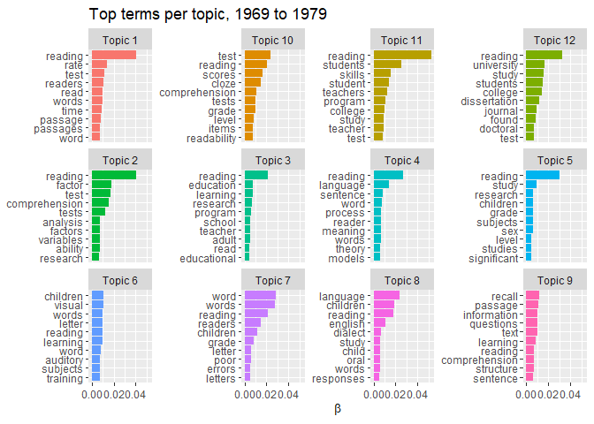
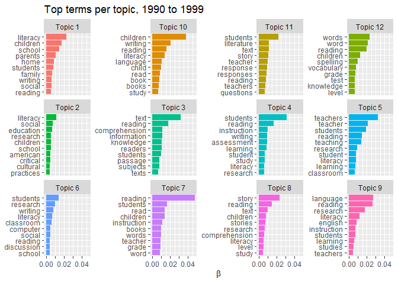
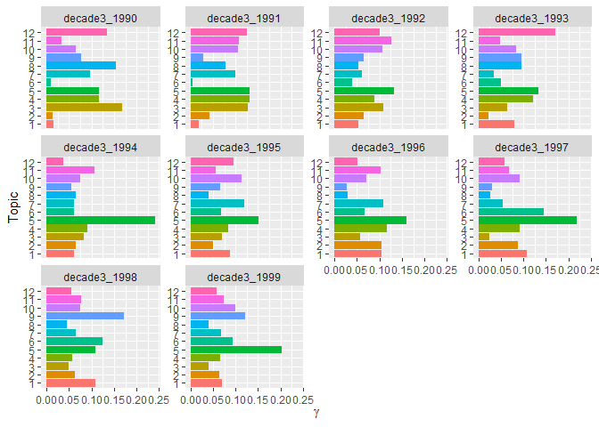
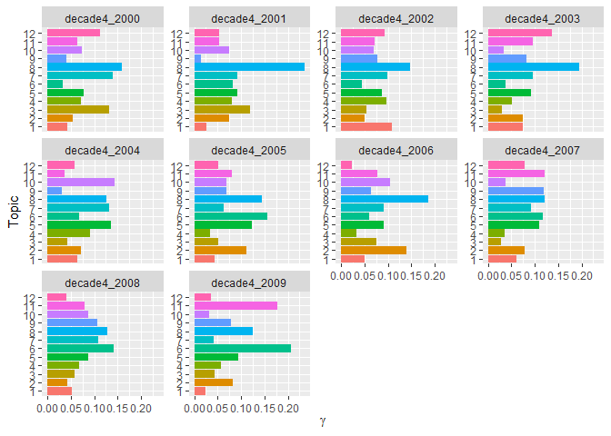

Final project; Data processing - Data Science for Linguists (LING 2340)
Fall 2022
================
Gianina Morales
12/1/2022 (version 1) - 12/15/2022 (version 2)

- <a href="#data-processing-new-continuing---part-2"
  id="toc-data-processing-new-continuing---part-2">Data processing (NEW
  CONTINUING - Part 2)</a>
  - <a href="#topic-modeling-by-decade"
    id="toc-topic-modeling-by-decade">Topic modeling by decade</a>
    - <a href="#decade-1---corpus-of-1969-to-1979"
      id="toc-decade-1---corpus-of-1969-to-1979">Decade 1 - Corpus of 1969 to
      1979</a>
    - <a href="#decade-2---corpus-of-1980-to-1989"
      id="toc-decade-2---corpus-of-1980-to-1989">Decade 2 - Corpus of 1980 to
      1989</a>
    - <a href="#decade-3---corpus-of-1990-to-1999"
      id="toc-decade-3---corpus-of-1990-to-1999">Decade 3 - Corpus of 1990 to
      1999</a>
    - <a href="#decade-4---corpus-of-2000-to-2009"
      id="toc-decade-4---corpus-of-2000-to-2009">Decade 4 - Corpus of 2000 to
      2009</a>
    - <a href="#decade-5---corpus-of-2010-to-2019"
      id="toc-decade-5---corpus-of-2010-to-2019">Decade 5 - Corpus of 2010 to
      2019</a>
    - <a href="#decade-6-corpus-of-2020-to-2022"
      id="toc-decade-6-corpus-of-2020-to-2022">Decade 6: Corpus of 2020 to
      2022</a>
  - <a href="#trends-over-decades" id="toc-trends-over-decades">Trends over
    decades</a>
    - <a href="#qualitative-analysis"
      id="toc-qualitative-analysis">Qualitative analysis</a>

# Data processing (NEW CONTINUING - Part 2)

------------------------------------------------------------------------

``` r
library(tidytext)
library(tidyverse)
library(tm)
library(stopwords)
library(stringi)
library(topicmodels)
library(lda)
library(stm)
library(ldatuning)
library(rmarkdown)
library(kableExtra)
knitr::opts_chunk$set(fig.path = "../Images/Data_processes2/", cache=TRUE)
```

------------------------------------------------------------------------

## Topic modeling by decade

**Method**

**Latent Dirichlet allocation (LDA)** is a mathematical method for
finding topic probabilities in a corpus. The mechanism includes two
elements:

- LDA allows finding topics in a series of documents automatically. The
  number of topics responds to a parameter set by the researcher
  (*n*=x). The topics listed are weighted by their relative importance
  in the corpus, informed by the frequency and distribution of words.

- Each topic includes a series of words that the algorithm *estimates*
  is part of the topic. The automatic process implies probabilities of
  word-topic association. That is why some words appear in different
  topics.

I have applied the method following primarily the book [Text Mining with
R](https://www.tidytextmining.com/index.html), in addition to other
sources, such as [Julia Silge’s YouTube
channel](https://www.youtube.com/@JuliaSilge) and two other data mining
books: [Text Mining for Social and Behavioral Research Using
R](https://books.psychstat.org/textmining/topic-models.html) and [Text
as Data Methods in R - Applications for Automated Analyses of News
Content](https://bookdown.org/valerie_hase/TextasData_HS2021/tutorial-13-topic-modeling.html)

**Number of topics (`k`)**

I have used `FindTopicsNumber()` from the `ldatuning` package to asses
the amount of topics recommended for my models. It is a time consuming
function, so I executed the command with the lighter data frame: decade
6 (it took 1 hour with the document term matrix based on the 11.8 Mb
object). I used the results as references for the entire data set. This
method indicated that a `k` between 8 and 13 represents a “balance”,
considering density, within-topic divergence and across topic
divergence. Given that the data frames for the other decades include
more documents, I decided to use a `k` of 12. My main sources for this
method are pages: [Select number of topics for LDA model (Murzintcev
Nikita)](https://rpubs.com/nikita-moor/107657) and [Topic Models(Chelsey
Hill)](https://rpubs.com/chelseyhill/672546)

To facilitate the organization of this document, the calculations are in
the space of the [decade 6](#decade-6:-corpus-of-2020-to-2022).

### Decade 1 - Corpus of 1969 to 1979

**1.1. Topic model**

- Document term matrix

``` r
#Loading Rds
tidy_corpus69_79 <- read_rds("../Private/tidy_corpus_all/tidy_corpus69_79.Rds")
#creating document-term matrix (necessary to apply the package)
corpus69_79_dtm <- tidy_corpus69_79 %>%
#joining decade and id column
    mutate(document= paste(decade, id, sep= "_"))%>%
    count(document, word) %>% 
    cast_dtm(document, word, n)
#results
corpus69_79_dtm
```

    ## <<DocumentTermMatrix (documents: 870, terms: 43739)>>
    ## Non-/sparse entries: 517485/37535445
    ## Sparsity           : 99%
    ## Maximal term length: 49
    ## Weighting          : term frequency (tf)

- Topic model

``` r
# creating a model with 12 topics
corpus69_79_topicmodel <- 
LDA(corpus69_79_dtm, k = 12, control = list(seed = 5178652))
#results
corpus69_79_topicmodel%>%
  write_rds("../Data_product_samples/topicmodels/topicmodel69_79.Rds")
```

The result is a model that I will use as a base in the next steps

**1.2. Word-topic probability**

This estimation indicates the probability of each term being present in
each topic.

``` r
# per topic per word probabilities
corpus69_79_topics <- tidy(corpus69_79_topicmodel, matrix = "beta")
head(corpus69_79_topics, 20)
```

    ## # A tibble: 20 × 3
    ##    topic term        beta
    ##    <int> <chr>      <dbl>
    ##  1     1 ability 0.00232 
    ##  2     2 ability 0.00742 
    ##  3     3 ability 0.000898
    ##  4     4 ability 0.000826
    ##  5     5 ability 0.000907
    ##  6     6 ability 0.00266 
    ##  7     7 ability 0.00248 
    ##  8     8 ability 0.00241 
    ##  9     9 ability 0.00115 
    ## 10    10 ability 0.00364 
    ## 11    11 ability 0.00197 
    ## 12    12 ability 0.00206 
    ## 13     1 able    0.00123 
    ## 14     2 able    0.000631
    ## 15     3 able    0.00137 
    ## 16     4 able    0.00177 
    ## 17     5 able    0.000198
    ## 18     6 able    0.000511
    ## 19     7 able    0.00123 
    ## 20     8 able    0.000803

I ranked the terms to find the words with more probability in each
topic. They are also called “top words.” I decided to look at the 30 top
terms to analyze the topics qualitatively. This process is commonly
called “tea-leaves-reading” because it implies the researcher’s
interpretation in search of meaningful patterns.

``` r
#Identifying the 30 terms more weighted to analyze the topics
corpus69_79_terms <- corpus69_79_topics %>%
  group_by(topic) %>%
  slice_max(beta, n = 30) %>% 
  ungroup() %>%
  arrange(topic, -beta) %>% 
  add_column(decade = "d1_1969-1979")
#results  
head(corpus69_79_terms, 10)
```

    ## # A tibble: 10 × 4
    ##    topic term        beta decade      
    ##    <int> <chr>      <dbl> <chr>       
    ##  1     1 reading  0.0404  d1_1969-1979
    ##  2     1 rate     0.0139  d1_1969-1979
    ##  3     1 test     0.0117  d1_1969-1979
    ##  4     1 readers  0.0106  d1_1969-1979
    ##  5     1 read     0.0101  d1_1969-1979
    ##  6     1 words    0.00990 d1_1969-1979
    ##  7     1 time     0.00875 d1_1969-1979
    ##  8     1 passage  0.00864 d1_1969-1979
    ##  9     1 passages 0.00763 d1_1969-1979
    ## 10     1 word     0.00750 d1_1969-1979

``` r
#Saving the data frame as a csv
write_csv(corpus69_79_terms, "../Data_product_samples/topicmodel_lists/corpus69_79_terms.csv", append = FALSE, col_names = TRUE)
```

*Analysis*

Looking at the topics qualitatively, I have inferred themes for each
topic. I have used my literature review of previous analyses of trends
in literacy scholarship (with the methodology “content analysis”) as a
guide in this task. As a result, I have new names for each topic in a
`csv` file. I plot the topics with the top ten terms.

``` r
#Loading csv with topics named
corpus69_79_terms_id<- read_csv("../Data_product_samples/topicmodel_listsanalyzed/corpus69_79_terms2.csv")
```

``` r
#List of topics
Topics69_79 <- corpus69_79_terms_id %>% 
  select (c("topic", "topic_name", "decade")) %>% 
  distinct()
Topics69_79k <- Topics69_79 %>%
  select (c("topic", "topic_name")) %>% 
  knitr::kable(booktabs = T, col.names = c("Topic", "Topic names 1969 to 1979"), align = c("l", "l")) %>% 
  kable_classic (full_width = F)
 Topics69_79k
```

<table class=" lightable-classic" style="font-family: &quot;Arial Narrow&quot;, &quot;Source Sans Pro&quot;, sans-serif; width: auto !important; margin-left: auto; margin-right: auto;">
<thead>
<tr>
<th style="text-align:left;">
Topic
</th>
<th style="text-align:left;">
Topic names 1969 to 1979
</th>
</tr>
</thead>
<tbody>
<tr>
<td style="text-align:left;">
1
</td>
<td style="text-align:left;">
Testing, reading comprehension
</td>
</tr>
<tr>
<td style="text-align:left;">
2
</td>
<td style="text-align:left;">
Study skills testing
</td>
</tr>
<tr>
<td style="text-align:left;">
3
</td>
<td style="text-align:left;">
Instructional programs and interventions
</td>
</tr>
<tr>
<td style="text-align:left;">
4
</td>
<td style="text-align:left;">
Grammar
</td>
</tr>
<tr>
<td style="text-align:left;">
5
</td>
<td style="text-align:left;">
Experiments
</td>
</tr>
<tr>
<td style="text-align:left;">
6
</td>
<td style="text-align:left;">
Visual processes testing
</td>
</tr>
<tr>
<td style="text-align:left;">
7
</td>
<td style="text-align:left;">
Phonics and word recognition/decoding
</td>
</tr>
<tr>
<td style="text-align:left;">
8
</td>
<td style="text-align:left;">
Students’ language
</td>
</tr>
<tr>
<td style="text-align:left;">
9
</td>
<td style="text-align:left;">
Memory testing
</td>
</tr>
<tr>
<td style="text-align:left;">
10
</td>
<td style="text-align:left;">
Testing, word/sentence level
</td>
</tr>
<tr>
<td style="text-align:left;">
11
</td>
<td style="text-align:left;">
Reading skills instruction
</td>
</tr>
<tr>
<td style="text-align:left;">
12
</td>
<td style="text-align:left;">
College reading
</td>
</tr>
</tbody>
</table>

``` r
 Topics69_79k %>% 
    save_kable("../Images/Data_processes2/topics_name_1969-1979.png")
```

Plot

``` r
#visualization of ten most common words by topic
decade1_10topics <- corpus69_79_terms %>%
  group_by(topic) %>%
  slice_max(beta, n = 10) %>% 
  ungroup() %>%
  mutate(topic =paste("Topic", topic), term= reorder_within(term, beta, topic)) %>% 
  ggplot(aes(beta, term, fill = factor(topic))) +
  geom_col(show.legend = FALSE) +
  labs(title = "Top terms per topic, 1969 to 1979", x = expression(beta), y = NULL) +
  facet_wrap(~ topic, ncol=4, scales = "free_y") +
  scale_y_reordered() +
   scale_x_continuous(guide = guide_axis(check.overlap = TRUE))
 
#results
decade1_10topics
```

<!-- -->

**1.3 Probability of topics by year: per-year-per-topic probability**

This measure will help me to see if there are changes in the presence of
each topic by year. I am using the technique to estimate the
“per-document-per-topic probability,” considering each year as a unique
document.

``` r
# per-document-per-topic probabilities
decade1_gamma <- tidy(corpus69_79_topicmodel, matrix="gamma")
sample_n(decade1_gamma, 10)
```

    ## # A tibble: 10 × 3
    ##    document                   topic     gamma
    ##    <chr>                      <int>     <dbl>
    ##  1 decade1_1975-lxcxs.txt         1 0.0000201
    ##  2 decade1_1977-sxmxxls.txt       1 0.0719   
    ##  3 decade1_1973-Krxxtlxw.txt      2 0.0000538
    ##  4 decade1_1971-hxndxrsxn.txt    12 0.0000198
    ##  5 decade1_1971-flxmxng.txt       3 0.180    
    ##  6 decade1_1979-Kxrth.txt        11 0.719    
    ##  7 decade1_1977-Dxpxxs.txt        7 0.0000260
    ##  8 decade1_1978-Pxxrsxn.txt       1 0.0000291
    ##  9 decade1_1970-cxrtxr.txt        4 0.0000437
    ## 10 decade1_1974-xrxcksxn.txt      2 0.0000502

The values are a proportion of words from each topic in each document
(document=journal article). Now, I will estimate the presence of topics
per year.

``` r
#separation of title name between year and article id
decade1_gamma <- decade1_gamma %>% 
  separate(document, c("year", "article"), sep = "-", convert = TRUE)
#Probability of topic per year
decade1_gamma_plot <- decade1_gamma %>%
  mutate(topic=factor(topic)) %>% 
  group_by(year, topic) %>% 
  summarise(gamma_mean=mean(gamma)) %>% 
  ggplot(aes(gamma_mean, topic, fill=topic))+
  geom_col(show.legend=FALSE)+
  facet_wrap(vars(year), ncol=4, scales = "free_y")+
  labs(x=expression(gamma), y="Topic")+
  scale_y_discrete()+
  theme(strip.text=element_text(size=10))
 #Results
decade1_gamma_plot
```

<!-- -->

### Decade 2 - Corpus of 1980 to 1989

**2.1. Topic model**

- Document term matrix

``` r
#Loading Rds
tidy_corpus80_89 <- read_rds("../Private/tidy_corpus_all/tidy_corpus80_89.Rds")

#creating document-term matrix (necessary to apply the package)
corpus80_89_dtm <- tidy_corpus80_89 %>%
#joining decade and id column
    mutate(document= paste(decade, id, sep= "_"))%>%
    count(document, word) %>% 
    cast_dtm(document, word, n)
#results
corpus80_89_dtm
```

    ## <<DocumentTermMatrix (documents: 686, terms: 35631)>>
    ## Non-/sparse entries: 497418/23945448
    ## Sparsity           : 98%
    ## Maximal term length: 42
    ## Weighting          : term frequency (tf)

- Topic model

``` r
# creating a model with 12 topics
corpus80_89_topicmodel <- 
LDA(corpus80_89_dtm, k = 12, control = list(seed = 6245))
#results
corpus80_89_topicmodel%>%
  write_rds("../Data_product_samples/topicmodels/topicmodel80_99.Rds")
```

The result is a model that I will use as a base in the next steps

**2.2. Word-topic probability**

This estimation indicates the probability of each term being present in
each topic.

``` r
# per topic per word probabilities
corpus80_89_topics <- tidy(corpus80_89_topicmodel, matrix = "beta")
head(corpus80_89_topics, 20)
```

    ## # A tibble: 20 × 3
    ##    topic term          beta
    ##    <int> <chr>        <dbl>
    ##  1     1 able      0.000981
    ##  2     2 able      0.000825
    ##  3     3 able      0.00116 
    ##  4     4 able      0.00153 
    ##  5     5 able      0.000811
    ##  6     6 able      0.000664
    ##  7     7 able      0.000531
    ##  8     8 able      0.000376
    ##  9     9 able      0.000741
    ## 10    10 able      0.00115 
    ## 11    11 able      0.000619
    ## 12    12 able      0.000983
    ## 13     1 according 0.000689
    ## 14     2 according 0.000120
    ## 15     3 according 0.000415
    ## 16     4 according 0.000425
    ## 17     5 according 0.000580
    ## 18     6 according 0.000701
    ## 19     7 according 0.000520
    ## 20     8 according 0.000663

I ranked the terms to find the words with more probability in each
topic. They are also called “top words.” I decided to look at the 30 top
terms to analyze the topics qualitatively. This process is commonly
called “tea-leaves-reading” because it implies the researcher’s
interpretation in search of meaningful patterns.

``` r
#Identifying the 30 terms more weighted to analyze the topics
corpus80_89_terms <- corpus80_89_topics %>%
  group_by(topic) %>%
  slice_max(beta, n = 30) %>% 
  ungroup() %>%
  arrange(topic, -beta) %>% 
  add_column(decade = "d2_1980-1989")
#results  
head(corpus80_89_terms, 10)
```

    ## # A tibble: 10 × 4
    ##    topic term           beta decade      
    ##    <int> <chr>         <dbl> <chr>       
    ##  1     1 cloze       0.0192  d2_1980-1989
    ##  2     1 reading     0.0130  d2_1980-1989
    ##  3     1 subjects    0.0103  d2_1980-1989
    ##  4     1 words       0.00966 d2_1980-1989
    ##  5     1 test        0.00928 d2_1980-1989
    ##  6     1 study       0.00767 d2_1980-1989
    ##  7     1 word        0.00746 d2_1980-1989
    ##  8     1 performance 0.00603 d2_1980-1989
    ##  9     1 passage     0.00587 d2_1980-1989
    ## 10     1 sentence    0.00576 d2_1980-1989

``` r
#Saving the data frame as a csv
write_csv(corpus80_89_terms, "../Data_product_samples/topicmodel_lists/corpus80_89_terms.csv", append = FALSE, col_names = TRUE)
```

*Analysis*

Looking at the topics qualitatively, I have inferred themes for each
topic. I have used my literature review of previous analyses of trends
in literacy scholarship (with the methodology “content analysis”) as a
guide in this task. As a result, I have new names for each topic in a
`csv` file. I plot the topics with the top ten terms.

``` r
#Loading csv with topics named
corpus80_89_terms_id<- read_csv("../Data_product_samples/topicmodel_listsanalyzed/corpus80_89_terms2.csv")
```

``` r
#List of topics
Topics80_89 <- corpus80_89_terms_id %>% 
  select (c("topic", "topic_name", "decade")) %>% 
  distinct() 
Topics80_89k <- Topics80_89 %>% 
  select (c("topic", "topic_name")) %>% 
  knitr::kable(booktabs = T, col.names = c("Topic", "Topic names 1980 to 1989"), align = c("l", "l")) %>% 
  kable_classic (full_width = F)
Topics80_89k
```

<table class=" lightable-classic" style="font-family: &quot;Arial Narrow&quot;, &quot;Source Sans Pro&quot;, sans-serif; width: auto !important; margin-left: auto; margin-right: auto;">
<thead>
<tr>
<th style="text-align:left;">
Topic
</th>
<th style="text-align:left;">
Topic names 1980 to 1989
</th>
</tr>
</thead>
<tbody>
<tr>
<td style="text-align:left;">
1
</td>
<td style="text-align:left;">
Testing, word/sentence level
</td>
</tr>
<tr>
<td style="text-align:left;">
2
</td>
<td style="text-align:left;">
Research and theory
</td>
</tr>
<tr>
<td style="text-align:left;">
3
</td>
<td style="text-align:left;">
Reading strategies
</td>
</tr>
<tr>
<td style="text-align:left;">
4
</td>
<td style="text-align:left;">
Vocabulary
</td>
</tr>
<tr>
<td style="text-align:left;">
5
</td>
<td style="text-align:left;">
Memory testing
</td>
</tr>
<tr>
<td style="text-align:left;">
6
</td>
<td style="text-align:left;">
Texts
</td>
</tr>
<tr>
<td style="text-align:left;">
7
</td>
<td style="text-align:left;">
Testing, reading comprehension
</td>
</tr>
<tr>
<td style="text-align:left;">
8
</td>
<td style="text-align:left;">
Classroom interaction
</td>
</tr>
<tr>
<td style="text-align:left;">
9
</td>
<td style="text-align:left;">
Children’s literacy instruction
</td>
</tr>
<tr>
<td style="text-align:left;">
10
</td>
<td style="text-align:left;">
Study skills testing
</td>
</tr>
<tr>
<td style="text-align:left;">
11
</td>
<td style="text-align:left;">
Readers’ characterization based on measures
</td>
</tr>
<tr>
<td style="text-align:left;">
12
</td>
<td style="text-align:left;">
Story reading instruction
</td>
</tr>
</tbody>
</table>

``` r
 Topics80_89k %>% 
    save_kable("../Images/Data_processes2/topics_name_1980-1989.png")
```

- Plot

``` r
#visualization of ten most common words by topic
decade2_10topics <- corpus80_89_terms%>%
  group_by(topic) %>%
  slice_max(beta, n = 10) %>% 
  ungroup() %>%
  mutate(topic =paste("Topic", topic), term= reorder_within(term, beta, topic)) %>% 
  ggplot(aes(beta, term, fill = factor(topic))) +
  geom_col(show.legend = FALSE) +
  labs(title = "Top terms per topic, 1980 to 1989", x = expression(beta), y = NULL) +
  facet_wrap(~ topic, ncol=4, scales = "free_y") +
  scale_y_reordered() +
   scale_x_continuous(guide = guide_axis(check.overlap = TRUE))
#results
decade2_10topics
```

<!-- -->

**2.3 Probability of topics by year: per-year-per-topic probability**

This measure will help me to see if there are changes in the presence of
each topic by year. I am using the technique to estimate the
“per-document-per-topic probability,” considering each year as a unique
document.

``` r
# per-document-per-topic probabilities
decade2_gamma <- tidy(corpus80_89_topicmodel, matrix="gamma")
sample_n(decade2_gamma, 10)
```

    ## # A tibble: 10 × 3
    ##    document                  topic     gamma
    ##    <chr>                     <int>     <dbl>
    ##  1 decade2_1989-sxxgxl.txt       2 0.344    
    ##  2 decade2_1988-nxst.txt         1 0.0000291
    ##  3 decade2_1980-Rxphxxl.txt      5 0.475    
    ##  4 decade2_1984-kxng.txt         2 0.0000152
    ##  5 decade2_1982-Nxxlsxn.txt      2 0.0000455
    ##  6 decade2_1982-Lxgxn.txt        4 0.0000347
    ##  7 decade2_1985-Cxx.txt          4 0.0000258
    ##  8 decade2_1986-Vxkxlxch.txt     3 0.0000340
    ##  9 decade2_1986-mxnxs.txt        3 0.0000130
    ## 10 decade2_1989-xndxrs.txt      10 0.204

The values are a proportion of words from each topic in each document
(document=journal article). Now, I will estimate the presence of topics
per year and create a visualization.

``` r
#separation of title name between year and article id
decade2_gamma <- decade2_gamma %>% 
  separate(document, c("year", "article"), sep = "-", convert = TRUE)
#Probability of topic per year
decade2_gamma_plot <- decade2_gamma %>%
 mutate(topic=factor(topic)) %>% 
  group_by(year, topic) %>% 
  summarise(gamma_mean=mean(gamma)) %>% 
  ggplot(aes(gamma_mean, topic, fill=topic))+
  geom_col(show.legend=FALSE)+
  facet_wrap(vars(year), ncol=4, scales = "free_y")+
  scale_x_continuous()+
  labs(x=expression(gamma), y="Topic")
 #Results
decade2_gamma_plot
```

<!-- -->

### Decade 3 - Corpus of 1990 to 1999

**3.1. Topic model**

- Document term matrix

``` r
#Loading Rds
tidy_corpus90_99 <- read_rds("../Private/tidy_corpus_all/tidy_corpus90_99.Rds")
#creating document-term matrix (necessary to apply the package)
corpus90_99_dtm <- tidy_corpus90_99 %>%
#joining decade and id column
    mutate(document= paste(decade, id, sep= "_"))%>%
    count(document, word) %>% 
    cast_dtm(document, word, n)
#results
corpus90_99_dtm
```

    ## <<DocumentTermMatrix (documents: 661, terms: 56327)>>
    ## Non-/sparse entries: 747439/36484708
    ## Sparsity           : 98%
    ## Maximal term length: 52
    ## Weighting          : term frequency (tf)

- Topic model

``` r
# creating a model with 12 topics
corpus90_99_topicmodel <- 
LDA(corpus90_99_dtm, k = 12, control = list(seed = 852))

#results
corpus90_99_topicmodel%>%
  write_rds("../Data_product_samples/topicmodels/topicmodel90_99.Rds")
```

The result is a model that I will use as a base in the next steps

**3.2. Word-topic probability**

This estimation indicates the probability of each term being present in
each topic.

``` r
# per topic per word probabilities
corpus90_99_topics <- tidy(corpus90_99_topicmodel, matrix = "beta")
head(corpus90_99_topics, 20)
```

    ## # A tibble: 20 × 3
    ##    topic term          beta
    ##    <int> <chr>        <dbl>
    ##  1     1 abstracts 2.13e- 6
    ##  2     2 abstracts 1.28e-23
    ##  3     3 abstracts 2.34e- 5
    ##  4     4 abstracts 5.71e- 5
    ##  5     5 abstracts 1.14e- 5
    ##  6     6 abstracts 3.77e-10
    ##  7     7 abstracts 3.80e- 5
    ##  8     8 abstracts 9.48e- 5
    ##  9     9 abstracts 4.82e- 4
    ## 10    10 abstracts 4.51e- 6
    ## 11    11 abstracts 5.88e- 5
    ## 12    12 abstracts 3.88e- 5
    ## 13     1 academic  1.16e- 3
    ## 14     2 academic  7.21e- 4
    ## 15     3 academic  4.64e- 4
    ## 16     4 academic  2.36e- 3
    ## 17     5 academic  6.12e- 4
    ## 18     6 academic  8.60e- 4
    ## 19     7 academic  3.41e- 4
    ## 20     8 academic  2.07e- 4

I ranked the terms to find the words with more probability in each
topic. They are also called “top words.” I decided to look at the 30 top
terms to analyze the topics qualitatively. This process is commonly
called “tea-leaves-reading” because it implies the researcher’s
interpretation in search of meaningful patterns.

``` r
#Identifying the 30 terms more weighted to analyze the topics
corpus90_99_terms <- corpus90_99_topics %>%
  group_by(topic) %>%
  slice_max(beta, n = 30) %>% 
  ungroup() %>%
  arrange(topic, -beta) %>% 
  add_column(decade = "d3_1990-1999")
#results  
head(corpus90_99_terms, 10)
```

    ## # A tibble: 10 × 4
    ##    topic term        beta decade      
    ##    <int> <chr>      <dbl> <chr>       
    ##  1     1 literacy 0.0224  d3_1990-1999
    ##  2     1 children 0.0171  d3_1990-1999
    ##  3     1 school   0.0147  d3_1990-1999
    ##  4     1 parents  0.0108  d3_1990-1999
    ##  5     1 home     0.00863 d3_1990-1999
    ##  6     1 students 0.00801 d3_1990-1999
    ##  7     1 family   0.00678 d3_1990-1999
    ##  8     1 writing  0.00634 d3_1990-1999
    ##  9     1 social   0.00612 d3_1990-1999
    ## 10     1 reading  0.00565 d3_1990-1999

``` r
#Saving the data frame as a csv
write_csv(corpus90_99_terms, "../Data_product_samples/topicmodel_lists/corpus90_99_terms.csv", append = FALSE, col_names = TRUE)
```

*Analysis*

Looking at the topics qualitatively, I have inferred themes for each
topic. I have used my literature review of previous analyses of trends
in literacy scholarship (with the methodology “content analysis”) as a
guide in this task. As a result, I have new names for each topic in a
`csv` file. I plot the topics with the top ten terms.

``` r
#Loading csv with topics named
corpus90_99_terms_id<- read_csv("../Data_product_samples/topicmodel_listsanalyzed/corpus90_99_terms2.csv")
```

``` r
#List of topics
Topics90_99 <- corpus90_99_terms_id %>% 
  select (c("topic", "topic_name", "decade")) %>% 
  distinct() 
Topics90_99k <- Topics90_99 %>%
  select (c("topic", "topic_name")) %>% 
    knitr::kable(booktabs = T, col.names = c("Topic", "Topic names 1990 to 1999"), align = c("l", "l")) %>% 
  kable_classic (full_width = F)
  Topics90_99k
```

<table class=" lightable-classic" style="font-family: &quot;Arial Narrow&quot;, &quot;Source Sans Pro&quot;, sans-serif; width: auto !important; margin-left: auto; margin-right: auto;">
<thead>
<tr>
<th style="text-align:left;">
Topic
</th>
<th style="text-align:left;">
Topic names 1990 to 1999
</th>
</tr>
</thead>
<tbody>
<tr>
<td style="text-align:left;">
1
</td>
<td style="text-align:left;">
Family and community literacy
</td>
</tr>
<tr>
<td style="text-align:left;">
2
</td>
<td style="text-align:left;">
Literacy as social practice
</td>
</tr>
<tr>
<td style="text-align:left;">
3
</td>
<td style="text-align:left;">
Reading strategies
</td>
</tr>
<tr>
<td style="text-align:left;">
4
</td>
<td style="text-align:left;">
Instructional programs and interventions
</td>
</tr>
<tr>
<td style="text-align:left;">
5
</td>
<td style="text-align:left;">
Teacher education
</td>
</tr>
<tr>
<td style="text-align:left;">
6
</td>
<td style="text-align:left;">
Technology and literacy
</td>
</tr>
<tr>
<td style="text-align:left;">
7
</td>
<td style="text-align:left;">
Classroom interaction
</td>
</tr>
<tr>
<td style="text-align:left;">
8
</td>
<td style="text-align:left;">
Story reading instruction
</td>
</tr>
<tr>
<td style="text-align:left;">
9
</td>
<td style="text-align:left;">
ESL/bilingualism and multilingualism
</td>
</tr>
<tr>
<td style="text-align:left;">
10
</td>
<td style="text-align:left;">
Writing
</td>
</tr>
<tr>
<td style="text-align:left;">
11
</td>
<td style="text-align:left;">
Literature
</td>
</tr>
<tr>
<td style="text-align:left;">
12
</td>
<td style="text-align:left;">
Phonics and word recognition/decoding
</td>
</tr>
</tbody>
</table>

``` r
  Topics90_99k %>% 
    save_kable("../Images/Data_processes2/topics_name_1990-1999.png")
```

- Plot

``` r
#visualization of ten most common words by topic
decade3_10topics <- corpus90_99_terms %>%
  group_by(topic) %>%
  slice_max(beta, n = 10) %>% 
  ungroup() %>%
  mutate(topic =paste("Topic", topic), term= reorder_within(term, beta, topic)) %>% 
  ggplot(aes(beta, term, fill = factor(topic))) +
  geom_col(show.legend = FALSE) +
  labs(title = "Top terms per topic, 1990 to 1999", x = expression(beta), y = NULL) +
  facet_wrap(~ topic, ncol=4, scales = "free_y") +
  scale_y_reordered() +
   scale_x_continuous(guide = guide_axis(check.overlap = TRUE))
#results
decade3_10topics
```

<!-- -->

**3.3 Probability of topics by year: per-year-per-topic probability**

This measure will help me to see if there are changes in the presence of
each topic by year. I am using the technique to estimate the
“per-document-per-topic probability,” considering each year as a unique
document.

``` r
# per-document-per-topic probabilities
decade3_gamma <- tidy(corpus90_99_topicmodel, matrix="gamma")
sample_n(decade3_gamma, 10)
```

    ## # A tibble: 10 × 3
    ##    document                      topic      gamma
    ##    <chr>                         <int>      <dbl>
    ##  1 decade3_1991-hxxbxrt.txt          7 0.0000239 
    ##  2 decade3_1992-xrmstrxng.txt        4 0.0000244 
    ##  3 decade3_1991-pxrcxllgxtxs.txt     9 0.00000547
    ##  4 decade3_1996-pxxrsxn.txt          6 0.0000230 
    ##  5 decade3_1994-kxnxpxk.txt          2 0.0000185 
    ##  6 decade3_1992-xl-Dxnxry.txt        6 0.0000179 
    ##  7 decade3_1996-xlvxrmxnn.txt        1 0.0000125 
    ##  8 decade3_1995-chxx.txt            12 0.0000318 
    ##  9 decade3_1994-xvxns.txt            5 0.958     
    ## 10 decade3_1995-gxllxnx.txt          2 0.0000161

The values are a proportion of words from each topic in each document
(document=journal article). Now, I will estimate the presence of topics
per year.

``` r
#separation of title name between year and article id
decade3_gamma <- decade3_gamma %>% 
  separate(document, c("year", "article"), sep = "-", convert = TRUE)
#Probability of topic per year
decade3_gamma_plot <- decade3_gamma %>%
  mutate(topic=factor(topic)) %>% 
  group_by(year, topic) %>% 
  summarise(gamma_mean=mean(gamma)) %>% 
  ggplot(aes(gamma_mean, topic, fill=topic))+
  geom_col(show.legend=FALSE)+
  facet_wrap(vars(year), ncol=4, scales = "free_y")+
  scale_x_continuous()+
  labs(x=expression(gamma), y="Topic")
 #Results
decade3_gamma_plot
```

<!-- -->

### Decade 4 - Corpus of 2000 to 2009

**4.1. Topic model**

- Document term matrix

``` r
#Loading Rds
tidy_corpus00_09 <- read_rds("../Private/tidy_corpus_all/tidy_corpus00_09.Rds")
#creating document-term matrix (necessary to apply the package)
corpus00_09_dtm <- tidy_corpus00_09 %>%
#joining decade and id column
    mutate(document= paste(decade, id, sep= "_"))%>%
    count(document, word) %>% 
    cast_dtm(document, word, n)
#results
corpus00_09_dtm
```

    ## <<DocumentTermMatrix (documents: 471, terms: 59077)>>
    ## Non-/sparse entries: 682364/27142903
    ## Sparsity           : 98%
    ## Maximal term length: 77
    ## Weighting          : term frequency (tf)

- Topic model

``` r
# creating a model with 12 topics
corpus00_09_topicmodel <- 
LDA(corpus00_09_dtm, k = 12, control = list(seed = 5178652))
#results
corpus00_09_topicmodel%>%
  write_rds("../Data_product_samples/topicmodels/topicmodel00_09.Rds")
```

The result is a model that I will use as a base in the next steps

**4.2. Word-topic probability**

This estimation indicates the probability of each term being present in
each topic.

``` r
# per topic per word probabilities
corpus00_09_topics <- tidy(corpus00_09_topicmodel, matrix = "beta")
head(corpus00_09_topics, 20)
```

    ## # A tibble: 20 × 3
    ##    topic term          beta
    ##    <int> <chr>        <dbl>
    ##  1     1 abbott    8.40e- 5
    ##  2     2 abbott    1.64e-20
    ##  3     3 abbott    5.84e-17
    ##  4     4 abbott    4.19e- 5
    ##  5     5 abbott    1.34e- 5
    ##  6     6 abbott    6.78e- 6
    ##  7     7 abbott    2.11e-23
    ##  8     8 abbott    2.04e- 5
    ##  9     9 abbott    2.19e-26
    ## 10    10 abbott    2.34e- 4
    ## 11    11 abbott    3.18e-13
    ## 12    12 abbott    3.60e- 8
    ## 13     1 abilities 3.75e- 4
    ## 14     2 abilities 6.20e- 5
    ## 15     3 abilities 1.89e- 4
    ## 16     4 abilities 2.11e- 4
    ## 17     5 abilities 1.20e- 4
    ## 18     6 abilities 4.50e- 4
    ## 19     7 abilities 5.14e- 4
    ## 20     8 abilities 3.92e- 4

I ranked the terms to find the words with more probability in each
topic. They are also called “top words.” I decided to look at the 30 top
terms to analyze the topics qualitatively. This process is commonly
called “tea-leaves-reading” because it implies the researcher’s
interpretation in search of meaningful patterns.

``` r
#Identifying the 30 terms more weighted to analyze the topics
corpus00_09_terms <- corpus00_09_topics %>%
  group_by(topic) %>%
  slice_max(beta, n = 30) %>% 
  ungroup() %>%
  arrange(topic, -beta) %>% 
  add_column(decade = "d4_2000-2009")
#results  
head(corpus00_09_terms, 10)
```

    ## # A tibble: 10 × 4
    ##    topic term         beta decade      
    ##    <int> <chr>       <dbl> <chr>       
    ##  1     1 words     0.0233  d4_2000-2009
    ##  2     1 word      0.0194  d4_2000-2009
    ##  3     1 reading   0.0180  d4_2000-2009
    ##  4     1 spelling  0.00844 d4_2000-2009
    ##  5     1 children  0.00780 d4_2000-2009
    ##  6     1 text      0.00746 d4_2000-2009
    ##  7     1 study     0.00648 d4_2000-2009
    ##  8     1 awareness 0.00635 d4_2000-2009
    ##  9     1 read      0.00551 d4_2000-2009
    ## 10     1 readers   0.00539 d4_2000-2009

``` r
#Saving the data frame as a csv
write_csv(corpus00_09_terms, "../Data_product_samples/topicmodel_lists/corpus00_09_terms.csv", append = FALSE, col_names = TRUE)
```

*Analysis*

Looking at the topics qualitatively, I have inferred themes for each
topic. I have used my literature review of previous analyses of trends
in literacy scholarship (with the methodology “content analysis”) as a
guide in this task. As a result, I have new names for each topic in a
`csv` file. I plot the topics with the top ten terms.

``` r
#Loading csv with topics named
corpus00_09_terms_id<- read_csv("../Data_product_samples/topicmodel_listsanalyzed/corpus00_09_terms2.csv")
```

``` r
#List of topics
Topics00_09 <- corpus00_09_terms_id %>% 
  select (c("topic", "topic_name", "decade")) %>% 
  distinct() 
Topics00_09k <- Topics00_09 %>% 
    select (c("topic", "topic_name")) %>% 
    knitr::kable(booktabs = T, col.names = c("Topic", "Topic names 2000 to 2009"), align = c("l", "l")) %>% 
  kable_classic (full_width = F)
  Topics00_09k
```

<table class=" lightable-classic" style="font-family: &quot;Arial Narrow&quot;, &quot;Source Sans Pro&quot;, sans-serif; width: auto !important; margin-left: auto; margin-right: auto;">
<thead>
<tr>
<th style="text-align:left;">
Topic
</th>
<th style="text-align:left;">
Topic names 2000 to 2009
</th>
</tr>
</thead>
<tbody>
<tr>
<td style="text-align:left;">
1
</td>
<td style="text-align:left;">
Phonics and word recognition/decoding
</td>
</tr>
<tr>
<td style="text-align:left;">
2
</td>
<td style="text-align:left;">
Literacy as social practice
</td>
</tr>
<tr>
<td style="text-align:left;">
3
</td>
<td style="text-align:left;">
Classroom interaction
</td>
</tr>
<tr>
<td style="text-align:left;">
4
</td>
<td style="text-align:left;">
Writing
</td>
</tr>
<tr>
<td style="text-align:left;">
5
</td>
<td style="text-align:left;">
Research and theory
</td>
</tr>
<tr>
<td style="text-align:left;">
6
</td>
<td style="text-align:left;">
Vocabulary
</td>
</tr>
<tr>
<td style="text-align:left;">
7
</td>
<td style="text-align:left;">
Teacher education
</td>
</tr>
<tr>
<td style="text-align:left;">
8
</td>
<td style="text-align:left;">
Instructional programs and interventions
</td>
</tr>
<tr>
<td style="text-align:left;">
9
</td>
<td style="text-align:left;">
Technology and literacy
</td>
</tr>
<tr>
<td style="text-align:left;">
10
</td>
<td style="text-align:left;">
Texts
</td>
</tr>
<tr>
<td style="text-align:left;">
11
</td>
<td style="text-align:left;">
Literature
</td>
</tr>
<tr>
<td style="text-align:left;">
12
</td>
<td style="text-align:left;">
Children’s literacy instruction
</td>
</tr>
</tbody>
</table>

``` r
Topics00_09k %>% 
    save_kable("../Images/Data_processes2/topics_name_2000-2009.png")
```

- Plot

``` r
#visualization of ten most common words by topic
decade4_10topics <- corpus00_09_terms %>%
  group_by(topic) %>%
  slice_max(beta, n = 10) %>% 
  ungroup() %>%
  mutate(topic =paste("Topic", topic), term= reorder_within(term, beta, topic)) %>% 
  ggplot(aes(beta, term, fill = factor(topic))) +
  geom_col(show.legend = FALSE) +
  labs(title = "Top terms per topic, 2000 to 2009", x = expression(beta), y = NULL) +
  facet_wrap(~ topic, ncol=4, scales = "free_y") +
  scale_y_reordered() +
   scale_x_continuous(guide = guide_axis(check.overlap = TRUE))+
  theme(strip.text=element_text(size=10))
#results
decade4_10topics
```

<!-- -->

**4.3 Probability of topics by year: per-year-per-topic probability**

This measure will help me to see if there are changes in the presence of
each topic by year. I am using the technique to estimate the
“per-document-per-topic probability,” considering each year as a unique
document.

``` r
# per-document-per-topic probabilities
decade4_gamma <- tidy(corpus00_09_topicmodel, matrix="gamma")
sample_n(decade4_gamma, 10)
```

    ## # A tibble: 10 × 3
    ##    document                 topic      gamma
    ##    <chr>                    <int>      <dbl>
    ##  1 decade4_2007-brxnnxr.txt     6 0.0000208 
    ##  2 decade4_2005-Hxlmxn.txt      3 0.0000104 
    ##  3 decade4_2002-brxndt.txt      5 0.814     
    ##  4 decade4_2000-mxlxch.txt     10 0.0000149 
    ##  5 decade4_2007-lxbxgxt.txt     7 0.00000788
    ##  6 decade4_2008-pxrry.txt       6 0.00000449
    ##  7 decade4_2008-mxrrxy.txt     11 0.00000779
    ##  8 decade4_2001-bxrr.txt        6 0.0000136 
    ##  9 decade4_2001-hxghxs.txt     10 0.0000152 
    ## 10 decade4_2008-rxmxx.txt       9 0.0000132

The values are a proportion of words from each topic in each document
(document=journal article). Now, I will estimate the presence of topics
per year.

``` r
#separation of title name between year and article id
decade4_gamma <- decade4_gamma %>% 
  separate(document, c("year", "article"), sep = "-", convert = TRUE)
#Probability of topic per year
decade4_gamma_plot <- decade4_gamma %>%
 mutate(topic=factor(topic)) %>% 
  group_by(year, topic) %>% 
  summarise(gamma_mean=mean(gamma)) %>% 
  ggplot(aes(gamma_mean, topic, fill=topic))+
  geom_col(show.legend=FALSE)+
  facet_wrap(vars(year), ncol=4, scales = "free_y")+
  scale_x_continuous()+
  labs(x=expression(gamma), y="Topic")
 #Results
decade4_gamma_plot
```

<!-- -->

### Decade 5 - Corpus of 2010 to 2019

**5.1. Topic model**

- Document term matrix

``` r
#Loading Rds
tidy_corpus10_19 <- read_rds("../Private/tidy_corpus_all/tidy_corpus10_19.Rds")
#creating document-term matrix (necessary to apply the package)
corpus10_19_dtm <- tidy_corpus10_19 %>%
#joining decade and id column
    mutate(document= paste(decade, id, sep= "_"))%>%
    count(document, word) %>% 
    cast_dtm(document, word, n)
#results
corpus10_19_dtm
```

    ## <<DocumentTermMatrix (documents: 384, terms: 53227)>>
    ## Non-/sparse entries: 597058/19842110
    ## Sparsity           : 97%
    ## Maximal term length: 50
    ## Weighting          : term frequency (tf)

- Topic model

``` r
# creating a model with 12 topics
corpus10_19_topicmodel <- 
LDA(corpus10_19_dtm, k = 12, control = list(seed = 123))
#results
corpus10_19_topicmodel%>%
  write_rds("../Data_product_samples/topicmodels/topicmodel10_19.Rds")
```

The result is a model that I will use as a base in the next steps

**5.2. Word-topic probability**

This estimation indicates the probability of each term being present in
each topic.

``` r
# per topic per word probabilities
corpus10_19_topics <- tidy(corpus10_19_topicmodel, matrix = "beta")
head(corpus10_19_topics, 20)
```

    ## # A tibble: 20 × 3
    ##    topic term           beta
    ##    <int> <chr>         <dbl>
    ##  1     1 abe       3.15e-  5
    ##  2     2 abe       3.18e-191
    ##  3     3 abe       4.40e- 18
    ##  4     4 abe       1.41e-187
    ##  5     5 abe       1.95e-  4
    ##  6     6 abe       5.97e-111
    ##  7     7 abe       6.73e- 18
    ##  8     8 abe       1.17e- 16
    ##  9     9 abe       1.44e-110
    ## 10    10 abe       2.40e- 17
    ## 11    11 abe       2.03e- 26
    ## 12    12 abe       1.37e- 21
    ## 13     1 abilities 4.38e-  4
    ## 14     2 abilities 1.95e-  4
    ## 15     3 abilities 4.04e-  4
    ## 16     4 abilities 2.02e-  4
    ## 17     5 abilities 7.78e-  5
    ## 18     6 abilities 9.33e-  4
    ## 19     7 abilities 2.29e-  4
    ## 20     8 abilities 3.61e-  4

I ranked the terms to find the words with more probability in each
topic. They are also called “top words.” I decided to look at the 30 top
terms to analyze the topics qualitatively. This process is commonly
called “tea-leaves-reading” because it implies the researcher’s
interpretation in search of meaningful patterns.

``` r
#Identifying the 30 terms more weighted to analyze the topics
corpus10_19_terms <- corpus10_19_topics %>%
  group_by(topic) %>%
  slice_max(beta, n = 30) %>% 
  ungroup() %>%
  arrange(topic, -beta) %>% 
  add_column(decade = "d5_2010-2019")
#results  
head(corpus10_19_terms, 10)
```

    ## # A tibble: 10 × 4
    ##    topic term            beta decade      
    ##    <int> <chr>          <dbl> <chr>       
    ##  1     1 literacy     0.0397  d5_2010-2019
    ##  2     1 reading      0.00795 d5_2010-2019
    ##  3     1 education    0.00745 d5_2010-2019
    ##  4     1 family       0.00686 d5_2010-2019
    ##  5     1 adult        0.00675 d5_2010-2019
    ##  6     1 school       0.00673 d5_2010-2019
    ##  7     1 research     0.00635 d5_2010-2019
    ##  8     1 children     0.00633 d5_2010-2019
    ##  9     1 practices    0.00620 d5_2010-2019
    ## 10     1 participants 0.00553 d5_2010-2019

``` r
#Saving the data frame as a csv
write_csv(corpus10_19_terms, "../Data_product_samples/topicmodel_lists/corpus10_19_terms.csv", append = FALSE, col_names = TRUE)
```

*Analysis*

Looking at the topics qualitatively, I have inferred themes for each
topic. I have used my literature review of previous analyses of trends
in literacy scholarship (with the methodology “content analysis”) as a
guide in this task. As a result, I have new names for each topic in a
`csv` file. I plot the topics with the top ten terms.

``` r
#Loading csv with topics named
corpus10_19_terms_id<- read_csv("../Data_product_samples/topicmodel_listsanalyzed/corpus10_19_terms2.csv")
```

``` r
#List of topics
Topics10_19 <- corpus10_19_terms_id %>% 
  select (c("topic", "topic_name", "decade")) %>% 
  distinct() 
Topics10_19k <- Topics10_19 %>%  
  select (c("topic", "topic_name")) %>% 
  knitr::kable(booktabs = T, col.names = c("Topic", "Topic names 2010 to 2019"), align = c("l", "l")) %>% 
  kable_classic (full_width = F)
Topics10_19k
```

<table class=" lightable-classic" style="font-family: &quot;Arial Narrow&quot;, &quot;Source Sans Pro&quot;, sans-serif; width: auto !important; margin-left: auto; margin-right: auto;">
<thead>
<tr>
<th style="text-align:left;">
Topic
</th>
<th style="text-align:left;">
Topic names 2010 to 2019
</th>
</tr>
</thead>
<tbody>
<tr>
<td style="text-align:left;">
1
</td>
<td style="text-align:left;">
Family and community literacy
</td>
</tr>
<tr>
<td style="text-align:left;">
2
</td>
<td style="text-align:left;">
Disciplinary literacy
</td>
</tr>
<tr>
<td style="text-align:left;">
3
</td>
<td style="text-align:left;">
Writing
</td>
</tr>
<tr>
<td style="text-align:left;">
4
</td>
<td style="text-align:left;">
Teacher education
</td>
</tr>
<tr>
<td style="text-align:left;">
5
</td>
<td style="text-align:left;">
Instructional programs and interventions
</td>
</tr>
<tr>
<td style="text-align:left;">
6
</td>
<td style="text-align:left;">
Vocabulary
</td>
</tr>
<tr>
<td style="text-align:left;">
7
</td>
<td style="text-align:left;">
Literacy as social practice
</td>
</tr>
<tr>
<td style="text-align:left;">
8
</td>
<td style="text-align:left;">
Technology and literacy
</td>
</tr>
<tr>
<td style="text-align:left;">
9
</td>
<td style="text-align:left;">
ESL/bilingualism and multilingualism
</td>
</tr>
<tr>
<td style="text-align:left;">
10
</td>
<td style="text-align:left;">
Digital literacies
</td>
</tr>
<tr>
<td style="text-align:left;">
11
</td>
<td style="text-align:left;">
Critical literacy
</td>
</tr>
<tr>
<td style="text-align:left;">
12
</td>
<td style="text-align:left;">
Literature
</td>
</tr>
</tbody>
</table>

``` r
Topics10_19k %>% 
    save_kable("../Images/Data_processes2/topics_name_2010-2019.png")
```

- Plot

``` r
#visualization of ten most common words by topic
decade5_10topics <- corpus10_19_terms %>%
  group_by(topic) %>%
  slice_max(beta, n = 10) %>% 
  ungroup() %>%
  mutate(topic =paste("Topic", topic), term= reorder_within(term, beta, topic)) %>% 
  ggplot(aes(beta, term, fill = factor(topic))) +
  geom_col(show.legend = FALSE) +
  labs(title = "Top terms per topic, 2010 to 2019", x = expression(beta), y = NULL) +
  facet_wrap(~ topic, ncol=4, scales = "free_y") +
  scale_y_reordered() +
   scale_x_continuous(guide = guide_axis(check.overlap = TRUE))
#results
decade5_10topics
```

<!-- -->

**5.3 Probability of topics by year: per-year-per-topic probability**

This measure will help me to see if there are changes in the presence of
each topic by year. I am using the technique to estimate the
“per-document-per-topic probability,” considering each year as a unique
document.

``` r
# per-document-per-topic probabilities
decade5_gamma <- tidy(corpus10_19_topicmodel, matrix="gamma")
sample_n(decade5_gamma, 10)
```

    ## # A tibble: 10 × 3
    ##    document                              topic      gamma
    ##    <chr>                                 <int>      <dbl>
    ##  1 decade5_2017-xmxtx.txt                   12 0.0000107 
    ##  2 decade5_2014-rxgxrs.txt                  11 0.0000110 
    ##  3 decade5_2010-chrxstxxnxkxs.txt            7 0.00000400
    ##  4 decade5_2017-jxcxxs.txt                  12 0.0000102 
    ##  5 decade5_2015-Cxssxnx_Schxckxndxnz.txt     4 0.00000772
    ##  6 decade5_2012-cxxchxxwskx.txt              6 0.00000408
    ##  7 decade5_2017-lxpx.txt                     9 0.0000117 
    ##  8 decade5_2017-gxrcxx.txt                   1 0.00000583
    ##  9 decade5_2011-lxcxnx.txt                  12 0.00000454
    ## 10 decade5_2019-hxffmxn.txt                 12 0.00000745

The values are a proportion of words from each topic in each document
(document=journal article). Now, I will estimate the presence of topics
per year and present it in a visualization.

``` r
#separation of title name between year and article id
decade5_gamma <- decade5_gamma %>% 
  separate(document, c("year", "article"), sep = "-", convert = TRUE)
#Probability of topic per year
decade5_gamma_plot <- decade5_gamma %>%
  mutate(topic=factor(topic)) %>% 
  group_by(year, topic) %>% 
  summarise(gamma_mean=mean(gamma)) %>% 
  ggplot(aes(gamma_mean, topic, fill=topic))+
  geom_col(show.legend=FALSE)+
  facet_wrap(vars(year), ncol=4, scales = "free_y")+
  scale_x_continuous()+
  labs(x=expression(gamma), y="Topic")
 #Results
decade5_gamma_plot
```

<!-- -->

### Decade 6: Corpus of 2020 to 2022

**6.1. Topic model**

- Document term matrix

``` r
#Loading Rds
tidy_corpus20_22 <- read_rds("../Private/tidy_corpus_all/tidy_corpus20_22.Rds")
#creating document-term matrix (necessary to apply the package)
corpus20_22_dtm <- tidy_corpus20_22 %>%
#joining decade and id column
    mutate(document= paste(decade, id, sep= "_"))%>%
    count(document, word) %>% 
    cast_dtm(document, word, n)
#results
corpus20_22_dtm
```

    ## <<DocumentTermMatrix (documents: 85, terms: 28068)>>
    ## Non-/sparse entries: 153661/2232119
    ## Sparsity           : 94%
    ## Maximal term length: 35
    ## Weighting          : term frequency (tf)

- Assessing the recommended number of topics for the corpus (`k`)

``` r
#Assessing the recommended number of topics for the corpus (`k`)
topicsnumber <- FindTopicsNumber(corpus20_22_dtm,
  topics = seq(from = 5, to = 25, by = 1),
  metrics = c("CaoJuan2009", "Arun2010", "Deveaud2014"),
  method = "Gibbs",
  control = list(seed = 77),
  mc.cores = 2L,
  verbose = TRUE)
```

    ## fit models... done.
    ## calculate metrics:
    ##   CaoJuan2009... done.
    ##   Arun2010... done.
    ##   Deveaud2014... done.

``` r
FindTopicsNumber_plot(topicsnumber)
```

<!-- -->

- Topic model

``` r
# creating a model with 12 topics
corpus20_22_topicmodel <- 
LDA(corpus20_22_dtm, k = 12, control = list(seed = 524))

#results
corpus20_22_topicmodel%>%
  write_rds("../Data_product_samples/topicmodels/topicmodel20_22.Rds")
```

The result is a model that I will use as a base in the next steps

**6.2. Word-topic probability**

This estimation indicates the probability of each term being present in
each topic.

``` r
# per topic per word probabilities
corpus20_22_topics <- tidy(corpus20_22_topicmodel, matrix = "beta")
head(corpus20_22_topics, 20)
```

    ## # A tibble: 20 × 3
    ##    topic term        beta
    ##    <int> <chr>      <dbl>
    ##  1     1 ability 0.000292
    ##  2     2 ability 0.000120
    ##  3     3 ability 0.000284
    ##  4     4 ability 0.00409 
    ##  5     5 ability 0.000479
    ##  6     6 ability 0.00261 
    ##  7     7 ability 0.000406
    ##  8     8 ability 0.000355
    ##  9     9 ability 0.000468
    ## 10    10 ability 0.000774
    ## 11    11 ability 0.000796
    ## 12    12 ability 0.000224
    ## 13     1 able    0.000216
    ## 14     2 able    0.000621
    ## 15     3 able    0.000525
    ## 16     4 able    0.000216
    ## 17     5 able    0.000559
    ## 18     6 able    0.000498
    ## 19     7 able    0.000473
    ## 20     8 able    0.000525

I ranked the terms to find the words with more probability in each
topic. They are also called “top words.” I decided to look at the 30 top
terms to analyze the topics qualitatively. This process is commonly
called “tea-leaves-reading” because it implies the researcher’s
interpretation in search of meaningful patterns.

``` r
#Identifying the 30 terms more weighted to analyze the topics
corpus20_22_terms <- corpus20_22_topics %>%
  group_by(topic) %>%
  slice_max(beta, n = 30) %>% 
  ungroup() %>%
  arrange(topic, -beta) %>% 
  add_column(decade = "d6_2020-2022")
#results  
head(corpus20_22_terms, 10)
```

    ## # A tibble: 10 × 4
    ##    topic term          beta decade      
    ##    <int> <chr>        <dbl> <chr>       
    ##  1     1 literacy   0.0169  d6_2020-2022
    ##  2     1 research   0.0116  d6_2020-2022
    ##  3     1 students   0.00972 d6_2020-2022
    ##  4     1 reading    0.00675 d6_2020-2022
    ##  5     1 english    0.00609 d6_2020-2022
    ##  6     1 language   0.00604 d6_2020-2022
    ##  7     1 identities 0.00559 d6_2020-2022
    ##  8     1 practices  0.00531 d6_2020-2022
    ##  9     1 classroom  0.00522 d6_2020-2022
    ## 10     1 learners   0.00502 d6_2020-2022

``` r
#Saving the data frame as a csv
write_csv(corpus20_22_terms, "../Data_product_samples/topicmodel_lists/corpus20_22_terms.csv", append = FALSE, col_names = TRUE)
```

*Analysis*

Looking at the topics qualitatively, I have inferred themes for each
topic. I have used my literature review of previous analyses of trends
in literacy scholarship (with the methodology “content analysis”) as a
guide in this task. As a result, I have new names for each topic in a
`csv` file. I plot the topics with the top ten terms.

``` r
#Loading csv with topics named
corpus20_22_terms_id<- read_csv("../Data_product_samples/topicmodel_listsanalyzed/corpus20_22_terms2.csv")
```

``` r
#List of topics
Topics20_22 <- corpus20_22_terms_id %>%
  select (c("topic", "topic_name", "decade")) %>% 
  distinct() 
Topics20_22k <- Topics20_22 %>%  
  select (c("topic", "topic_name")) %>% 
  knitr::kable(booktabs = T, col.names = c("Topic", "Topic names 2020 to 2022"), align = c("l", "l")) %>% 
  kable_classic (full_width = F)
Topics20_22k
```

<table class=" lightable-classic" style="font-family: &quot;Arial Narrow&quot;, &quot;Source Sans Pro&quot;, sans-serif; width: auto !important; margin-left: auto; margin-right: auto;">
<thead>
<tr>
<th style="text-align:left;">
Topic
</th>
<th style="text-align:left;">
Topic names 2020 to 2022
</th>
</tr>
</thead>
<tbody>
<tr>
<td style="text-align:left;">
1
</td>
<td style="text-align:left;">
Instructional programs and interventions
</td>
</tr>
<tr>
<td style="text-align:left;">
2
</td>
<td style="text-align:left;">
Children’s literacy instruction
</td>
</tr>
<tr>
<td style="text-align:left;">
3
</td>
<td style="text-align:left;">
Digital literacies
</td>
</tr>
<tr>
<td style="text-align:left;">
4
</td>
<td style="text-align:left;">
Readers’ characterization based on measures
</td>
</tr>
<tr>
<td style="text-align:left;">
5
</td>
<td style="text-align:left;">
Writing
</td>
</tr>
<tr>
<td style="text-align:left;">
6
</td>
<td style="text-align:left;">
Research and theory
</td>
</tr>
<tr>
<td style="text-align:left;">
7
</td>
<td style="text-align:left;">
Literature
</td>
</tr>
<tr>
<td style="text-align:left;">
8
</td>
<td style="text-align:left;">
Classroom interaction
</td>
</tr>
<tr>
<td style="text-align:left;">
9
</td>
<td style="text-align:left;">
Literacy as social practice
</td>
</tr>
<tr>
<td style="text-align:left;">
10
</td>
<td style="text-align:left;">
Critical literacy
</td>
</tr>
<tr>
<td style="text-align:left;">
11
</td>
<td style="text-align:left;">
Teacher education
</td>
</tr>
<tr>
<td style="text-align:left;">
12
</td>
<td style="text-align:left;">
ESL/bilingualism and multilingualism
</td>
</tr>
</tbody>
</table>

``` r
Topics20_22k%>% 
    save_kable("../Images/Data_processes2/topics_name_2020-2022.png")
```

- Plot

``` r
#visualization of ten most common words by topic
decade6_10topics <- corpus20_22_terms %>%
  group_by(topic) %>%
  slice_max(beta, n = 10) %>% 
  ungroup() %>%
  mutate(topic =paste("Topic", topic), term= reorder_within(term, beta, topic)) %>% 
  ggplot(aes(beta, term, fill = factor(topic))) +
  geom_col(show.legend = FALSE) +
  labs(title = "Top terms per topic, 2020 to 2022", x = expression(beta), y = NULL) +
  facet_wrap(~ topic, ncol=4, scales = "free_y") +
  scale_y_reordered() +
   scale_x_continuous(guide = guide_axis(check.overlap = TRUE))
#results
decade6_10topics
```

<!-- -->

**6.3 Probability of topics by year: per-year-per-topic probability**

This measure will help me to see if there are changes in the presence of
each topic by year. I am using the technique to estimate the
“per-document-per-topic probability,” considering each year as a unique
document.

``` r
# per-document-per-topic probabilities
decade6_gamma <- tidy(corpus20_22_topicmodel, matrix="gamma")
sample_n(decade6_gamma, 10)
```

    ## # A tibble: 10 × 3
    ##    document                      topic      gamma
    ##    <chr>                         <int>      <dbl>
    ##  1 decade6_2020-pxrclx.txt           4 0.00000360
    ##  2 decade6_2021-kxxlx.txt            4 0.00000296
    ##  3 decade6_2021-fxntxnxllx.txt       6 0.466     
    ##  4 decade6_2021-nxsh.txt            10 0.00000327
    ##  5 decade6_2021-pxckxrd.txt          9 0.00000271
    ##  6 decade6_2022-bhxttxchxryx.txt     7 1.00      
    ##  7 decade6_2020-txylxr.txt           9 0.00000325
    ##  8 decade6_2021-wxng.txt            12 0.00000264
    ##  9 decade6_2020-wxllxs.txt           9 0.00000209
    ## 10 decade6_2020-rxbxrtsxn.txt        5 0.943

The values are a proportion of words from each topic in each document
(document=journal article). Now, I will estimate the presence of topics
per year and present it in a visualization.

``` r
#separation of title name between year and article id
decade6_gamma <- decade6_gamma %>% 
  separate(document, c("year", "article"), sep = "-", convert = TRUE)
#Probability of topic per year
decade6_gamma_plot2 <- 
  decade6_gamma %>%
  mutate(topic=factor(topic)) %>% 
  group_by(year, topic) %>% 
  summarise(gamma_mean=mean(gamma)) %>% 
  ggplot(aes(gamma_mean, topic, fill=topic))+
  geom_col(show.legend=FALSE)+
  facet_wrap(vars(year), ncol=3, scales = "free_y")+
  scale_x_continuous()+
  labs(x=expression(gamma), y="Topic")
 #Results
decade6_gamma_plot2
```

<!-- -->

This last set set only considers three years and could explain why in
2022 it seems that some topics have not been touched by literacy
scholars.

------------------------------------------------------------------------

## Trends over decades

### Qualitative analysis

``` r
#loading manual analysis
all_topics <- rbind(Topics69_79, Topics80_89, Topics90_99, Topics00_09, Topics10_19, Topics20_22)
#plot
all_topics_accross <-  
  all_topics %>%
  mutate(decade = str_replace_all(decade, ".*_", "")) %>%   
  select(c("topic_name", "decade"))%>%
  group_by(decade) %>% 
  arrange(desc(topic_name)) %>%
  #to mantain the order of my df in the plot
  mutate(topic_name = forcats::fct_inorder(topic_name)) %>%
  ggplot(aes(decade, topic_name, color= topic_name)) +
  geom_point(show.legend=F) +
  labs(x = "Decade", y = "Topics", title = "LDA Topics over decades")+ 
  theme(axis.text.x = element_text(angle = 30, hjust = 1))
all_topics_accross
```

<!-- -->

``` r
sessionInfo()
```

    ## R version 4.2.1 (2022-06-23 ucrt)
    ## Platform: x86_64-w64-mingw32/x64 (64-bit)
    ## Running under: Windows 10 x64 (build 19045)
    ## 
    ## Matrix products: default
    ## 
    ## locale:
    ## [1] LC_COLLATE=English_United States.utf8 
    ## [2] LC_CTYPE=English_United States.utf8   
    ## [3] LC_MONETARY=English_United States.utf8
    ## [4] LC_NUMERIC=C                          
    ## [5] LC_TIME=English_United States.utf8    
    ## 
    ## attached base packages:
    ## [1] stats     graphics  grDevices utils     datasets  methods   base     
    ## 
    ## other attached packages:
    ##  [1] kableExtra_1.3.4    rmarkdown_2.16      ldatuning_1.0.2    
    ##  [4] stm_1.3.6           lda_1.4.2           topicmodels_0.2-12 
    ##  [7] stringi_1.7.8       stopwords_2.3       tm_0.7-9           
    ## [10] NLP_0.2-1           forcats_0.5.2       stringr_1.4.1      
    ## [13] dplyr_1.0.9         purrr_0.3.4         readr_2.1.2        
    ## [16] tidyr_1.2.0         tibble_3.1.8        ggplot2_3.3.6      
    ## [19] tidyverse_1.3.2     tidytext_0.3.4.9000
    ## 
    ## loaded via a namespace (and not attached):
    ##  [1] fs_1.5.2            bit64_4.0.5         lubridate_1.8.0    
    ##  [4] webshot_0.5.4       httr_1.4.4          SnowballC_0.7.0    
    ##  [7] tools_4.2.1         backports_1.4.1     bslib_0.4.0        
    ## [10] utf8_1.2.2          R6_2.5.1            DBI_1.1.3          
    ## [13] colorspace_2.0-3    withr_2.5.0         processx_3.7.0     
    ## [16] tidyselect_1.1.2    bit_4.0.4           compiler_4.2.1     
    ## [19] cli_3.4.1           rvest_1.0.3         xml2_1.3.3         
    ## [22] labeling_0.4.2      sass_0.4.2          slam_0.1-50        
    ## [25] scales_1.2.1        callr_3.7.3         systemfonts_1.0.4  
    ## [28] digest_0.6.29       svglite_2.1.0       pkgconfig_2.0.3    
    ## [31] htmltools_0.5.3     dbplyr_2.2.1        fastmap_1.1.0      
    ## [34] highr_0.9           rlang_1.0.4         readxl_1.4.1       
    ## [37] rstudioapi_0.14     farver_2.1.1        jquerylib_0.1.4    
    ## [40] generics_0.1.3      jsonlite_1.8.0      vroom_1.5.7        
    ## [43] tokenizers_0.2.3    googlesheets4_1.0.1 magrittr_2.0.3     
    ## [46] modeltools_0.2-23   Matrix_1.5-3        Rcpp_1.0.9         
    ## [49] munsell_0.5.0       fansi_1.0.3         lifecycle_1.0.1    
    ## [52] yaml_2.3.5          plyr_1.8.8          grid_4.2.1         
    ## [55] parallel_4.2.1      crayon_1.5.1        lattice_0.20-45    
    ## [58] haven_2.5.1         hms_1.1.2           magick_2.7.3       
    ## [61] ps_1.7.1            knitr_1.40          pillar_1.8.1       
    ## [64] reshape2_1.4.4      codetools_0.2-18    stats4_4.2.1       
    ## [67] reprex_2.0.2        glue_1.6.2          evaluate_0.16      
    ## [70] data.table_1.14.2   modelr_0.1.9        vctrs_0.4.1        
    ## [73] tzdb_0.3.0          cellranger_1.1.0    gtable_0.3.0       
    ## [76] assertthat_0.2.1    cachem_1.0.6        xfun_0.32          
    ## [79] broom_1.0.1         janeaustenr_1.0.0   googledrive_2.0.0  
    ## [82] viridisLite_0.4.1   gargle_1.2.0        ellipsis_0.3.2
