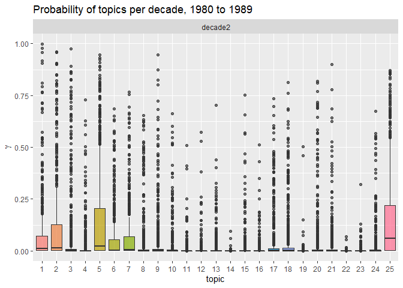
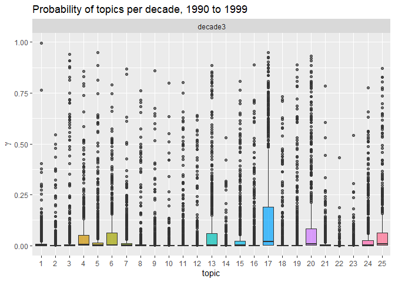
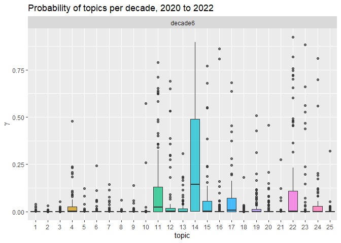

Final project; Data processing - Data Science for Linguists (LING 2340)
Fall 2022
================
Gianina Morales
12/15/2022

- <a href="#data-processing---part-3-final-report"
  id="toc-data-processing---part-3-final-report">Data processing - Part 3
  (final report)</a>
- <a href="#trends-over-decades" id="toc-trends-over-decades">Trends over
  decades</a>
  - <a href="#applying-a-new-method-structured-topic-models-stm"
    id="toc-applying-a-new-method-structured-topic-models-stm">Applying a
    new method: Structured Topic Models (STM)</a>
    - <a href="#topic-model" id="toc-topic-model">Topic model</a>
    - <a href="#results" id="toc-results">Results</a>
    - <a href="#analysis" id="toc-analysis">Analysis</a>

# Data processing - Part 3 (final report)

------------------------------------------------------------------------

``` r
library(tidytext)
library(tidyverse)
library(tm)
library(stopwords)
library(stringi)
library(topicmodels)
library(lda)
library(stm)
library(ldatuning)
library(rmarkdown)
library(kableExtra)
knitr::opts_chunk$set(fig.fullwidth=TRUE, fig.path = "../Images/Data_processes3/", cache=TRUE)
```

# Trends over decades

## Applying a new method: Structured Topic Models (STM)

**Preparing the data**

``` r
#Loading Rds with all the corpus
total_corpus <- read_rds("../Private/master_tidy_corpus.Rds")

# preparing data frame for topic modeling
total_corpus_sparse <- total_corpus %>% 
  mutate(document= paste(decade, id, sep= "_")) %>% 
# creating DTM
  count(document, word) %>% 
  cast_sparse(document,word,n)
```

### Topic model

``` r
set.seed(123)
topic_model_corpus <- stm(total_corpus_sparse, K=25)
```

    ## Beginning Spectral Initialization 
    ##   Calculating the gram matrix...
    ##   Using only 10000 most frequent terms during initialization...
    ##   Finding anchor words...
    ##      .........................
    ##   Recovering initialization...
    ##      ....................................................................................................
    ## Initialization complete.
    ## .....................................................................................................
    ## Completed E-Step (25 seconds). 
    ## Completed M-Step. 
    ## Completing Iteration 1 (approx. per word bound = -8.620) 
    ## .....................................................................................................
    ## Completed E-Step (28 seconds). 
    ## Completed M-Step. 
    ## Completing Iteration 2 (approx. per word bound = -8.014, relative change = 7.032e-02) 
    ## .....................................................................................................
    ## Completed E-Step (20 seconds). 
    ## Completed M-Step. 
    ## Completing Iteration 3 (approx. per word bound = -7.976, relative change = 4.661e-03) 
    ## .....................................................................................................
    ## Completed E-Step (23 seconds). 
    ## Completed M-Step. 
    ## Completing Iteration 4 (approx. per word bound = -7.962, relative change = 1.768e-03) 
    ## .....................................................................................................
    ## Completed E-Step (18 seconds). 
    ## Completed M-Step. 
    ## Completing Iteration 5 (approx. per word bound = -7.954, relative change = 9.880e-04) 
    ## Topic 1: grade, level, reading, students, scores 
    ##  Topic 2: test, subjects, passage, recall, study 
    ##  Topic 3: word, words, reading, children, letter 
    ##  Topic 4: writing, students, write, writers, classroom 
    ##  Topic 5: reading, text, comprehension, readers, students 
    ##  Topic 6: language, reading, research, skills, meaning 
    ##  Topic 7: reading, comprehension, scores, test, study 
    ##  Topic 8: words, word, vocabulary, reading, context 
    ##  Topic 9: children, language, writing, knowledge, reading 
    ##  Topic 10: reading, test, comprehension, factor, tests 
    ##  Topic 11: literacy, education, black, research, school 
    ##  Topic 12: language, english, students, reading, spanish 
    ##  Topic 13: story, children, stories, literature, reading 
    ##  Topic 14: language, children, students, literacy, school 
    ##  Topic 15: students, text, student, writing, teacher 
    ##  Topic 16: reading, research, strategies, literacy, knowledge 
    ##  Topic 17: teachers, teacher, students, teaching, literacy 
    ##  Topic 18: text, story, reading, readers, recall 
    ##  Topic 19: students, class, social, classroom, school 
    ##  Topic 20: children, literacy, reading, school, read 
    ##  Topic 21: reading, students, college, program, study 
    ##  Topic 22: literacy, social, practices, research, literacies 
    ##  Topic 23: texts, students, reading, literacy, books 
    ##  Topic 24: reading, children, instruction, read, teachers 
    ##  Topic 25: questions, students, reading, study, comprehension 
    ## .....................................................................................................
    ## Completed E-Step (19 seconds). 
    ## Completed M-Step. 
    ## Completing Iteration 6 (approx. per word bound = -7.949, relative change = 6.682e-04) 
    ## .....................................................................................................
    ## Completed E-Step (22 seconds). 
    ## Completed M-Step. 
    ## Completing Iteration 7 (approx. per word bound = -7.945, relative change = 4.900e-04) 
    ## .....................................................................................................
    ## Completed E-Step (18 seconds). 
    ## Completed M-Step. 
    ## Completing Iteration 8 (approx. per word bound = -7.942, relative change = 3.790e-04) 
    ## .....................................................................................................
    ## Completed E-Step (18 seconds). 
    ## Completed M-Step. 
    ## Completing Iteration 9 (approx. per word bound = -7.940, relative change = 2.932e-04) 
    ## .....................................................................................................
    ## Completed E-Step (21 seconds). 
    ## Completed M-Step. 
    ## Completing Iteration 10 (approx. per word bound = -7.938, relative change = 2.305e-04) 
    ## Topic 1: grade, reading, level, test, scores 
    ##  Topic 2: subjects, passage, recall, test, information 
    ##  Topic 3: word, words, reading, children, letter 
    ##  Topic 4: writing, students, write, writers, classroom 
    ##  Topic 5: text, reading, readers, comprehension, knowledge 
    ##  Topic 6: language, reading, research, learning, theory 
    ##  Topic 7: reading, comprehension, test, scores, variables 
    ##  Topic 8: words, word, vocabulary, reading, context 
    ##  Topic 9: children, language, writing, written, knowledge 
    ##  Topic 10: reading, test, comprehension, factor, rate 
    ##  Topic 11: literacy, education, black, research, school 
    ##  Topic 12: language, english, students, spanish, reading 
    ##  Topic 13: story, children, literature, stories, reading 
    ##  Topic 14: language, literacy, students, children, practices 
    ##  Topic 15: students, text, student, teacher, discussion 
    ##  Topic 16: reading, research, literacy, information, knowledge 
    ##  Topic 17: teachers, teacher, students, teaching, reading 
    ##  Topic 18: text, story, reading, readers, recall 
    ##  Topic 19: students, class, social, classroom, school 
    ##  Topic 20: children, literacy, reading, read, child 
    ##  Topic 21: reading, students, college, program, study 
    ##  Topic 22: literacy, social, practices, research, literacies 
    ##  Topic 23: texts, students, reading, literacy, books 
    ##  Topic 24: reading, children, instruction, students, read 
    ##  Topic 25: students, reading, questions, strategies, strategy 
    ## .....................................................................................................
    ## Completed E-Step (17 seconds). 
    ## Completed M-Step. 
    ## Completing Iteration 11 (approx. per word bound = -7.936, relative change = 1.857e-04) 
    ## .....................................................................................................
    ## Completed E-Step (19 seconds). 
    ## Completed M-Step. 
    ## Completing Iteration 12 (approx. per word bound = -7.935, relative change = 1.532e-04) 
    ## .....................................................................................................
    ## Completed E-Step (20 seconds). 
    ## Completed M-Step. 
    ## Completing Iteration 13 (approx. per word bound = -7.934, relative change = 1.295e-04) 
    ## .....................................................................................................
    ## Completed E-Step (17 seconds). 
    ## Completed M-Step. 
    ## Completing Iteration 14 (approx. per word bound = -7.933, relative change = 1.075e-04) 
    ## .....................................................................................................
    ## Completed E-Step (17 seconds). 
    ## Completed M-Step. 
    ## Completing Iteration 15 (approx. per word bound = -7.933, relative change = 9.266e-05) 
    ## Topic 1: grade, reading, test, level, scores 
    ##  Topic 2: subjects, recall, passage, test, information 
    ##  Topic 3: word, words, children, reading, letter 
    ##  Topic 4: writing, students, write, writers, classroom 
    ##  Topic 5: text, reading, readers, comprehension, knowledge 
    ##  Topic 6: reading, language, research, learning, theory 
    ##  Topic 7: reading, test, comprehension, scores, variables 
    ##  Topic 8: words, word, vocabulary, reading, context 
    ##  Topic 9: children, language, written, writing, text 
    ##  Topic 10: reading, comprehension, test, factor, rate 
    ##  Topic 11: literacy, education, black, research, critical 
    ##  Topic 12: language, english, students, spanish, reading 
    ##  Topic 13: story, children, literature, reading, stories 
    ##  Topic 14: literacy, language, students, practices, children 
    ##  Topic 15: students, student, teacher, text, discussion 
    ##  Topic 16: reading, research, literacy, information, knowledge 
    ##  Topic 17: teachers, teacher, students, teaching, reading 
    ##  Topic 18: story, text, reading, readers, retelling 
    ##  Topic 19: students, class, social, classroom, school 
    ##  Topic 20: children, literacy, reading, child, read 
    ##  Topic 21: reading, students, college, program, study 
    ##  Topic 22: literacy, social, practices, digital, literacies 
    ##  Topic 23: texts, literacy, students, reading, science 
    ##  Topic 24: reading, children, students, instruction, teachers 
    ##  Topic 25: students, reading, strategies, questions, instruction 
    ## .....................................................................................................
    ## Completed E-Step (18 seconds). 
    ## Completed M-Step. 
    ## Completing Iteration 16 (approx. per word bound = -7.932, relative change = 8.649e-05) 
    ## .....................................................................................................
    ## Completed E-Step (18 seconds). 
    ## Completed M-Step. 
    ## Completing Iteration 17 (approx. per word bound = -7.931, relative change = 7.686e-05) 
    ## .....................................................................................................
    ## Completed E-Step (17 seconds). 
    ## Completed M-Step. 
    ## Completing Iteration 18 (approx. per word bound = -7.931, relative change = 6.683e-05) 
    ## .....................................................................................................
    ## Completed E-Step (20 seconds). 
    ## Completed M-Step. 
    ## Completing Iteration 19 (approx. per word bound = -7.930, relative change = 6.039e-05) 
    ## .....................................................................................................
    ## Completed E-Step (17 seconds). 
    ## Completed M-Step. 
    ## Completing Iteration 20 (approx. per word bound = -7.930, relative change = 5.618e-05) 
    ## Topic 1: grade, test, reading, level, scores 
    ##  Topic 2: subjects, recall, passage, test, information 
    ##  Topic 3: word, words, children, reading, letter 
    ##  Topic 4: writing, students, write, writers, classroom 
    ##  Topic 5: text, reading, readers, comprehension, knowledge 
    ##  Topic 6: reading, language, research, learning, process 
    ##  Topic 7: reading, test, scores, comprehension, variables 
    ##  Topic 8: words, word, vocabulary, reading, context 
    ##  Topic 9: children, language, written, writing, text 
    ##  Topic 10: reading, comprehension, factor, test, rate 
    ##  Topic 11: literacy, education, black, research, critical 
    ##  Topic 12: language, english, students, spanish, bilingual 
    ##  Topic 13: children, story, literature, reading, book 
    ##  Topic 14: literacy, language, students, practices, school 
    ##  Topic 15: students, student, teacher, text, discussion 
    ##  Topic 16: reading, research, literacy, information, technology 
    ##  Topic 17: teachers, teacher, students, teaching, reading 
    ##  Topic 18: story, text, reading, readers, stories 
    ##  Topic 19: students, class, social, school, classroom 
    ##  Topic 20: children, literacy, reading, child, read 
    ##  Topic 21: reading, students, college, program, study 
    ##  Topic 22: literacy, social, practices, digital, literacies 
    ##  Topic 23: texts, literacy, students, reading, science 
    ##  Topic 24: reading, children, students, instruction, school 
    ##  Topic 25: students, reading, strategies, instruction, comprehension 
    ## .....................................................................................................
    ## Completed E-Step (16 seconds). 
    ## Completed M-Step. 
    ## Completing Iteration 21 (approx. per word bound = -7.929, relative change = 5.336e-05) 
    ## .....................................................................................................
    ## Completed E-Step (17 seconds). 
    ## Completed M-Step. 
    ## Completing Iteration 22 (approx. per word bound = -7.929, relative change = 4.693e-05) 
    ## .....................................................................................................
    ## Completed E-Step (20 seconds). 
    ## Completed M-Step. 
    ## Completing Iteration 23 (approx. per word bound = -7.929, relative change = 4.182e-05) 
    ## .....................................................................................................
    ## Completed E-Step (17 seconds). 
    ## Completed M-Step. 
    ## Completing Iteration 24 (approx. per word bound = -7.928, relative change = 3.910e-05) 
    ## .....................................................................................................
    ## Completed E-Step (16 seconds). 
    ## Completed M-Step. 
    ## Completing Iteration 25 (approx. per word bound = -7.928, relative change = 3.641e-05) 
    ## Topic 1: test, reading, grade, level, scores 
    ##  Topic 2: subjects, recall, passage, test, condition 
    ##  Topic 3: word, words, children, reading, letter 
    ##  Topic 4: writing, students, write, writers, classroom 
    ##  Topic 5: text, reading, readers, comprehension, knowledge 
    ##  Topic 6: reading, language, research, learning, process 
    ##  Topic 7: reading, test, scores, comprehension, variables 
    ##  Topic 8: words, word, vocabulary, context, reading 
    ##  Topic 9: children, language, written, writing, text 
    ##  Topic 10: reading, comprehension, factor, rate, test 
    ##  Topic 11: literacy, education, black, research, critical 
    ##  Topic 12: language, english, students, spanish, bilingual 
    ##  Topic 13: children, literature, story, reading, book 
    ##  Topic 14: literacy, language, students, practices, school 
    ##  Topic 15: students, student, teacher, text, discussion 
    ##  Topic 16: research, reading, literacy, information, technology 
    ##  Topic 17: teachers, teacher, students, teaching, literacy 
    ##  Topic 18: story, text, reading, stories, readers 
    ##  Topic 19: students, class, social, school, classroom 
    ##  Topic 20: children, literacy, reading, child, read 
    ##  Topic 21: reading, students, college, program, study 
    ##  Topic 22: literacy, social, practices, digital, literacies 
    ##  Topic 23: texts, literacy, students, reading, science 
    ##  Topic 24: reading, children, students, instruction, school 
    ##  Topic 25: students, reading, strategies, instruction, comprehension 
    ## .....................................................................................................
    ## Completed E-Step (18 seconds). 
    ## Completed M-Step. 
    ## Completing Iteration 26 (approx. per word bound = -7.928, relative change = 3.266e-05) 
    ## .....................................................................................................
    ## Completed E-Step (20 seconds). 
    ## Completed M-Step. 
    ## Completing Iteration 27 (approx. per word bound = -7.928, relative change = 3.281e-05) 
    ## .....................................................................................................
    ## Completed E-Step (15 seconds). 
    ## Completed M-Step. 
    ## Completing Iteration 28 (approx. per word bound = -7.927, relative change = 3.166e-05) 
    ## .....................................................................................................
    ## Completed E-Step (16 seconds). 
    ## Completed M-Step. 
    ## Completing Iteration 29 (approx. per word bound = -7.927, relative change = 3.093e-05) 
    ## .....................................................................................................
    ## Completed E-Step (20 seconds). 
    ## Completed M-Step (2 seconds). 
    ## Completing Iteration 30 (approx. per word bound = -7.927, relative change = 3.244e-05) 
    ## Topic 1: test, reading, grade, level, scores 
    ##  Topic 2: subjects, recall, passage, test, condition 
    ##  Topic 3: word, words, children, letter, reading 
    ##  Topic 4: writing, students, write, writers, classroom 
    ##  Topic 5: text, reading, comprehension, readers, knowledge 
    ##  Topic 6: reading, language, research, learning, process 
    ##  Topic 7: reading, scores, test, comprehension, significant 
    ##  Topic 8: words, word, vocabulary, context, reading 
    ##  Topic 9: children, language, written, writing, text 
    ##  Topic 10: reading, comprehension, factor, rate, test 
    ##  Topic 11: literacy, education, black, research, critical 
    ##  Topic 12: language, english, students, spanish, bilingual 
    ##  Topic 13: children, literature, reading, story, book 
    ##  Topic 14: literacy, students, practices, language, school 
    ##  Topic 15: students, student, teacher, text, discussion 
    ##  Topic 16: research, reading, literacy, information, technology 
    ##  Topic 17: teachers, teacher, students, teaching, literacy 
    ##  Topic 18: story, text, reading, stories, readers 
    ##  Topic 19: students, class, social, school, classroom 
    ##  Topic 20: children, literacy, reading, child, read 
    ##  Topic 21: reading, students, college, program, study 
    ##  Topic 22: literacy, social, practices, digital, literacies 
    ##  Topic 23: texts, literacy, students, reading, science 
    ##  Topic 24: reading, children, students, instruction, school 
    ##  Topic 25: students, reading, strategies, instruction, comprehension 
    ## .....................................................................................................
    ## Completed E-Step (18 seconds). 
    ## Completed M-Step. 
    ## Completing Iteration 31 (approx. per word bound = -7.927, relative change = 3.156e-05) 
    ## .....................................................................................................
    ## Completed E-Step (16 seconds). 
    ## Completed M-Step. 
    ## Completing Iteration 32 (approx. per word bound = -7.926, relative change = 2.946e-05) 
    ## .....................................................................................................
    ## Completed E-Step (15 seconds). 
    ## Completed M-Step. 
    ## Completing Iteration 33 (approx. per word bound = -7.926, relative change = 2.869e-05) 
    ## .....................................................................................................
    ## Completed E-Step (15 seconds). 
    ## Completed M-Step. 
    ## Completing Iteration 34 (approx. per word bound = -7.926, relative change = 2.853e-05) 
    ## .....................................................................................................
    ## Completed E-Step (14 seconds). 
    ## Completed M-Step. 
    ## Completing Iteration 35 (approx. per word bound = -7.926, relative change = 2.635e-05) 
    ## Topic 1: test, reading, grade, level, scores 
    ##  Topic 2: subjects, recall, condition, test, passage 
    ##  Topic 3: word, words, children, letter, reading 
    ##  Topic 4: writing, students, write, writers, classroom 
    ##  Topic 5: text, reading, knowledge, comprehension, readers 
    ##  Topic 6: reading, language, research, learning, process 
    ##  Topic 7: reading, scores, test, comprehension, significant 
    ##  Topic 8: words, word, vocabulary, context, knowledge 
    ##  Topic 9: children, language, written, writing, text 
    ##  Topic 10: reading, comprehension, factor, rate, test 
    ##  Topic 11: literacy, education, black, research, critical 
    ##  Topic 12: language, english, students, spanish, bilingual 
    ##  Topic 13: literature, children, reading, story, books 
    ##  Topic 14: literacy, practices, students, language, school 
    ##  Topic 15: students, student, teacher, discussion, text 
    ##  Topic 16: research, reading, literacy, information, technology 
    ##  Topic 17: teachers, teacher, students, teaching, literacy 
    ##  Topic 18: story, text, reading, stories, readers 
    ##  Topic 19: students, class, social, school, classroom 
    ##  Topic 20: children, literacy, reading, child, read 
    ##  Topic 21: reading, students, college, program, study 
    ##  Topic 22: literacy, social, practices, digital, research 
    ##  Topic 23: literacy, texts, students, science, reading 
    ##  Topic 24: reading, students, children, instruction, school 
    ##  Topic 25: reading, students, strategies, instruction, comprehension 
    ## .....................................................................................................
    ## Completed E-Step (14 seconds). 
    ## Completed M-Step. 
    ## Completing Iteration 36 (approx. per word bound = -7.926, relative change = 2.267e-05) 
    ## .....................................................................................................
    ## Completed E-Step (14 seconds). 
    ## Completed M-Step. 
    ## Completing Iteration 37 (approx. per word bound = -7.925, relative change = 2.112e-05) 
    ## .....................................................................................................
    ## Completed E-Step (14 seconds). 
    ## Completed M-Step. 
    ## Completing Iteration 38 (approx. per word bound = -7.925, relative change = 1.853e-05) 
    ## .....................................................................................................
    ## Completed E-Step (14 seconds). 
    ## Completed M-Step. 
    ## Completing Iteration 39 (approx. per word bound = -7.925, relative change = 1.716e-05) 
    ## .....................................................................................................
    ## Completed E-Step (17 seconds). 
    ## Completed M-Step. 
    ## Completing Iteration 40 (approx. per word bound = -7.925, relative change = 1.551e-05) 
    ## Topic 1: test, reading, grade, level, scores 
    ##  Topic 2: subjects, recall, condition, test, information 
    ##  Topic 3: word, words, children, letter, reading 
    ##  Topic 4: writing, students, write, writers, teacher 
    ##  Topic 5: text, reading, knowledge, comprehension, readers 
    ##  Topic 6: reading, research, language, learning, process 
    ##  Topic 7: reading, scores, test, comprehension, significant 
    ##  Topic 8: words, word, vocabulary, context, knowledge 
    ##  Topic 9: children, language, written, writing, text 
    ##  Topic 10: reading, comprehension, factor, rate, test 
    ##  Topic 11: literacy, education, black, research, critical 
    ##  Topic 12: language, english, students, spanish, bilingual 
    ##  Topic 13: literature, children, reading, books, book 
    ##  Topic 14: literacy, practices, students, language, school 
    ##  Topic 15: students, teacher, student, discussion, text 
    ##  Topic 16: research, reading, literacy, information, technology 
    ##  Topic 17: teachers, teacher, students, teaching, literacy 
    ##  Topic 18: story, text, reading, stories, readers 
    ##  Topic 19: students, class, social, school, classroom 
    ##  Topic 20: children, literacy, reading, child, read 
    ##  Topic 21: reading, students, college, program, study 
    ##  Topic 22: literacy, social, practices, digital, research 
    ##  Topic 23: literacy, texts, students, science, reading 
    ##  Topic 24: reading, students, children, instruction, school 
    ##  Topic 25: reading, students, strategies, instruction, comprehension 
    ## .....................................................................................................
    ## Completed E-Step (14 seconds). 
    ## Completed M-Step. 
    ## Completing Iteration 41 (approx. per word bound = -7.925, relative change = 1.578e-05) 
    ## .....................................................................................................
    ## Completed E-Step (14 seconds). 
    ## Completed M-Step. 
    ## Completing Iteration 42 (approx. per word bound = -7.925, relative change = 1.520e-05) 
    ## .....................................................................................................
    ## Completed E-Step (12 seconds). 
    ## Completed M-Step. 
    ## Completing Iteration 43 (approx. per word bound = -7.925, relative change = 1.705e-05) 
    ## .....................................................................................................
    ## Completed E-Step (12 seconds). 
    ## Completed M-Step. 
    ## Completing Iteration 44 (approx. per word bound = -7.924, relative change = 1.799e-05) 
    ## .....................................................................................................
    ## Completed E-Step (15 seconds). 
    ## Completed M-Step. 
    ## Completing Iteration 45 (approx. per word bound = -7.924, relative change = 1.714e-05) 
    ## Topic 1: test, reading, level, grade, scores 
    ##  Topic 2: subjects, recall, condition, test, information 
    ##  Topic 3: word, words, children, letter, reading 
    ##  Topic 4: writing, students, write, writers, teacher 
    ##  Topic 5: text, knowledge, reading, comprehension, readers 
    ##  Topic 6: reading, research, language, learning, process 
    ##  Topic 7: reading, scores, test, comprehension, significant 
    ##  Topic 8: words, word, vocabulary, context, knowledge 
    ##  Topic 9: children, language, written, writing, text 
    ##  Topic 10: reading, comprehension, factor, rate, read 
    ##  Topic 11: literacy, education, black, research, critical 
    ##  Topic 12: language, english, students, spanish, bilingual 
    ##  Topic 13: literature, reading, children, books, book 
    ##  Topic 14: literacy, practices, students, language, school 
    ##  Topic 15: students, teacher, student, discussion, text 
    ##  Topic 16: research, reading, literacy, information, technology 
    ##  Topic 17: teachers, teacher, students, teaching, literacy 
    ##  Topic 18: story, text, reading, stories, readers 
    ##  Topic 19: students, class, social, school, classroom 
    ##  Topic 20: children, literacy, reading, child, read 
    ##  Topic 21: reading, students, college, program, study 
    ##  Topic 22: literacy, social, practices, digital, research 
    ##  Topic 23: literacy, texts, students, science, reading 
    ##  Topic 24: reading, students, children, instruction, school 
    ##  Topic 25: reading, students, strategies, instruction, comprehension 
    ## .....................................................................................................
    ## Completed E-Step (12 seconds). 
    ## Completed M-Step. 
    ## Completing Iteration 46 (approx. per word bound = -7.924, relative change = 1.565e-05) 
    ## .....................................................................................................
    ## Completed E-Step (12 seconds). 
    ## Completed M-Step. 
    ## Completing Iteration 47 (approx. per word bound = -7.924, relative change = 1.624e-05) 
    ## .....................................................................................................
    ## Completed E-Step (14 seconds). 
    ## Completed M-Step. 
    ## Completing Iteration 48 (approx. per word bound = -7.924, relative change = 1.659e-05) 
    ## .....................................................................................................
    ## Completed E-Step (15 seconds). 
    ## Completed M-Step. 
    ## Completing Iteration 49 (approx. per word bound = -7.924, relative change = 1.608e-05) 
    ## .....................................................................................................
    ## Completed E-Step (16 seconds). 
    ## Completed M-Step. 
    ## Completing Iteration 50 (approx. per word bound = -7.924, relative change = 1.210e-05) 
    ## Topic 1: test, reading, level, grade, scores 
    ##  Topic 2: subjects, recall, condition, information, test 
    ##  Topic 3: word, words, children, letter, reading 
    ##  Topic 4: writing, students, write, writers, teacher 
    ##  Topic 5: text, knowledge, reading, comprehension, readers 
    ##  Topic 6: reading, research, language, learning, theory 
    ##  Topic 7: reading, scores, test, comprehension, significant 
    ##  Topic 8: words, word, vocabulary, context, knowledge 
    ##  Topic 9: children, language, written, writing, text 
    ##  Topic 10: reading, comprehension, factor, rate, read 
    ##  Topic 11: literacy, education, black, research, critical 
    ##  Topic 12: language, english, students, spanish, bilingual 
    ##  Topic 13: literature, reading, children, books, book 
    ##  Topic 14: literacy, practices, students, language, school 
    ##  Topic 15: students, teacher, student, discussion, classroom 
    ##  Topic 16: research, reading, literacy, information, technology 
    ##  Topic 17: teachers, teacher, students, teaching, literacy 
    ##  Topic 18: story, text, reading, stories, readers 
    ##  Topic 19: students, class, social, school, classroom 
    ##  Topic 20: children, literacy, reading, child, read 
    ##  Topic 21: reading, students, college, program, study 
    ##  Topic 22: literacy, social, practices, digital, research 
    ##  Topic 23: literacy, texts, students, science, reading 
    ##  Topic 24: reading, students, children, instruction, school 
    ##  Topic 25: reading, students, instruction, strategies, comprehension 
    ## .....................................................................................................
    ## Completed E-Step (15 seconds). 
    ## Completed M-Step. 
    ## Completing Iteration 51 (approx. per word bound = -7.924, relative change = 1.169e-05) 
    ## .....................................................................................................
    ## Completed E-Step (14 seconds). 
    ## Completed M-Step. 
    ## Completing Iteration 52 (approx. per word bound = -7.924, relative change = 1.145e-05) 
    ## .....................................................................................................
    ## Completed E-Step (15 seconds). 
    ## Completed M-Step. 
    ## Completing Iteration 53 (approx. per word bound = -7.923, relative change = 1.153e-05) 
    ## .....................................................................................................
    ## Completed E-Step (17 seconds). 
    ## Completed M-Step. 
    ## Completing Iteration 54 (approx. per word bound = -7.923, relative change = 1.082e-05) 
    ## .....................................................................................................
    ## Completed E-Step (18 seconds). 
    ## Completed M-Step. 
    ## Model Converged

``` r
#Summary
summary(topic_model_corpus)
```

    ## A topic model with 25 topics, 3157 documents and a 131328 word dictionary.

    ## Topic 1 Top Words:
    ##       Highest Prob: test, reading, level, grade, scores, cloze, tests 
    ##       FREX: drp, cloze, doze, readability, bormuth, formula, deletion 
    ##       Lift: adajji, adaptalioli, ajjfjraisal, akelrod, allegany, allert, barbati 
    ##       Score: cloze, drp, readability, bormuth, rauding, doze, passage 
    ## Topic 2 Top Words:
    ##       Highest Prob: subjects, recall, condition, information, test, passage, effect 
    ##       FREX: retention, experiment, adjunct, condition, rothkopf, encoding, organizer 
    ##       Lift: bisbicos, blandford, bpermission, effectivenss, garmezy, grodps, holborn 
    ##       Score: frase, latencies, passage, subjects, experimenter, notetaking, lookback 
    ## Topic 3 Top Words:
    ##       Highest Prob: word, words, children, letter, reading, spelling, letters 
    ##       FREX: dst, phoneme, phonemes, spellings, segmentation, ehri, orthographic 
    ##       Lift: pizillo, alluisi, pemtad, cattel, davelaar, nonhomophonous, intuitable 
    ##       Score: phonological, phoneme, orthographic, spelling, nonwords, phonemes, vowel 
    ## Topic 4 Top Words:
    ##       Highest Prob: writing, students, write, writers, teacher, classroom, writer 
    ##       FREX: writers, writing, lois, draft, writer, poetry, workshop 
    ##       Lift: ahout, alllevels, arsons, atiitude, boardst, bombastic, cardboards 
    ##       Score: writing, psts, lois, ella, neuroqueer, micah, peer 
    ## Topic 5 Top Words:
    ##       Highest Prob: text, knowledge, reading, comprehension, information, readers, passage 
    ##       FREX: expository, propositions, kintsch, schemata, recalls, dijk, propositional 
    ##       Lift: lanes, supertankers, misidentifications, suvr, xm, xplicitly, inferrable 
    ##       Score: text, kintsch, passage, comprehension, expository, recall, predicates 
    ## Topic 6 Top Words:
    ##       Highest Prob: reading, research, language, learning, theory, process, meaning 
    ##       FREX: metaphor, metaphors, philosophy, figurative, intellect, philosophical, logic 
    ##       Lift: stankiewicz, unifunctionality, maley, baskwill, brountas, graystone, gadfly 
    ##       Score: metaphors, delacato, metaphor, tzu, nrc, language, percussion 
    ## Topic 7 Top Words:
    ##       Highest Prob: reading, scores, test, comprehension, significant, grade, variables 
    ##       FREX: regression, predictors, auditory, predictor, mrt, sex, subtest 
    ##       Lift: cookson, develojjment, nonachiever, nondeprived, staps, leptokurtic, porterfield 
    ##       Score: regression, correlations, subtest, variables, mrt, scores, comprehension 
    ## Topic 8 Top Words:
    ##       Highest Prob: words, word, vocabulary, knowledge, context, students, meaning 
    ##       FREX: decodable, nagy, decodability, seaver, vocabulary, clue, mckeown 
    ##       Lift: negativeness, shanks, deighton, capcup, frew, haspiel, iable 
    ##       Score: vocabulary, nagy, decodable, words, word, morphological, decodability 
    ## Topic 9 Top Words:
    ##       Highest Prob: language, children, written, writing, text, reading, sentence 
    ##       FREX: cava, cohesive, anaphora, hasan, radicals, clause, dialect 
    ##       Lift: latinate, deletable, herdan, infinitival, pinched, rentell, ijj 
    ##       Score: anaphora, radicals, syntactic, sulzby, connectives, lexical, cava 
    ## Topic 10 Top Words:
    ##       Highest Prob: reading, comprehension, factor, rate, read, test, research 
    ##       FREX: loadings, fixation, prosody, scanning, loading, audal, loaded 
    ##       Lift: defectiveness, alshan, reminiscence, accoustical, articulators, boor, certainlyfeel 
    ##       Score: fixation, loadings, rauding, fixations, reading, audal, comprehension 
    ## Topic 11 Top Words:
    ##       Highest Prob: literacy, education, black, research, critical, school, white 
    ##       FREX: ubuntu, layla, rajon, colonia, avenae, blackness, tenure 
    ##       Lift: fg, avers, codwell, derprivileged, dicapped, domij, elligence 
    ##       Score: racism, whiteness, blackness, literacy, layla, ubuntu, freire 
    ## Topic 12 Top Words:
    ##       Highest Prob: language, english, students, spanish, bilingual, reading, literacy 
    ##       FREX: cognates, jamilet, dlbs, esl, bilinguals, biliteracy, bilingual 
    ##       Lift: arsenian, eames, montes, ortego, thonis, prasad, ianco 
    ##       Score: translanguaging, bilingual, spanish, biliteracy, esl, bilinguals, cognates 
    ## Topic 13 Top Words:
    ##       Highest Prob: literature, reading, children, books, book, story, read 
    ##       FREX: literary, rosenblatt, sadako, aesthetic, fiction, nancy, reggie 
    ##       Lift: brocki, btt, carriar, categroes, dellerup, fadar, ffy 
    ##       Score: sadako, mikey, literary, story, aesthetic, books, characters 
    ## Topic 14 Top Words:
    ##       Highest Prob: literacy, practices, students, language, school, cultural, research 
    ##       FREX: rukai, vanesa, fabiola, ariana, htoo, pts, refugee 
    ##       Lift: fung, cheche, fronteras, konnen, sonora, trilingual, yaqui 
    ##       Score: rukai, pts, literacies, transnational, identities, vanesa, immigrant 
    ## Topic 15 Top Words:
    ##       Highest Prob: students, teacher, student, discussion, classroom, text, learning 
    ##       FREX: argumentation, scaffolding, nystrand, mei, cmc, sided, arguments 
    ##       Lift: brip, brlp, btxnr, compwison, differepces, feproduction, flrost 
    ##       Score: students, cmc, mei, talk, collaborative, scts, ivanna 
    ## Topic 16 Top Words:
    ##       Highest Prob: research, reading, literacy, information, technology, online, studies 
    ##       FREX: dyslexia, reinking, internet, electronic, hypertext, hypermedia, web 
    ##       Lift: ethnographi, datasets, entist, futurists, isaacson, kurzweil, onference 
    ##       Score: internet, hypertext, dyslexia, online, literacy, literacies, coiro 
    ## Topic 17 Top Words:
    ##       Highest Prob: teachers, teacher, students, teaching, literacy, reading, research 
    ##       FREX: preservice, coaching, portfolio, coaches, portfolios, coach, interns 
    ##       Lift: acapulco, rce, spicuous, curreht, domipant, inciuded, inductee 
    ##       Score: preservice, teachers, coaching, teacher, portfolio, coaches, portfolios 
    ## Topic 18 Top Words:
    ##       Highest Prob: story, text, reading, stories, readers, reader, retelling 
    ##       FREX: importations, retelling, miscue, retellings, miscues, glenn, burglar 
    ##       Lift: graphophonically, episodically, gomprehension, likeways, passmore, scheffes, batons 
    ##       Score: story, importations, miscue, retelling, miscues, stories, retellings 
    ## Topic 19 Top Words:
    ##       Highest Prob: students, class, social, school, classroom, girls, gender 
    ##       FREX: antwan, queer, camilo, desuna, masculinity, masculinities, gendered 
    ##       Lift: monrovia, whitehorse, nyul, abelard, homosexuals, petrovitch, dirk 
    ##       Score: antwan, feminist, queer, discourses, masculinity, kyles, desuna 
    ## Topic 20 Top Words:
    ##       Highest Prob: children, literacy, reading, child, read, parents, school 
    ##       FREX: mothers, teale, parent, storybook, parents, lses, maternal 
    ##       Lift: assmptions, davidsons, hantman, housekeep, kasele, noveias, phlets 
    ##       Score: literacy, children, lses, mothers, hses, storybook, sulzby 
    ## Topic 21 Top Words:
    ##       Highest Prob: reading, students, college, program, study, university, skills 
    ##       FREX: microfilms, freshmen, counseling, tutors, colleges, arbor, abe 
    ##       Lift: ahya, ambic, amman, caliphes, ciancolo, commandos, conquerer 
    ##       Score: nrc, tutors, bliesmer, microfilms, abe, mich, freshmen 
    ## Topic 22 Top Words:
    ##       Highest Prob: literacy, social, practices, digital, research, literacies, multimodal 
    ##       FREX: digitalk, barad, noriah, domiana, koral, larnee, pbi 
    ##       Lift: acu, afirewall, akrich, andover, antifiction, antitechnology, basedclassrooms 
    ##       Score: multimodal, literacies, digital, nigel, noriah, domiana, barad 
    ## Topic 23 Top Words:
    ##       Highest Prob: literacy, texts, students, science, reading, content, visual 
    ##       FREX: jazmin, stefinia, diegetic, ngss, cmp, csi, punk 
    ##       Lift: cmp, hunchback, merla, dishonesty, borasi, medals, rembrandt 
    ##       Score: ccss, punk, disciplinary, csi, literacy, oswald, stefinia 
    ## Topic 24 Top Words:
    ##       Highest Prob: reading, students, children, instruction, school, grade, teachers 
    ##       FREX: cacy, uency, flp, recovery, slavin, allington, sbe 
    ##       Lift: beckerman, chfld, currin, harnishchfeger, ione, terobserver, theproject 
    ##       Score: reading, uency, basal, flp, cacy, strs, sfa 
    ## Topic 25 Top Words:
    ##       Highest Prob: reading, students, instruction, strategies, comprehension, strategy, study 
    ##       FREX: metacognitive, monitoring, strategy, metacognition, strategies, roehler, posttest 
    ##       Lift: cquld, establislied, histruction, insulator, stereoscope, totaj, abilties 
    ##       Score: posttest, comprehension, students, metacomprehension, pretest, metacognitive, drta

``` r
#Ranking of topics
topics_rank <- plot(topic_model_corpus, "summary", n=5, text.cex= 0.6, main= "Topic shares of the entire corpus", xlab= "estimated share of topics")
```

<!-- -->

### Results

**1. Beta metric**

Top probability words by topic

``` r
#topic- word probability
betaSTM <- tidy(topic_model_corpus, matrix ="beta") %>% 
  group_by(topic) %>% 
  slice_max(beta, n=50) %>% 
  arrange(-beta) %>% 
  mutate(rank= row_number()) %>% 
  ungroup() %>% 
  select(-beta) %>%
  arrange(topic) %>% 
  pivot_wider(names_from = "topic", 
              names_glue = "topic {.name}",
              values_from = "term") %>% 
    select(-rank)
knitr::kable(betaSTM , options = list(rows.print=20))
```

| topic 1       | topic 2       | topic 3       | topic 4     | topic 5       | topic 6       | topic 7       | topic 8       | topic 9       | topic 10      | topic 11    | topic 12        | topic 13      | topic 14    | topic 15      | topic 16      | topic 17      | topic 18      | topic 19     | topic 20     | topic 21      | topic 22     | topic 23     | topic 24      | topic 25      |
|:--------------|:--------------|:--------------|:------------|:--------------|:--------------|:--------------|:--------------|:--------------|:--------------|:------------|:----------------|:--------------|:------------|:--------------|:--------------|:--------------|:--------------|:-------------|:-------------|:--------------|:-------------|:-------------|:--------------|:--------------|
| test          | subjects      | word          | writing     | text          | reading       | reading       | words         | language      | reading       | literacy    | language        | literature    | literacy    | students      | research      | teachers      | story         | students     | children     | reading       | literacy     | literacy     | reading       | reading       |
| reading       | recall        | words         | students    | knowledge     | research      | scores        | word          | children      | comprehension | education   | english         | reading       | practices   | teacher       | reading       | teacher       | text          | class        | literacy     | students      | social       | texts        | students      | students      |
| level         | condition     | children      | write       | reading       | language      | test          | vocabulary    | written       | factor        | black       | students        | children      | students    | student       | literacy      | students      | reading       | social       | reading      | college       | practices    | students     | children      | instruction   |
| grade         | information   | letter        | writers     | comprehension | learning      | comprehension | knowledge     | writing       | rate          | research    | spanish         | books         | language    | discussion    | information   | teaching      | stories       | school       | child        | program       | digital      | science      | instruction   | strategies    |
| scores        | test          | reading       | teacher     | information   | theory        | significant   | context       | text          | read          | critical    | bilingual       | book          | school      | classroom     | technology    | literacy      | readers       | classroom    | read         | study         | research     | reading      | school        | comprehension |
| cloze         | passage       | spelling      | classroom   | readers       | process       | grade         | students      | reading       | test          | school      | reading         | story         | cultural    | text          | online        | reading       | reader        | girls        | parents      | university    | literacies   | content      | grade         | strategy      |
| tests         | effect        | letters       | writer      | passage       | meaning       | variables     | meaning       | sentence      | research      | white       | literacy        | read          | research    | learning      | studies       | research      | retelling     | gender       | school       | skills        | multimodal   | visual       | teachers      | study         |
| passage       | effects       | readers       | wrote       | students      | educational   | achievement   | reading       | sentences     | factors       | policy      | languages       | text          | social      | talk          | computer      | learning      | comprehension | literacy     | home         | programs      | space        | text         | level         | questions     |
| passages      | questions     | sound         | process     | recall        | press         | study         | instruction   | linguistic    | fluency       | people      | esl             | students      | community   | questions     | internet      | school        | read          | research     | language     | student       | world        | culture      | read          | research      |
| items         | experiment    | read          | written     | structure     | reader        | ability       | learning      | oral          | speed         | american    | research        | response      | education   | knowledge     | national      | student       | miscues       | time         | book         | adult         | practice     | social       | schools       | teacher       |
| students      | learning      | awareness     | teachers    | main          | example       | measures      | study         | child         | analysis      | social      | instruction     | literary      | identity    | research      | researchers   | instruction   | children      | people       | books        | education     | school       | school       | research      | instructional |
| difficulty    | study         | phonological  | student     | texts         | model         | differences   | meanings      | syntactic     | eye           | educational | learners        | responses     | english     | discussions   | journal       | classroom     | structure     | power        | print        | materials     | learning     | disciplinary | literacy      | learning      |
| comprehension | sentences     | grade         | research    | prior         | system        | readers       | frequency     | structure     | oral          | schools     | education       | readers       | critical    | class         | study         | education     | analysis      | boys         | family       | course        | analysis     | popular      | teacher       | student       |
| word          | sentence      | task          | time        | idea          | models        | children      | children      | development   | readers       | race        | learning        | reader        | learning    | study         | knowledge     | preservice    | recall        | discourse    | learning     | school        | texts        | teachers     | achievement   | training      |
| levels        | readers       | child         | study       | expository    | knowledge     | skills        | research      | research      | items         | african     | children        | stories       | children    | teachers      | education     | study         | miscue        | identity     | study        | nrc           | media        | language     | time          | read          |
| readability   | memory        | recognition   | audience    | passages      | terms         | analysis      | teaching      | knowledge     | time          | students    | school          | study         | identities  | social        | dyslexia      | data          | study         | own          | development  | dissertation  | meaning      | mathematics  | development   | task          |
| words         | journal       | study         | own         | ideas         | york          | results       | taught        | semantic      | reader        | community   | linguistic      | characters    | experiences | texts         | data          | practice      | meaning       | women        | writing      | training      | people       | study        | program       | text          |
| table         | conditions    | sounds        | poetry      | content       | university    | performance   | text          | study         | data          | cultural    | speaking        | texts         | culturally  | analysis      | learning      | development   | research      | cultural     | classroom    | time          | critical     | analysis     | classroom     | subjects      |
| item          | results       | phoneme       | peer        | questions     | systems       | level         | list          | structures    | tests         | women       | native          | teacher       | practice    | discourse     | articles      | course        | based         | practices    | activities   | found         | video        | read         | student       | self          |
| study         | significant   | knowledge     | children    | level         | development   | research      | analysis      | discourse     | word          | national    | study           | teachers      | family      | thinking      | search        | knowledge     | goodman       | york         | research     | academic      | spaces       | research     | assessment    | teachers      |
| ability       | time          | learning      | school      | study         | social        | mean          | using         | texts         | study         | issues      | development     | york          | culture     | data          | analysis      | professional  | narrative     | reading      | teacher      | research      | time         | critical     | motivation    | information   |
| subjects      | processing    | orthographic  | teaching    | topic         | cognitive     | variance      | sentence      | speech        | accuracy      | racial      | proficiency     | character     | literacies  | information   | readers       | time          | retellings    | read         | mother       | read          | data         | art          | study         | control       |
| score         | psychology    | beginning     | language    | research      | experience    | tests         | language      | english       | variables     | public      | speakers        | picture       | study       | evidence      | text          | experiences   | aloud         | life         | knowledge    | learning      | cultural     | example      | skills        | readers       |
| results       | verbal        | print         | class       | reader        | view          | score         | unknown       | words         | ability       | racism      | studies         | personal      | knowledge   | ideas         | based         | beliefs       | elements      | discussion   | play         | journal       | online       | learning     | classrooms    | question      |
| data          | task          | visual        | ideas       | grade         | practice      | measure       | read          | grade         | information   | york        | grade           | own           | teachers    | meaning       | web           | content       | texts         | press        | time         | test          | education    | york         | instructional | time          |
| responses     | experimental  | ability       | story       | subjects      | context       | table         | target        | features      | level         | political   | chinese         | questions     | class       | support       | conference    | practices     | information   | study        | families     | level         | youth        | adolescent   | low           | children      |
| mean          | prose         | phonemic      | social      | read          | approach      | relationship  | definition    | lexical       | critical      | university  | journal         | understanding | communities | reading       | students      | teach         | imagery       | talk         | parent       | doctoral      | university   | education    | intervention  | performance   |
| procedure     | subject       | errors        | data        | propositions  | processes     | poor          | table         | grammatical   | measure       | power       | academic        | grade         | classroom   | understanding | instruction   | university    | response      | critical     | written      | instruction   | students     | standards    | support       | treatment     |
| performance   | control       | tasks         | workshop    | narrative     | paper         | variable      | nagy          | analysis      | listening     | children    | code            | experience    | youth       | based         | educational   | based         | written       | american     | emergent     | educational   | participants | instruction  | based         | responses     |
| testing       | reading       | development   | composing   | explicit      | teaching      | significantly | responses     | level         | measures      | teachers    | student         | research      | analysis    | question      | participants  | instructional | oral          | self         | data         | courses       | studies      | studies      | educational   | knowledge     |
| using         | question      | decoding      | learning    | poor          | particular    | journal       | example       | task          | silent        | press       | speak           | discussion    | teacher     | content       | using         | program       | language      | literature   | social       | improvement   | text         | media        | readers       | monitoring    |
| materials     | context       | level         | author      | children      | understanding | experimental  | acquisition   | meaning       | attitude      | researchers | oral            | meaning       | people      | time          | comprehension | class         | using         | experiences  | write        | adults        | press        | knowledge    | text          | metacognitive |
| school        | retention     | responses     | words       | units         | human         | vocabulary    | school        | dialect       | skills        | teaching    | biliteracy      | author        | linguistic  | inquiry       | yearbook      | process       | events        | texts        | events       | teaching      | york         | multiple     | education     | ability       |
| average       | semantic      | vowel         | conference  | ability       | sense         | age           | instructional | cohesive      | flexibility   | standards   | strategies      | world         | studies     | engagement    | content       | experience    | table         | personal     | interactions | english       | activity     | game         | basal         | teaching      |
| form          | differences   | spellings     | english     | type          | own           | subjects      | found         | information   | university    | society     | read            | narrative     | discourse   | topic         | eds           | own           | readings      | analysis     | mothers      | basic         | design       | practices    | books         | skills        |
| errors        | analysis      | correct       | paper       | found         | instruction   | regression    | phonics       | form          | words         | life        | cultural        | talk          | teaching    | example       | literacies    | curriculum    | grammar       | discourses   | help         | reported      | community    | readers      | programs      | using         |
| research      | material      | developmental | classrooms  | importance    | individual    | studies       | clues         | school        | students      | educators   | knowledge       | fiction       | american    | instructional | hypertext     | national      | results       | identities   | words        | content       | technology   | curriculum   | self          | grade         |
| measure       | educational   | training      | composition | effects       | set           | visual        | decodable     | forms         | process       | world       | teachers        | life          | contexts    | context       | texts         | assessment    | understanding | world        | activity     | classes       | writing      | history      | language      | results       |
| read          | type          | name          | self        | types         | behavior      | correlations  | sight         | character     | item          | culture     | translanguaging | time          | texts       | interaction   | skills        | change        | effects       | issues       | adult        | national      | bodies       | book         | levels        | content       |
| choice        | passages      | table         | authors     | discourse     | basic         | learning      | definitions   | content       | results       | own         | monolingual     | analysis      | families    | interactions  | review        | methods       | character     | language     | story        | junior        | study        | world        | effects       | based         |
| material      | research      | research      | revision    | studies       | theoretical   | sample        | series        | patterns      | measurement   | communities | classroom       | experiences   | university  | video         | related       | schools       | perspective   | teachers     | example      | evaluation    | visual       | arts         | national      | test          |
| multiple      | materials     | syllable      | peers       | analysis      | nature        | development   | studies       | understanding | scale         | action      | bilinguals      | child         | diverse     | teaching      | example       | participants  | units         | teacher      | related      | job           | human        | images       | learning      | practice      |
| difficult     | significantly | initial       | journal     | significant   | complex       | treatment     | grade         | university    | studies       | color       | minority        | example       | data        | classrooms    | electronic    | questions     | found         | community    | experiences  | tutors        | global       | literacies   | assessments   | tasks         |
| total         | words         | response      | conferences | question      | researchers   | educational   | anderson      | differences   | individual    | lives       | awareness       | school        | pts         | instruction   | strategies    | classrooms    | university    | feminist     | day          | international | theory       | national     | grades        | experimental  |
| error         | comprehension | phonemes      | grade       | anderson      | thinking      | effects       | learn         | based         | validity      | self        | writing         | people        | press       | using         | association   | analysis      | ratings       | data         | class        | class         | action       | journal      | data          | cognitive     |
| correct       | interaction   | subjects      | stories     | effect        | learn         | school        | contextual    | verb          | correlations  | scholars    | american        | stance        | immigrant   | argument      | found         | reflection    | process       | participants | kindergarten | studies       | tools        | adolescents  | child         | posttest      |
| differences   | read          | test          | piece       | results       | studies       | correlation   | decoding      | related       | efficiency    | stories     | words           | little        | discourses  | participation | issues        | conference    | stein         | student      | learn        | community     | resources    | using        | journal       | brown         |
| scale         | recognition   | alphabet      | using       | recalled      | education     | factors       | english       | found         | theory        | united      | national        | discussions   | power       | conversation  | journals      | field         | eds           | university   | own          | material      | identity     | english      | elementary    | feedback      |
| significant   | performance   | frequency     | experiences | table         | eds           | model         | method        | quality       | fixation      | adult       | bilingualism    | english       | own         | task          | read          | journal       | inferences    | discussions  | questions    | objectives    | composing    | design       | fluency       | effective     |
| analysis      | studies       | phonetic      | poem        | schema        | science       | effect        | morphological | categories    | material      | change      | using           | aesthetic     | journal     | comments      | time          | lesson        | importance    | space        | talk         | achievement   | body         | discourse    | practices     | answer        |

**2. FREX**

FREX is a matrix that presents a balance between words that are frequent
in probability but exclusive to the topic of interest.

``` r
#FREX metric
devtools::install_github("juliasilge/tidytext")
frexSTM <- tidy(topic_model_corpus, matrix= "frex")%>% 
  group_by(topic) %>% 
  slice_head(n=20) %>% 
  mutate(rank= row_number()) %>% 
  ungroup() %>% 
  pivot_wider(names_from = "topic", 
              names_glue = "topic {.name}",
              values_from = "term") %>% 
    select(-rank)
knitr::kable(frexSTM, options = list(rows.print=20))
```

| topic 1       | topic 2        | topic 3         | topic 4       | topic 5     | topic 6    | topic 7          | topic 8     | topic 9         | topic 10       | topic 11        | topic 12          | topic 13       | topic 14       | topic 15     | topic 16        | topic 17       | topic 18          | topic 19    | topic 20    | topic 21        | topic 22      | topic 23        | topic 24     | topic 25        |
|:--------------|:---------------|:----------------|:--------------|:------------|:-----------|:-----------------|:------------|:----------------|:---------------|:----------------|:------------------|:---------------|:---------------|:-------------|:----------------|:---------------|:------------------|:------------|:------------|:----------------|:--------------|:----------------|:-------------|:----------------|
| aunt          | goodlad        | charged         | bisbicos      | absolute    | converting | probed           | spellers    | distinctiveness | lookback       | apprenticeships | conceptually      | woke           | sustains       | hegemonic    | italics         | mosley         | canagarajah       | revrac      | uence       | negroes         | laminated     | compile         | marketplace  | semesters       |
| configuration | probed         | certification   | initiation    | alternately | pulls      | grass            | stolen      | market          | whites         | restore         | alternatively     | clinton        | hagood         | invisible    | basing          | doc            | mine              | siegel      | het         | backward        | lenging       | corestandards   | phonology    | catego          |
| joan          | necessitates   | premise         | carrier       | prominence  | winds      | dashed           | rationales  | occasional      | waiting        | audiotapes      | tenth             | metaphorically | toy            | journalism   | populated       | claiming       | translating       | dyad        | cheating    | arman           | reactors      | scheffe         | nacke        | baquedano       |
| spark         | distracting    | bottle          | punctuated    | fabiola     | chen       | rrq              | wheels      | covington       | friendly       | jastak          | calgary           | beloved        | edp            | isaiah       | reggie          | inn            | misunderstandings | niche       | attest      | biliterate      | prioritizing  | assigning       | subsection   | identifications |
| steve         | ndrt           | eleanor         | photos        | talbot      | jail       | homeless         | murphy      | maloch          | contextualize  | bully           | impression        | camps          | brice          | blanket      | asterisk        | popham         | walls             | punish      | delight     | derrida         | semiosis      | emails          | stratum      | finishing       |
| credited      | dear           | neisser         | obstacles     | undertook   | thrust     | aren             | coker       | plete           | acceptability  | uncritically    | imagined          | simulation     | cluded         | seas         | discriminant    | underline      | tacit             | mobility    | artley      | wasted          | sanitation    | compound        | bart         | hartley         |
| armbruster    | andre          | raciolinguistic | announcements | navigation  | button     | nant             | laura       | merriam         | acuity         | banner          | fer               | vacuum         | interim        | nomic        | joshi           | misinterpreted | operating         | cookie      | marsh       | federation      | transcending  | interacted      | typographic  | fe              |
| bernhardt     | conceptualize  | distractions    | physics       | invisible   | demoe      | reminiscent      | teeth       | collapsing      | brandts        | castle          | rape              | certified      | cattell        | schneider    | poet            | enculturation  | continent         | filtered    | dramatized  | ruby            | triadic       | malleable       | transparent  | ubiquitous      |
| dying         | lenses         | inequitable     | schmidt       | slavin      | disruption | mono             | mc          | authoritative   | collectively   | pipeline        | carlos            | matic          | depended       | grove        | dear            | grappled       | operate           | renewal     | trainer     | stat            | believable    | analogies       | blanks       | river           |
| bryan         | violation      | focussed        | victoria      | lowercase   | fearful    | cities           | threads     | bite            | tacitly        | employers       | exchanging        | brainstorming  | cronbach       | doris        | seas            | lesaux         | offices           | wh          | sessment    | mcconkie        | womanhood     | fathers         | endeavor     | den             |
| walkerdine    | transcriptions | ery             | havior        | cedures     | gaitan     | baldwin          | meek        | solidarity      | sym            | quadrants       | layered           | ensued         | diagram        | protagonist  | hobby           | imaginative    | banneker          | lawyers     | caption     | appreciably     | skinny        | pronunciations  | situate      | possessing      |
| belenky       | navigating     | pssa            | credence      | valuing     | avid       | tu               | anxious     | craik           | apprenticeship | mildly          | crane             | fused          | surpassed      | wetzel       | lary            | displacement   | cells             | tangential  | audiovisual | towre           | lor           | permits         | arithmetic   | tier            |
| konopak       | injustices     | semiotics       | piaget        | darling     | barnitz    | underrepresented | productions | woodson         | recruited      | legitimized     | surprised         | trusting       | fans           | nokes        | pigs            | chick          | suf               | foils       | alton       | impose          | gonzalez      | lever           | hurley       | silly           |
| paso          | hagen          | hyosun          | exclaimed     | excited     | arriving   | sb               | butter      | conjunctive     | oliver         | marxism         | heal              | higgins        | strongest      | ently        | technologically | activism       | aim               | spain       | etal        | corollary       | trilogy       | causing         | schwa        | colleen         |
| parametric    | trt            | instantiation   | recast        | storybooks  | shouted    | disagree         | trast       | lester          | permission     | chen            | recontextualizing | aera           | disturbance    | coal         | explorers       | unison         | finnish           | latent      | slavery     | nuances         | polished      | lewin           | deficiencies | creatively      |
| lucy          | susceptible    | academics       | supervisors   | devel       | breathing  | encourages       | instantly   | secured         | abc            | poignant        | kleifgen          | rape           | transmediation | deficiencies | dutro           | satv           | missouri          | admitting   | cairney     | curriculums     | multiliterate | brook           | northern     | edumetric       |
| assistants    | roy            | rear            | lyzed         | novices     | closure    | semesters        | prepares    | husband         | shelby         | seidman         | subdivided        | tester         | trope          | atwell       | chunks          | playground     | dev               | newell      | und         | constrain       | filed         | correspondingly | copied       | arguing         |
| grad          | cool           | humanizing      | brightman     | northeast   | nexus      | vera             | pacheco     | dustin          | travers        | playful         | drugs             | shocked        | sketching      | listens      | disseminate     | scotland       | graduation        | hoff        | reed        | sponsoring      | empiricism    | brick           | yekovich     | rosenshine      |
| sing          | cleary         | brings          | katz          | clubs       | rosenthal  | operation        | fourths     | simpson         | rounded        | shield          | valdes            | burn           | normativity    | loaded       | maintenance     | wellington     | rime              | dered       | longing     | salary          | remixing      | passing         | shade        | aims            |
| kenny         | narration      | sociolinguistic | posthumanist  | alice       | yesterday  | rhodes           | unlock      | soul            | milliseconds   | bullet          | corr              | fulfilled      | coexist        | employment   | jeremy          | suspense       | walter            | selectivity | fires       | predispositions | gardens       | crest           | subjected    | sequenced       |

Useful only in some cases. Sometimes the words are related to authors.

I applied also the Lift metric (words calculated by dividing the
topic-word distributionbeta by the word count probability distribution
in each topic), but the result were not very useful because of the
amount of words from other languages and names without format included.

### Analysis

**1. Topics named**

Considering the words in each metric, I analyzed the topics
qualitatively, comparing the results from STM with my results by decade
with the LDA method. My identification of topics is in the table.

``` r
#Loading Rds with my qualitative identification of STM topics
STM_topics <- read_csv("../Private/all_topics.csv")
```

    ## New names:
    ## Rows: 25 Columns: 4
    ##  Column specification
    ##  Delimiter: "," chr
    ## (4): Topic_names, STM_topic, Change_over_time, ...4
    ##  Use `spec()` to retrieve the full column specification for this data. 
    ## Specify the column types or set `show_col_types = FALSE` to quiet this message.
    ##  `` -> `...4`

``` r
STM_topics_table <- STM_topics %>% 
  select(c("Topic_names", "STM_topic")) %>% 
  knitr::kable(booktabs = T, col.names = c("Topic names", "STM topic"), align = c("l", "l")) %>% 
  kable_classic (full_width = F)
STM_topics_table
```

<table class=" lightable-classic" style="font-family: &quot;Arial Narrow&quot;, &quot;Source Sans Pro&quot;, sans-serif; width: auto !important; margin-left: auto; margin-right: auto;">
<thead>
<tr>
<th style="text-align:left;">
Topic names
</th>
<th style="text-align:left;">
STM topic
</th>
</tr>
</thead>
<tbody>
<tr>
<td style="text-align:left;">
Testing, word/sentence level
</td>
<td style="text-align:left;">
topic1\_ STM
</td>
</tr>
<tr>
<td style="text-align:left;">
Experiments
</td>
<td style="text-align:left;">
topic2\_ STM
</td>
</tr>
<tr>
<td style="text-align:left;">
Phonics and word recognition/decoding
</td>
<td style="text-align:left;">
topic3_STM
</td>
</tr>
<tr>
<td style="text-align:left;">
Writing
</td>
<td style="text-align:left;">
topic4_STM
</td>
</tr>
<tr>
<td style="text-align:left;">
Texts
</td>
<td style="text-align:left;">
topic5_STM
</td>
</tr>
<tr>
<td style="text-align:left;">
Research and theory
</td>
<td style="text-align:left;">
topic6_STM
</td>
</tr>
<tr>
<td style="text-align:left;">
Testing, reading comprehension
</td>
<td style="text-align:left;">
topic7_STM
</td>
</tr>
<tr>
<td style="text-align:left;">
Vocabulary
</td>
<td style="text-align:left;">
topic8_STM
</td>
</tr>
<tr>
<td style="text-align:left;">
Grammar
</td>
<td style="text-align:left;">
topic9_STM
</td>
</tr>
<tr>
<td style="text-align:left;">
Readers characterization based on measures
</td>
<td style="text-align:left;">
topic10\_ STM
</td>
</tr>
<tr>
<td style="text-align:left;">
Critical literacy
</td>
<td style="text-align:left;">
topic11_STM
</td>
</tr>
<tr>
<td style="text-align:left;">
ESL/bilingualism and multilingualism
</td>
<td style="text-align:left;">
topic12\_ STM
</td>
</tr>
<tr>
<td style="text-align:left;">
Literature
</td>
<td style="text-align:left;">
topic13_STM
</td>
</tr>
<tr>
<td style="text-align:left;">
Family and community literacy
</td>
<td style="text-align:left;">
topic14_STM
</td>
</tr>
<tr>
<td style="text-align:left;">
Classroom interaction
</td>
<td style="text-align:left;">
topic15_STM
</td>
</tr>
<tr>
<td style="text-align:left;">
Technology and literacy
</td>
<td style="text-align:left;">
topic16_STM
</td>
</tr>
<tr>
<td style="text-align:left;">
Teacher education
</td>
<td style="text-align:left;">
topic17_STM
</td>
</tr>
<tr>
<td style="text-align:left;">
Story reading instruction
</td>
<td style="text-align:left;">
topic18_STM
</td>
</tr>
<tr>
<td style="text-align:left;">
Literacy as social practice
</td>
<td style="text-align:left;">
topic19_STM
</td>
</tr>
<tr>
<td style="text-align:left;">
Childrens literacy instruction
</td>
<td style="text-align:left;">
topic20_STM
</td>
</tr>
<tr>
<td style="text-align:left;">
College reading
</td>
<td style="text-align:left;">
topic21_STM
</td>
</tr>
<tr>
<td style="text-align:left;">
Digital literacies
</td>
<td style="text-align:left;">
topic22_STM
</td>
</tr>
<tr>
<td style="text-align:left;">
Disciplinary literacy
</td>
<td style="text-align:left;">
topic23_STM
</td>
</tr>
<tr>
<td style="text-align:left;">
Instructional programs and interventions
</td>
<td style="text-align:left;">
topic24_STM
</td>
</tr>
<tr>
<td style="text-align:left;">
Reading strategies
</td>
<td style="text-align:left;">
topic25_STM
</td>
</tr>
</tbody>
</table>

``` r
STM_topics_table %>% 
    save_kable("../Images/Data_processes3/topicsSTM.png")
```

**2. Topics by decade**

I applied the gamma distribution to observe the decade per topic
probability.

``` r
#gamma matrix
alldecades_gamma <- tidy(topic_model_corpus, matrix="gamma", document_names=rownames(total_corpus_sparse)) %>% 
  #separation of document name between decade and article id
   separate(document, c("decade", "article"), sep = "_", convert = TRUE)
#visualization decade 1
alldecades_gamma %>%
  filter(decade == "decade1") %>% 
  mutate(topic=factor(topic)) %>% 
  ggplot(aes(topic, gamma, fill=topic))+
  geom_boxplot(alpha=0.7, show.legend=F)+
  facet_wrap(vars(decade), ncol=1)+
  labs(title = "Probability of topics per decade, 1969 to 1979", y = expression(gamma))
```

<!-- -->

Each dot is a document marking the document-topic probabilities in the
decade.

``` r
#visualization decade 2
alldecades_gamma %>%
  filter(decade == "decade2") %>% 
  mutate(topic=factor(topic)) %>% 
  ggplot(aes(topic, gamma, fill=topic))+
  geom_boxplot(alpha=0.7, show.legend=F)+
  facet_wrap(vars(decade), ncol=1)+
  labs(title = "Probability of topics per decade, 1980 to 1989", y = expression(gamma))
```

<!-- -->

Each dot is a document marking the document-topic probabilities in the
decade.

``` r
#visualization decade 3
alldecades_gamma %>%
  filter(decade == "decade3") %>% 
  mutate(topic=factor(topic)) %>% 
  ggplot(aes(topic, gamma, fill=topic))+
  geom_boxplot(alpha=0.7, show.legend=F)+
  facet_wrap(vars(decade), ncol=1)+
  labs(title = "Probability of topics per decade, 1990 to 1999", y = expression(gamma))
```

<!-- -->

Each dot is a document marking the document-topic probabilities in the
decade.

``` r
#visualization decade 4
alldecades_gamma %>%
  filter(decade == "decade4") %>% 
  mutate(topic=factor(topic)) %>% 
  ggplot(aes(topic, gamma, fill=topic))+
  geom_boxplot(alpha=0.7, show.legend=F)+
  facet_wrap(vars(decade), ncol=1)+
  labs(title = "Probability of topics per decade, 2000 to 2009", y = expression(gamma))
```

<!-- -->

Each dot is a document marking the document-topic probabilities in the
decade.

``` r
#visualization decade 5
alldecades_gamma %>%
  filter(decade == "decade5") %>% 
  mutate(topic=factor(topic)) %>% 
  ggplot(aes(topic, gamma, fill=topic))+
  geom_boxplot(alpha=0.7, show.legend=F)+
  facet_wrap(vars(decade), ncol=1)+
  labs(title = "Probability of topics per decade, 2010 to 2019", y = expression(gamma))
```

<!-- -->

Each dot is a document marking the document-topic probabilities in the
decade.

``` r
#visualization decade 6
alldecades_gamma %>%
  filter(decade == "decade6") %>% 
  mutate(topic=factor(topic)) %>% 
  ggplot(aes(topic, gamma, fill=topic))+
  geom_boxplot(alpha=0.7, show.legend=F)+
  facet_wrap(vars(decade), ncol=1)+
  labs(title = "Probability of topics per decade, 2020 to 2022", y = expression(gamma))
```

<!-- -->

Only two and a half year.That explain the difference in some topics.

**3. Regression**

``` r
#Documents
effects <-
  estimateEffect(
    1:25 ~ as.factor(decade),
    topic_model_corpus,
    total_corpus %>% distinct(id, decade)%>% arrange(id)
  )
summary(effects)
```

    ## 
    ## Call:
    ## estimateEffect(formula = 1:25 ~ as.factor(decade), stmobj = topic_model_corpus, 
    ##     metadata = total_corpus %>% distinct(id, decade) %>% arrange(id))
    ## 
    ## 
    ## Topic 1:
    ## 
    ## Coefficients:
    ##                           Estimate Std. Error t value Pr(>|t|)    
    ## (Intercept)               0.112056   0.006604  16.967  < 2e-16 ***
    ## as.factor(decade)decade2 -0.041889   0.008761  -4.781 1.82e-06 ***
    ## as.factor(decade)decade3 -0.089245   0.008713 -10.243  < 2e-16 ***
    ## as.factor(decade)decade4 -0.100015   0.009415 -10.622  < 2e-16 ***
    ## as.factor(decade)decade5 -0.103176   0.010104 -10.211  < 2e-16 ***
    ## as.factor(decade)decade6 -0.109821   0.016967  -6.473 1.11e-10 ***
    ## ---
    ## Signif. codes:  0 '***' 0.001 '**' 0.01 '*' 0.05 '.' 0.1 ' ' 1
    ## 
    ## 
    ## Topic 2:
    ## 
    ## Coefficients:
    ##                           Estimate Std. Error t value Pr(>|t|)    
    ## (Intercept)               0.094261   0.006808  13.846  < 2e-16 ***
    ## as.factor(decade)decade2  0.010942   0.011214   0.976    0.329    
    ## as.factor(decade)decade3 -0.077296   0.009327  -8.287  < 2e-16 ***
    ## as.factor(decade)decade4 -0.090863   0.009863  -9.212  < 2e-16 ***
    ## as.factor(decade)decade5 -0.091285   0.010175  -8.972  < 2e-16 ***
    ## as.factor(decade)decade6 -0.091616   0.018353  -4.992  6.3e-07 ***
    ## ---
    ## Signif. codes:  0 '***' 0.001 '**' 0.01 '*' 0.05 '.' 0.1 ' ' 1
    ## 
    ## 
    ## Topic 3:
    ## 
    ## Coefficients:
    ##                           Estimate Std. Error t value Pr(>|t|)    
    ## (Intercept)               0.066942   0.006489  10.316  < 2e-16 ***
    ## as.factor(decade)decade2 -0.010242   0.008635  -1.186 0.235685    
    ## as.factor(decade)decade3 -0.025125   0.009440  -2.662 0.007817 ** 
    ## as.factor(decade)decade4 -0.033663   0.010249  -3.285 0.001033 ** 
    ## as.factor(decade)decade5 -0.053382   0.010442  -5.112 3.37e-07 ***
    ## as.factor(decade)decade6 -0.061566   0.017837  -3.451 0.000565 ***
    ## ---
    ## Signif. codes:  0 '***' 0.001 '**' 0.01 '*' 0.05 '.' 0.1 ' ' 1
    ## 
    ## 
    ## Topic 4:
    ## 
    ## Coefficients:
    ##                          Estimate Std. Error t value Pr(>|t|)    
    ## (Intercept)              0.006913   0.003574   1.934 0.053193 .  
    ## as.factor(decade)decade2 0.015285   0.005684   2.689 0.007205 ** 
    ## as.factor(decade)decade3 0.045283   0.006402   7.073 1.86e-12 ***
    ## as.factor(decade)decade4 0.026198   0.007632   3.433 0.000605 ***
    ## as.factor(decade)decade5 0.039087   0.007492   5.217 1.93e-07 ***
    ## as.factor(decade)decade6 0.027022   0.013951   1.937 0.052838 .  
    ## ---
    ## Signif. codes:  0 '***' 0.001 '**' 0.01 '*' 0.05 '.' 0.1 ' ' 1
    ## 
    ## 
    ## Topic 5:
    ## 
    ## Coefficients:
    ##                           Estimate Std. Error t value Pr(>|t|)    
    ## (Intercept)               0.027529   0.005614   4.903  9.9e-07 ***
    ## as.factor(decade)decade2  0.104488   0.010238  10.206  < 2e-16 ***
    ## as.factor(decade)decade3  0.014038   0.009098   1.543    0.123    
    ## as.factor(decade)decade4 -0.008675   0.008803  -0.985    0.324    
    ## as.factor(decade)decade5 -0.013843   0.009434  -1.467    0.142    
    ## as.factor(decade)decade6 -0.019858   0.017066  -1.164    0.245    
    ## ---
    ## Signif. codes:  0 '***' 0.001 '**' 0.01 '*' 0.05 '.' 0.1 ' ' 1
    ## 
    ## 
    ## Topic 6:
    ## 
    ## Coefficients:
    ##                           Estimate Std. Error t value Pr(>|t|)    
    ## (Intercept)               0.082744   0.006387  12.956  < 2e-16 ***
    ## as.factor(decade)decade2 -0.030813   0.009136  -3.373 0.000754 ***
    ## as.factor(decade)decade3 -0.029547   0.008824  -3.348 0.000822 ***
    ## as.factor(decade)decade4 -0.040939   0.010790  -3.794 0.000151 ***
    ## as.factor(decade)decade5 -0.057583   0.010380  -5.547 3.14e-08 ***
    ## as.factor(decade)decade6 -0.073100   0.016415  -4.453 8.75e-06 ***
    ## ---
    ## Signif. codes:  0 '***' 0.001 '**' 0.01 '*' 0.05 '.' 0.1 ' ' 1
    ## 
    ## 
    ## Topic 7:
    ## 
    ## Coefficients:
    ##                           Estimate Std. Error t value Pr(>|t|)    
    ## (Intercept)               0.107026   0.007476  14.316  < 2e-16 ***
    ## as.factor(decade)decade2 -0.041658   0.010467  -3.980 7.05e-05 ***
    ## as.factor(decade)decade3 -0.071156   0.010080  -7.059 2.05e-12 ***
    ## as.factor(decade)decade4 -0.086862   0.009996  -8.690  < 2e-16 ***
    ## as.factor(decade)decade5 -0.086717   0.010861  -7.984 1.97e-15 ***
    ## as.factor(decade)decade6 -0.096256   0.018416  -5.227 1.84e-07 ***
    ## ---
    ## Signif. codes:  0 '***' 0.001 '**' 0.01 '*' 0.05 '.' 0.1 ' ' 1
    ## 
    ## 
    ## Topic 8:
    ## 
    ## Coefficients:
    ##                           Estimate Std. Error t value Pr(>|t|)    
    ## (Intercept)               0.040968   0.004578   8.948  < 2e-16 ***
    ## as.factor(decade)decade2 -0.005930   0.006738  -0.880  0.37893    
    ## as.factor(decade)decade3 -0.015749   0.007096  -2.219  0.02654 *  
    ## as.factor(decade)decade4 -0.020638   0.006971  -2.960  0.00310 ** 
    ## as.factor(decade)decade5 -0.023319   0.008004  -2.914  0.00360 ** 
    ## as.factor(decade)decade6 -0.037031   0.013016  -2.845  0.00447 ** 
    ## ---
    ## Signif. codes:  0 '***' 0.001 '**' 0.01 '*' 0.05 '.' 0.1 ' ' 1
    ## 
    ## 
    ## Topic 9:
    ## 
    ## Coefficients:
    ##                           Estimate Std. Error t value Pr(>|t|)    
    ## (Intercept)               0.041654   0.005076   8.207 3.28e-16 ***
    ## as.factor(decade)decade2  0.002254   0.008156   0.276  0.78229    
    ## as.factor(decade)decade3 -0.021249   0.007407  -2.869  0.00415 ** 
    ## as.factor(decade)decade4 -0.023719   0.007582  -3.128  0.00177 ** 
    ## as.factor(decade)decade5 -0.021774   0.008826  -2.467  0.01368 *  
    ## as.factor(decade)decade6 -0.034751   0.014483  -2.399  0.01648 *  
    ## ---
    ## Signif. codes:  0 '***' 0.001 '**' 0.01 '*' 0.05 '.' 0.1 ' ' 1
    ## 
    ## 
    ## Topic 10:
    ## 
    ## Coefficients:
    ##                           Estimate Std. Error t value Pr(>|t|)    
    ## (Intercept)               0.089057   0.005950  14.968  < 2e-16 ***
    ## as.factor(decade)decade2 -0.063838   0.007878  -8.104 7.56e-16 ***
    ## as.factor(decade)decade3 -0.075096   0.008430  -8.908  < 2e-16 ***
    ## as.factor(decade)decade4 -0.081260   0.008635  -9.411  < 2e-16 ***
    ## as.factor(decade)decade5 -0.082621   0.008981  -9.200  < 2e-16 ***
    ## as.factor(decade)decade6 -0.081608   0.015759  -5.178 2.38e-07 ***
    ## ---
    ## Signif. codes:  0 '***' 0.001 '**' 0.01 '*' 0.05 '.' 0.1 ' ' 1
    ## 
    ## 
    ## Topic 11:
    ## 
    ## Coefficients:
    ##                           Estimate Std. Error t value Pr(>|t|)    
    ## (Intercept)               0.014963   0.004622   3.238  0.00122 ** 
    ## as.factor(decade)decade2 -0.006896   0.006584  -1.047  0.29501    
    ## as.factor(decade)decade3  0.017841   0.007132   2.501  0.01242 *  
    ## as.factor(decade)decade4  0.041666   0.008827   4.720 2.46e-06 ***
    ## as.factor(decade)decade5  0.047307   0.009084   5.207 2.04e-07 ***
    ## as.factor(decade)decade6  0.106019   0.021168   5.008 5.79e-07 ***
    ## ---
    ## Signif. codes:  0 '***' 0.001 '**' 0.01 '*' 0.05 '.' 0.1 ' ' 1
    ## 
    ## 
    ## Topic 12:
    ## 
    ## Coefficients:
    ##                            Estimate Std. Error t value Pr(>|t|)    
    ## (Intercept)               0.0103408  0.0034594   2.989  0.00282 ** 
    ## as.factor(decade)decade2 -0.0006346  0.0051564  -0.123  0.90206    
    ## as.factor(decade)decade3  0.0147122  0.0057291   2.568  0.01028 *  
    ## as.factor(decade)decade4  0.0153129  0.0060795   2.519  0.01183 *  
    ## as.factor(decade)decade5  0.0351742  0.0076766   4.582 4.78e-06 ***
    ## as.factor(decade)decade6  0.0462466  0.0170090   2.719  0.00658 ** 
    ## ---
    ## Signif. codes:  0 '***' 0.001 '**' 0.01 '*' 0.05 '.' 0.1 ' ' 1
    ## 
    ## 
    ## Topic 13:
    ## 
    ## Coefficients:
    ##                            Estimate Std. Error t value Pr(>|t|)    
    ## (Intercept)               2.021e-02  4.927e-03   4.101 4.22e-05 ***
    ## as.factor(decade)decade2 -9.332e-05  7.388e-03  -0.013    0.990    
    ## as.factor(decade)decade3  5.093e-02  7.806e-03   6.525 7.90e-11 ***
    ## as.factor(decade)decade4  4.572e-02  8.402e-03   5.441 5.70e-08 ***
    ## as.factor(decade)decade5  9.684e-03  8.958e-03   1.081    0.280    
    ## as.factor(decade)decade6  1.282e-02  1.639e-02   0.782    0.434    
    ## ---
    ## Signif. codes:  0 '***' 0.001 '**' 0.01 '*' 0.05 '.' 0.1 ' ' 1
    ## 
    ## 
    ## Topic 14:
    ## 
    ## Coefficients:
    ##                            Estimate Std. Error t value Pr(>|t|)    
    ## (Intercept)               1.333e-03  4.002e-03   0.333   0.7392    
    ## as.factor(decade)decade2 -8.333e-06  5.934e-03  -0.001   0.9989    
    ## as.factor(decade)decade3  1.303e-02  6.528e-03   1.996   0.0461 *  
    ## as.factor(decade)decade4  4.223e-02  8.757e-03   4.822 1.49e-06 ***
    ## as.factor(decade)decade5  9.809e-02  1.195e-02   8.209 3.21e-16 ***
    ## as.factor(decade)decade6  2.218e-01  2.974e-02   7.459 1.12e-13 ***
    ## ---
    ## Signif. codes:  0 '***' 0.001 '**' 0.01 '*' 0.05 '.' 0.1 ' ' 1
    ## 
    ## 
    ## Topic 15:
    ## 
    ## Coefficients:
    ##                          Estimate Std. Error t value Pr(>|t|)    
    ## (Intercept)              0.002922   0.004295   0.680  0.49633    
    ## as.factor(decade)decade2 0.017135   0.006792   2.523  0.01169 *  
    ## as.factor(decade)decade3 0.050432   0.007925   6.364 2.25e-10 ***
    ## as.factor(decade)decade4 0.047398   0.008725   5.432 5.98e-08 ***
    ## as.factor(decade)decade5 0.071934   0.009445   7.616 3.44e-14 ***
    ## as.factor(decade)decade6 0.066731   0.020738   3.218  0.00131 ** 
    ## ---
    ## Signif. codes:  0 '***' 0.001 '**' 0.01 '*' 0.05 '.' 0.1 ' ' 1
    ## 
    ## 
    ## Topic 16:
    ## 
    ## Coefficients:
    ##                          Estimate Std. Error t value Pr(>|t|)    
    ## (Intercept)              0.005285   0.004009   1.318    0.188    
    ## as.factor(decade)decade2 0.005705   0.006305   0.905    0.366    
    ## as.factor(decade)decade3 0.032123   0.006910   4.649 3.48e-06 ***
    ## as.factor(decade)decade4 0.057253   0.009603   5.962 2.77e-09 ***
    ## as.factor(decade)decade5 0.059110   0.009560   6.183 7.10e-10 ***
    ## as.factor(decade)decade6 0.022774   0.015280   1.490    0.136    
    ## ---
    ## Signif. codes:  0 '***' 0.001 '**' 0.01 '*' 0.05 '.' 0.1 ' ' 1
    ## 
    ## 
    ## Topic 17:
    ## 
    ## Coefficients:
    ##                          Estimate Std. Error t value Pr(>|t|)    
    ## (Intercept)              0.027480   0.006268   4.384 1.20e-05 ***
    ## as.factor(decade)decade2 0.011375   0.009819   1.158   0.2468    
    ## as.factor(decade)decade3 0.092971   0.010949   8.491  < 2e-16 ***
    ## as.factor(decade)decade4 0.098583   0.013022   7.570 4.86e-14 ***
    ## as.factor(decade)decade5 0.065325   0.011857   5.509 3.89e-08 ***
    ## as.factor(decade)decade6 0.038178   0.021741   1.756   0.0792 .  
    ## ---
    ## Signif. codes:  0 '***' 0.001 '**' 0.01 '*' 0.05 '.' 0.1 ' ' 1
    ## 
    ## 
    ## Topic 18:
    ## 
    ## Coefficients:
    ##                           Estimate Std. Error t value Pr(>|t|)    
    ## (Intercept)               0.009134   0.003948   2.314  0.02076 *  
    ## as.factor(decade)decade2  0.041777   0.007700   5.425 6.22e-08 ***
    ## as.factor(decade)decade3  0.023465   0.007316   3.207  0.00135 ** 
    ## as.factor(decade)decade4  0.011083   0.006955   1.594  0.11114    
    ## as.factor(decade)decade5  0.004712   0.007279   0.647  0.51748    
    ## as.factor(decade)decade6 -0.002393   0.012871  -0.186  0.85252    
    ## ---
    ## Signif. codes:  0 '***' 0.001 '**' 0.01 '*' 0.05 '.' 0.1 ' ' 1
    ## 
    ## 
    ## Topic 19:
    ## 
    ## Coefficients:
    ##                           Estimate Std. Error t value Pr(>|t|)    
    ## (Intercept)               0.007687   0.004363   1.762   0.0782 .  
    ## as.factor(decade)decade2 -0.004177   0.006500  -0.643   0.5205    
    ## as.factor(decade)decade3  0.039784   0.007418   5.363 8.76e-08 ***
    ## as.factor(decade)decade4  0.060544   0.008661   6.991 3.32e-12 ***
    ## as.factor(decade)decade5  0.043889   0.010185   4.309 1.69e-05 ***
    ## as.factor(decade)decade6  0.036742   0.017824   2.061   0.0394 *  
    ## ---
    ## Signif. codes:  0 '***' 0.001 '**' 0.01 '*' 0.05 '.' 0.1 ' ' 1
    ## 
    ## 
    ## Topic 20:
    ## 
    ## Coefficients:
    ##                          Estimate Std. Error t value Pr(>|t|)    
    ## (Intercept)              0.012288   0.004666   2.634  0.00849 ** 
    ## as.factor(decade)decade2 0.022273   0.007163   3.110  0.00189 ** 
    ## as.factor(decade)decade3 0.074833   0.008424   8.883  < 2e-16 ***
    ## as.factor(decade)decade4 0.048263   0.009705   4.973 6.95e-07 ***
    ## as.factor(decade)decade5 0.021452   0.009571   2.241  0.02507 *  
    ## as.factor(decade)decade6 0.015709   0.019070   0.824  0.41014    
    ## ---
    ## Signif. codes:  0 '***' 0.001 '**' 0.01 '*' 0.05 '.' 0.1 ' ' 1
    ## 
    ## 
    ## Topic 21:
    ## 
    ## Coefficients:
    ##                           Estimate Std. Error t value Pr(>|t|)    
    ## (Intercept)               0.176276   0.008329  21.164  < 2e-16 ***
    ## as.factor(decade)decade2 -0.149666   0.010477 -14.285  < 2e-16 ***
    ## as.factor(decade)decade3 -0.154652   0.010265 -15.066  < 2e-16 ***
    ## as.factor(decade)decade4 -0.153366   0.011451 -13.394  < 2e-16 ***
    ## as.factor(decade)decade5 -0.166454   0.011829 -14.072  < 2e-16 ***
    ## as.factor(decade)decade6 -0.166528   0.021045  -7.913 3.45e-15 ***
    ## ---
    ## Signif. codes:  0 '***' 0.001 '**' 0.01 '*' 0.05 '.' 0.1 ' ' 1
    ## 
    ## 
    ## Topic 22:
    ## 
    ## Coefficients:
    ##                            Estimate Std. Error t value Pr(>|t|)    
    ## (Intercept)               1.505e-03  3.888e-03   0.387    0.699    
    ## as.factor(decade)decade2 -7.450e-06  5.924e-03  -0.001    0.999    
    ## as.factor(decade)decade3  6.910e-03  6.066e-03   1.139    0.255    
    ## as.factor(decade)decade4  3.487e-02  7.909e-03   4.409 1.07e-05 ***
    ## as.factor(decade)decade5  1.059e-01  9.544e-03  11.100  < 2e-16 ***
    ## as.factor(decade)decade6  1.222e-01  2.043e-02   5.979 2.50e-09 ***
    ## ---
    ## Signif. codes:  0 '***' 0.001 '**' 0.01 '*' 0.05 '.' 0.1 ' ' 1
    ## 
    ## 
    ## Topic 23:
    ## 
    ## Coefficients:
    ##                           Estimate Std. Error t value Pr(>|t|)    
    ## (Intercept)              0.0040307  0.0036535   1.103  0.27000    
    ## as.factor(decade)decade2 0.0006186  0.0055482   0.111  0.91123    
    ## as.factor(decade)decade3 0.0084382  0.0058070   1.453  0.14630    
    ## as.factor(decade)decade4 0.0409700  0.0087634   4.675 3.06e-06 ***
    ## as.factor(decade)decade5 0.0624280  0.0101765   6.135 9.60e-10 ***
    ## as.factor(decade)decade6 0.0439792  0.0162714   2.703  0.00691 ** 
    ## ---
    ## Signif. codes:  0 '***' 0.001 '**' 0.01 '*' 0.05 '.' 0.1 ' ' 1
    ## 
    ## 
    ## Topic 24:
    ## 
    ## Coefficients:
    ##                          Estimate Std. Error t value Pr(>|t|)    
    ## (Intercept)              0.011406   0.004580   2.490   0.0128 *  
    ## as.factor(decade)decade2 0.016021   0.007252   2.209   0.0272 *  
    ## as.factor(decade)decade3 0.037897   0.008023   4.724 2.42e-06 ***
    ## as.factor(decade)decade4 0.072720   0.008957   8.119 6.67e-16 ***
    ## as.factor(decade)decade5 0.047472   0.010355   4.584 4.73e-06 ***
    ## as.factor(decade)decade6 0.032219   0.018002   1.790   0.0736 .  
    ## ---
    ## Signif. codes:  0 '***' 0.001 '**' 0.01 '*' 0.05 '.' 0.1 ' ' 1
    ## 
    ## 
    ## Topic 25:
    ## 
    ## Coefficients:
    ##                           Estimate Std. Error t value Pr(>|t|)    
    ## (Intercept)               0.026207   0.004984   5.258 1.55e-07 ***
    ## as.factor(decade)decade2  0.107890   0.009148  11.794  < 2e-16 ***
    ## as.factor(decade)decade3  0.036065   0.008462   4.262 2.09e-05 ***
    ## as.factor(decade)decade4 -0.002977   0.008526  -0.349    0.727    
    ## as.factor(decade)decade5 -0.011743   0.009124  -1.287    0.198    
    ## as.factor(decade)decade6 -0.018868   0.015565  -1.212    0.226    
    ## ---
    ## Signif. codes:  0 '***' 0.001 '**' 0.01 '*' 0.05 '.' 0.1 ' ' 1

``` r
tidy(effects)
```

    ## # A tibble: 150  6
    ##    topic term                     estimate std.error statistic  p.value
    ##    <int> <chr>                       <dbl>     <dbl>     <dbl>    <dbl>
    ##  1     1 (Intercept)                0.112    0.00660    17.0   6.97e-62
    ##  2     1 as.factor(decade)decade2  -0.0418   0.00881    -4.75  2.18e- 6
    ##  3     1 as.factor(decade)decade3  -0.0891   0.00879   -10.1   8.32e-24
    ##  4     1 as.factor(decade)decade4  -0.100    0.00943   -10.6   7.30e-26
    ##  5     1 as.factor(decade)decade5  -0.103    0.0101    -10.2   3.24e-24
    ##  6     1 as.factor(decade)decade6  -0.110    0.0168     -6.53  7.67e-11
    ##  7     2 (Intercept)                0.0943   0.00681    13.9   2.12e-42
    ##  8     2 as.factor(decade)decade2   0.0108   0.0112      0.961 3.36e- 1
    ##  9     2 as.factor(decade)decade3  -0.0773   0.00934    -8.27  1.89e-16
    ## 10     2 as.factor(decade)decade4  -0.0908   0.00992    -9.15  9.74e-20
    ## #  with 140 more rows

``` r
sessionInfo()
```

    ## R version 4.2.1 (2022-06-23 ucrt)
    ## Platform: x86_64-w64-mingw32/x64 (64-bit)
    ## Running under: Windows 10 x64 (build 19045)
    ## 
    ## Matrix products: default
    ## 
    ## locale:
    ## [1] LC_COLLATE=English_United States.utf8 
    ## [2] LC_CTYPE=English_United States.utf8   
    ## [3] LC_MONETARY=English_United States.utf8
    ## [4] LC_NUMERIC=C                          
    ## [5] LC_TIME=English_United States.utf8    
    ## 
    ## attached base packages:
    ## [1] stats     graphics  grDevices utils     datasets  methods   base     
    ## 
    ## other attached packages:
    ##  [1] kableExtra_1.3.4    rmarkdown_2.16      ldatuning_1.0.2    
    ##  [4] stm_1.3.6           lda_1.4.2           topicmodels_0.2-12 
    ##  [7] stringi_1.7.8       stopwords_2.3       tm_0.7-9           
    ## [10] NLP_0.2-1           forcats_0.5.2       stringr_1.4.1      
    ## [13] dplyr_1.0.9         purrr_0.3.4         readr_2.1.2        
    ## [16] tidyr_1.2.0         tibble_3.1.8        ggplot2_3.3.6      
    ## [19] tidyverse_1.3.2     tidytext_0.3.4.9000
    ## 
    ## loaded via a namespace (and not attached):
    ##  [1] matrixStats_0.63.0  fs_1.5.2            lubridate_1.8.0    
    ##  [4] bit64_4.0.5         webshot_0.5.4       httr_1.4.4         
    ##  [7] SnowballC_0.7.0     bslib_0.4.0         tools_4.2.1        
    ## [10] backports_1.4.1     utf8_1.2.2          R6_2.5.1           
    ## [13] DBI_1.1.3           colorspace_2.0-3    withr_2.5.0        
    ## [16] processx_3.7.0      tidyselect_1.1.2    bit_4.0.4          
    ## [19] compiler_4.2.1      cli_3.4.1           rvest_1.0.3        
    ## [22] xml2_1.3.3          labeling_0.4.2      sass_0.4.2         
    ## [25] slam_0.1-50         scales_1.2.1        callr_3.7.3        
    ## [28] systemfonts_1.0.4   digest_0.6.29       svglite_2.1.0      
    ## [31] pkgconfig_2.0.3     htmltools_0.5.3     highr_0.9          
    ## [34] dbplyr_2.2.1        fastmap_1.1.0       rlang_1.0.4        
    ## [37] readxl_1.4.1        rstudioapi_0.14     farver_2.1.1       
    ## [40] jquerylib_0.1.4     generics_0.1.3      jsonlite_1.8.0     
    ## [43] vroom_1.5.7         tokenizers_0.2.3    googlesheets4_1.0.1
    ## [46] magrittr_2.0.3      modeltools_0.2-23   Matrix_1.5-3       
    ## [49] Rcpp_1.0.9          munsell_0.5.0       fansi_1.0.3        
    ## [52] lifecycle_1.0.1     yaml_2.3.5          plyr_1.8.8         
    ## [55] grid_4.2.1          parallel_4.2.1      crayon_1.5.1       
    ## [58] lattice_0.20-45     haven_2.5.1         hms_1.1.2          
    ## [61] magick_2.7.3        ps_1.7.1            knitr_1.40         
    ## [64] pillar_1.8.1        reshape2_1.4.4      codetools_0.2-18   
    ## [67] stats4_4.2.1        reprex_2.0.2        glue_1.6.2         
    ## [70] evaluate_0.16       data.table_1.14.2   modelr_0.1.9       
    ## [73] vctrs_0.4.1         tzdb_0.3.0          cellranger_1.1.0   
    ## [76] gtable_0.3.0        assertthat_0.2.1    cachem_1.0.6       
    ## [79] xfun_0.32           broom_1.0.1         janeaustenr_1.0.0  
    ## [82] googledrive_2.0.0   viridisLite_0.4.1   gargle_1.2.0       
    ## [85] ellipsis_0.3.2
