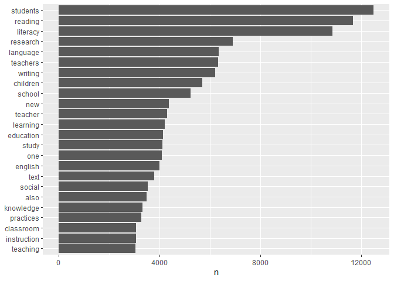

Final project; Data processing - Data Science for Linguists (LING 2340)
Fall 2022
================
Gianina Morales
11/3/2022

-   <a href="#data-processing" id="toc-data-processing">Data processing</a>
    -   <a
        href="#pre-processing-creating-and-tidying-a-dataframe-from-the-corpus"
        id="toc-pre-processing-creating-and-tidying-a-dataframe-from-the-corpus">Pre-processing:
        Creating and tidying a dataframe from the corpus</a>
    -   <a href="#processing-test" id="toc-processing-test">Processing
        (test)</a>
    -   <a href="#next-steps" id="toc-next-steps">Next steps</a>

# Data processing

## Pre-processing: Creating and tidying a dataframe from the corpus

``` r
library(tidytext)
library(tidyverse)
library(tm)
library(tidyr)
library(stopwords)
library(stringr)
```

1.  **Turning raw data on data frame**

1.1. I divided the data into decades, because of the time required for
processing and the fact that I continually had parsing problems. I
decided to use data from one decade (2010-2019) for the first report and
as a way to test the wrangling process.

``` r
# read all the content from one decade of .txt files into a data frame.
raw_corpus10_19 <- tibble(file = dir("Private/2010-2019", full.names = TRUE))%>%
    mutate(text = map(file, read_lines, skip = 1, skip_empty_rows = TRUE, n_max = Inf,locale = default_locale(), na = character(), num_threads = readr_threads(), progress = show_progress())) %>%
    transmute(id = basename(file), text) %>%
    unnest(text) %>%
#replace dots, underscore and numbers with spaces in column 'text'
    mutate(text = str_replace_all(text, "_|\\.|[0-9]+", "")) 
  #replace spaces with underscore and other changes in column id
raw_corpus10_19$id <- gsub(" ", "_", raw_corpus10_19$id) 
raw_corpus10_19$id <- gsub("JLR", "J1_", raw_corpus10_19$id)
raw_corpus10_19$id <- gsub("[aeiou]", "x", raw_corpus10_19$id)
  
head(raw_corpus10_19) 
```

    ## # A tibble: 6 × 2
    ##   id               text                                                         
    ##   <chr>            <chr>                                                        
    ## 1 J1_2010_bxxn.txt "Reading First in Pennsylvania: Achievement Findings After F…
    ## 2 J1_2010_bxxn.txt "Rita Bean and Jason Draper "                                
    ## 3 J1_2010_bxxn.txt "Department of Instruction and Learning, School of Education…
    ## 4 J1_2010_bxxn.txt "Greg Turner "                                               
    ## 5 J1_2010_bxxn.txt "Florida State University "                                  
    ## 6 J1_2010_bxxn.txt "Naomi Zigmond "

2.  **“Tokenizing” and cleaning the data**

2.1. 2010-2019

``` r
#Tokens of one word by row
tidy_corpus10.19 <- raw_corpus10_19 %>%
  unnest_tokens(word, text) 
  
head(tidy_corpus10.19)
```

    ## # A tibble: 6 × 2
    ##   id               word        
    ##   <chr>            <chr>       
    ## 1 J1_2010_bxxn.txt reading     
    ## 2 J1_2010_bxxn.txt first       
    ## 3 J1_2010_bxxn.txt in          
    ## 4 J1_2010_bxxn.txt pennsylvania
    ## 5 J1_2010_bxxn.txt achievement 
    ## 6 J1_2010_bxxn.txt findings

``` r
tidy_corpus10.19
```

    ## # A tibble: 2,005,110 × 2
    ##    id               word        
    ##    <chr>            <chr>       
    ##  1 J1_2010_bxxn.txt reading     
    ##  2 J1_2010_bxxn.txt first       
    ##  3 J1_2010_bxxn.txt in          
    ##  4 J1_2010_bxxn.txt pennsylvania
    ##  5 J1_2010_bxxn.txt achievement 
    ##  6 J1_2010_bxxn.txt findings    
    ##  7 J1_2010_bxxn.txt after       
    ##  8 J1_2010_bxxn.txt five        
    ##  9 J1_2010_bxxn.txt years       
    ## 10 J1_2010_bxxn.txt rita        
    ## # … with 2,005,100 more rows

``` r
#create a list of stopwords additionally to snowball (base from NLTK's to eliminate "giberish" and similar)
My_stopwords <- c("rf", "ve", "ce", 'el', 'ww', "en", "los", "las", "la", "de", "del", "--", "---", "0o", "0s", "3a", "3b", "3d", "6b", "6o", "a", "a1", "a2", "a3", "a4", "ab", "ag", "aj", "0o", "0s", "3a", "3b", "3d", "6b", "6o", "a", "a1", "a2", "a3", "a4", "ab", "abst", "ac", "ad", "adj", "ae", "af", "ag", "ah", "ain", "aj", "al", "all", "ao", "ap", "ar", "av","aw", "ax", "ay", "az", "b", "b1", "b2", "b3", "ba", "bc", "bd", "be", "bi", "bj", "bk", "bl", "bn", "bp", "br", "bs", "bt", "bu", "bx", "by", "c", "c1", "c2", "c3", "ca", "cc", "cd", "ce", "cf", "cg", "ch", "ci", "cit", "cj", "cl", "cm",  "cn", "co", "com", "con", "cp", "cq", "cr", "cs", "c's", "ct", "cu", "cv", "cx", "cy", "cz", "d", "d2", "da", "dc", "dd", "de", "df", "di", "dj", "dk", "dl", "don", "dp", "dr", "ds", "dt", "du", "dx", "dy", "e", "e2", "e3", "ea", "ec", "ed", "edu", "ee", "ef", "eg", "ei", "ej", "el", "em", "en", "eo", "ep", "eq", "er", "es", "est", "et", "et-al", "etc", "eu", "ev", "ex", "ey", "f", "f2", "fa", "fc", "ff", "fi", "fj", "fl", "fn", "fo", "fr", "fs", "ft", "fu", "fy", "g", "ga", "ge", "gi", "gj", "gl", "go", "gr", "gs", "gy", "h", "h2", "h3", "hh", "hi", "hj", "ho", "hr", "hs", "http", "hu", "hy", "i", "i2", "i3", "i4", "i6", "i7", "i8", "ia", "ib", "ibid", "ic", "id", "i'd", "ie", "if", "ig", "ih", "ii", "ij", "il", "in", "inc", "io", "ip", "iq", "ir", "itd", "iv", "ix", "iy", "iz", "j", "jj", "jr", "js", "jt", "ju", "k", "ke", "kg", "kj", "km", "ko", "l", "l2", "la", "lb", "lc", "le", "les", "lf",  "lj", "ll", "ll", "ln", "lo", "los", "lr", "ls", "lt", "ltd", "m", "m2", "ma", "me", "mg", "ml", "mn", "mo", "mr", "mrs", "ms", "mt", "mu", "n", "n2", "na", "nc", "nd", "ne", "ng", "ni", "nj", "nl", "nn", "no", "nr", "ns", "nt", "ny", "o", "oa", "ob", "oc", "od", "of", "og", "oh", "oi", "oj", "ok", "okay", "ol", "om", "on", "oo", "op", "oq", "or", "ord", "os", "ot", "ou", "ow", "ox", "oz", "p", "p1", "p2", "p3", "pas", "pc", "pd", "pe", "per", "pf", "ph", "pi", "pj", "pk", "pl", "pm", "pn", "po", "pp", "pq", "pr", "ps", "pt", "pu", "put", "py", "q", "qj", "qu", "que", "qv", "r", "r2", "ra", "rc", "rd", "re", "ref", "refs", "rf", "rh", "ri", "rj", "rl", "rm", "rn", "ro", "rq", "rr", "rs", "rt", "ru", "run", "rv", "ry", "s", "s2", "sa", "sc", "sd", "se", "sec", "sf", "si", "sj", "sl", "sm", "sn", "so", "sp", "sq", "sr", "ss", "st", "sub", "sup", "sy", "sz", "t", "t1", "t2", "t3", "tb", "tas", "tc", "td", "te", "tf", "th", "ti", "til", "tip", "tj", "tl", "tm", "tn", "to", "tp", "tq", "tr", "ts", "t's", "tt", "tv", "tx", "u", "u201d", "ue", "ui", "uj", "uk", "um", "un", "unto", "uo",  "ups", "ur", "ut", "v", "va", "vd", "ve", "vj", "vo", "vol", "vols", "vq", "vs", "vt", "vu", "w", "wa", "wi", "wo", "www", "x", "x1", "x2", "x3", "xf", "xi", "xj", "xk", "xl", "xn", "xo", "xs", "xt", "xv", "xx", "y", "y2", "yes", "yet", "yj", "yl", "yr", "ys", "yt", "z", "zi", "zz", "doi", "pre", "rst", "dv", "uqlp")

#Apply stop words
tidy_corpus10.19  <- tidy_corpus10.19 %>%
   anti_join(stop_words %>% 
               filter(lexicon=="snowball") %>% 
               rbind(tibble(lexicon = "custom", word =My_stopwords)))
```

    ## Joining, by = "word"

``` r
head (tidy_corpus10.19)
```

    ## # A tibble: 6 × 2
    ##   id               word        
    ##   <chr>            <chr>       
    ## 1 J1_2010_bxxn.txt reading     
    ## 2 J1_2010_bxxn.txt first       
    ## 3 J1_2010_bxxn.txt pennsylvania
    ## 4 J1_2010_bxxn.txt achievement 
    ## 5 J1_2010_bxxn.txt findings    
    ## 6 J1_2010_bxxn.txt five

3.  ***Rds***

I saved the product of tokenization in an Rd file

``` r
save(tidy_corpus10.19, file = "Private/tidy_corpus10.19.Rds")
```

## Processing (test)

1.  **How the data looks like**

Stats to have a sense of the data.

-   Word count and plot

``` r
tidy_corpus10.19 %>%
  count(word, sort = TRUE)%>%
  filter(n > 3000) %>%
  mutate(word = reorder(word, n)) %>%
  ggplot(aes(n, word)) +
  geom_col() +
  labs(y = NULL)
```

<!-- -->

*Explanation*

The data frame `tidy_corpus10.19` represents all the words (minus the
“stop words”) from the articles published by a leading journal in the
field of literacy education between the years 2010 and 2019. This data
frame is composed by 38,562 unique words. In the chart, it is displayed
the words that appears more than 3,000 in the corpus. At first sight it
identifies clearly the focus of the journal: literacy research and
teaching in school settings. Although interesting, this analysis is not
enough to answer my research questions. To advance further, I need to
use this data, and the data from the other decades of the journal, to
apply a topic modeling methodology. This exercise only represents the
first step in the analysis of my data.

## Next steps

1.  “Troubleshoting” to see how to work with all the data by once and
    not by decade-group

2.  Run topic modeling coding with the data.

3.  Test parameters to prepare the final model for analysis.

``` r
sessionInfo()
```

    ## R version 4.2.1 (2022-06-23 ucrt)
    ## Platform: x86_64-w64-mingw32/x64 (64-bit)
    ## Running under: Windows 10 x64 (build 19045)
    ## 
    ## Matrix products: default
    ## 
    ## locale:
    ## [1] LC_COLLATE=English_United States.utf8 
    ## [2] LC_CTYPE=English_United States.utf8   
    ## [3] LC_MONETARY=English_United States.utf8
    ## [4] LC_NUMERIC=C                          
    ## [5] LC_TIME=English_United States.utf8    
    ## 
    ## attached base packages:
    ## [1] stats     graphics  grDevices utils     datasets  methods   base     
    ## 
    ## other attached packages:
    ##  [1] stopwords_2.3   tm_0.7-9        NLP_0.2-1       forcats_0.5.2  
    ##  [5] stringr_1.4.1   dplyr_1.0.9     purrr_0.3.4     readr_2.1.2    
    ##  [9] tidyr_1.2.0     tibble_3.1.8    ggplot2_3.3.6   tidyverse_1.3.2
    ## [13] tidytext_0.3.4 
    ## 
    ## loaded via a namespace (and not attached):
    ##  [1] httr_1.4.4          bit64_4.0.5         vroom_1.5.7        
    ##  [4] jsonlite_1.8.0      modelr_0.1.9        assertthat_0.2.1   
    ##  [7] highr_0.9           googlesheets4_1.0.1 cellranger_1.1.0   
    ## [10] yaml_2.3.5          slam_0.1-50         pillar_1.8.1       
    ## [13] backports_1.4.1     lattice_0.20-45     glue_1.6.2         
    ## [16] digest_0.6.29       rvest_1.0.3         colorspace_2.0-3   
    ## [19] htmltools_0.5.3     Matrix_1.4-1        pkgconfig_2.0.3    
    ## [22] broom_1.0.1         haven_2.5.1         scales_1.2.1       
    ## [25] tzdb_0.3.0          googledrive_2.0.0   generics_0.1.3     
    ## [28] farver_2.1.1        ellipsis_0.3.2      withr_2.5.0        
    ## [31] cli_3.3.0           magrittr_2.0.3      crayon_1.5.1       
    ## [34] readxl_1.4.1        evaluate_0.16       tokenizers_0.2.3   
    ## [37] janeaustenr_1.0.0   fs_1.5.2            fansi_1.0.3        
    ## [40] SnowballC_0.7.0     xml2_1.3.3          tools_4.2.1        
    ## [43] hms_1.1.2           gargle_1.2.0        lifecycle_1.0.1    
    ## [46] munsell_0.5.0       reprex_2.0.2        compiler_4.2.1     
    ## [49] rlang_1.0.4         grid_4.2.1          rstudioapi_0.14    
    ## [52] labeling_0.4.2      rmarkdown_2.16      gtable_0.3.0       
    ## [55] DBI_1.1.3           R6_2.5.1            lubridate_1.8.0    
    ## [58] knitr_1.40          fastmap_1.1.0       bit_4.0.4          
    ## [61] utf8_1.2.2          stringi_1.7.8       parallel_4.2.1     
    ## [64] Rcpp_1.0.9          vctrs_0.4.1         dbplyr_2.2.1       
    ## [67] tidyselect_1.1.2    xfun_0.32
