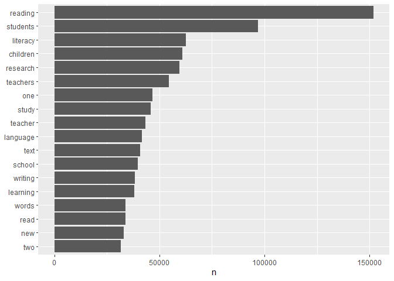

Final project; Data processing - Data Science for Linguists (LING 2340)
Fall 2022
================
Gianina Morales
11/15/2022

- <a href="#data-processing-new-replacement-file---progress-report-2"
  id="toc-data-processing-new-replacement-file---progress-report-2">Data
  processing (new replacement file) - Progress report 2</a>
  - <a
    href="#pre-processing-creating-and-tidying-dataframes-from-the-corpus"
    id="toc-pre-processing-creating-and-tidying-dataframes-from-the-corpus">Pre-processing:
    Creating and tidying dataframes from the corpus</a>
    - <a href="#turning-raw-data-on-raw-data-frames"
      id="toc-turning-raw-data-on-raw-data-frames">Turning raw data on raw
      data frames</a>
    - <a href="#turning-raw-data-frames-on-tidy-data-frames-of-tokens"
      id="toc-turning-raw-data-frames-on-tidy-data-frames-of-tokens">Turning
      raw data frames on tidy data frames of tokens</a>
  - <a href="#initial-processing" id="toc-initial-processing">Initial
    processing</a>
    - <a href="#general-sense-of-the-data-by-decade"
      id="toc-general-sense-of-the-data-by-decade">General sense of the data
      by decade</a>
    - <a href="#description-of-my-data-so-far"
      id="toc-description-of-my-data-so-far">Description of my data so far</a>
  - <a href="#topic-modeling" id="toc-topic-modeling">Topic modeling</a>
  - <a href="#next-steps" id="toc-next-steps">Next steps</a>

# Data processing (new replacement file) - Progress report 2

------------------------------------------------------------------------

## Pre-processing: Creating and tidying dataframes from the corpus

``` r
library(tidytext)
library(tidyverse)
library(tm)
library(tidyr)
library(stopwords)
library(stringr)
library(stringi)
library(topicmodels)
```

### Turning raw data on raw data frames

***Note***

*After further discussion with my advisor on the possible results of my
project, the R processing of my initial data, and the confidential
agreement with the publishers of the “leading journal in the field of
Literacy education,” I decided to include data from a second journal in
my corpus. This time, I am considering the journal that publishes the
paper conferences of the annual conference of the same organization in
charge of the “leading journal in the field of Literacy education.” This
movement will have three benefits:*

- *I can share a sample of my raw data (open-access articles).*
- *I will have a more significant corpus to analyze trends over time in
  topics and language present in a community of literacy research (the
  leading association).*
- *I will have more tools to comply with the ethics of avoiding
  individualization in the data analysis*.

I divided the data into decades. It was very difficult to manipulate the
whole data (almost 3,200 `.txt` files), so I created individual data
frames.

**1. 1969-1979**

*Note: I am considering data from the first year in which the two focal
journals published, to facilitate further comparison with previous
content analysis studies.*

- Reading the `.txt` files

``` r
# read all the content from one decade of .txt files into a data frame.
raw_corpus69_79 <- tibble(file = dir("Private/1969-1979", full.names = TRUE))%>%
    mutate(text = map(file, read_lines, skip = 2, skip_empty_rows = TRUE, n_max = Inf,locale = default_locale(), na = character(), num_threads = readr_threads())) %>%
    transmute(id = basename(file), text) %>%
    unnest(text) %>%
#replace punctuation signs and numbers with spaces in column 'text'
    mutate(text = str_replace_all(text, "[[:punct:]]+|[0-9]+", " ")) 
  #replace spaces with underscore and other changes in column id
raw_corpus69_79$id <- stri_replace_all_regex(raw_corpus69_79$id, pattern=c(" ","JLR","[aeiou]"), replacement=c("_","JY_","x"), vectorize=F)

#visualization 
sample_n(raw_corpus69_79, 10) 
```

    ## # A tibble: 10 × 2
    ##    id                  text                                                     
    ##    <chr>               <chr>                                                    
    ##  1 JY_1978_brxdlxy.txt ""                                                       
    ##  2 Y1969_Trxmxntx.txt  "alive  cherished  and confirmeci "                      
    ##  3 Y1973_sxngxr.txt    "pressing issues to contend with  Indeed  in satisfying …
    ##  4 Y1971_xndxrsxn.txt  "students  Junior College Journal            "           
    ##  5 JY_1975_cxrvxrB.txt "RP High  C                         "                    
    ##  6 Y1972_swxlm.txt     "continued for several chapters and then one period was …
    ##  7 Y1972_xhnmxcht.txt  "   "                                                    
    ##  8 Y1974_cxmpbxll.txt  "for developing vocabulary skills       Plan and impleme…
    ##  9 Y1970_bxhx.txt      "Word Attack Skills"                                     
    ## 10 Y1972_chrxst.txt    "degree and three years teaching experience  fifth year …

**2. 1980-1989**

- Reading the `.txt` files

``` r
# read all the content from one decade of .txt files into a data frame.
raw_corpus80_89 <- tibble(file = dir("Private/1980-1989", full.names = TRUE))%>%
    mutate(text = map(file, read_lines, skip = 2, skip_empty_rows = TRUE, n_max = Inf,locale = default_locale(), na = character(), num_threads = readr_threads())) %>%
    transmute(id = basename(file), text) %>%
    unnest(text) %>%
#replace punctuation signs and numbers with spaces in column 'text'
    mutate(text = str_replace_all(text, "[[:punct:]]+|[0-9]+", " ")) 
  #replace spaces with underscore and other changes in column id
raw_corpus80_89$id <- stri_replace_all_regex(raw_corpus80_89$id, pattern=c(" ","JLR","[aeiou]"), replacement=c("_","JY_","x"), vectorize=F)

#visualization 
sample_n(raw_corpus80_89, 10)
```

    ## # A tibble: 10 × 2
    ##    id                    text                                                   
    ##    <chr>                 <chr>                                                  
    ##  1 Y1981_Bxrkxwxtz.txt   "erroneous  statements  about  text  content    and   …
    ##  2 JY_1982_schwxntxs.txt "Frederick M  Schwantes "                              
    ##  3 Y1981_Vxnxzky.txt     "    Kantowitz   Ed   Human  information  processing  …
    ##  4 Y1984_Pxtnxm.txt      "sion  making  is  described   Third   the  critical  …
    ##  5 JY_1989_nxwxll.txt    "Words                       "                         
    ##  6 Y1983_Ottx.txt        "      Child       turns to page     Now he can t find…
    ##  7 JY_1988_rxxnkxng.txt  "t� "                                                  
    ##  8 Y1989_hxnry.txt       "the metacognitive interview indicated that English pr…
    ##  9 Y1985_McCxxn.txt      "                                                     …
    ## 10 Y1985_Rxxnxng.txt     "                Monologic storytelling   "

**3. 1990-1999**

- Reading the `.txt` files

``` r
# read all the content from one decade of .txt files into a data frame.
raw_corpus90_99 <- tibble(file = dir("Private/1990-1999", full.names = TRUE))%>%
    mutate(text = map(file, read_lines, skip = 2, skip_empty_rows = TRUE, n_max = Inf,locale = default_locale(), na = character(), num_threads = readr_threads())) %>%
    transmute(id = basename(file), text) %>%
    unnest(text) %>%
#replace punctuation signs and numbers with spaces in column 'text'
    mutate(text = str_replace_all(text, "[[:punct:]]+|[0-9]+", " ")) 
  #replace spaces with underscore and other changes in column id
raw_corpus90_99$id <- stri_replace_all_regex(raw_corpus90_99$id, pattern=c(" ","JLR","[aeiou]"), replacement=c("_","JY_","x"), vectorize=F)

#visualization 
sample_n(raw_corpus90_99, 10)
```

    ## # A tibble: 10 × 2
    ##    id                   text                                                    
    ##    <chr>                <chr>                                                   
    ##  1 Y1993_myxrs.txt      " EILlOO              Note    Re  Article    "          
    ##  2 JY_1995_gxllxnx.txt  "Suzanne Terry "                                        
    ##  3 Y1992_bxttxn.txt     "provided focus and direction during data collection an…
    ##  4 JY_1995_mxkx.txt     "An example of this is when Keith approached while Bob …
    ##  5 JY_1999_chrxstxx.txt "dren who chose to play in the play center  On some day…
    ##  6 JY_1993_dxhl.txt     "ABSTRACT "                                             
    ##  7 Y1995_mxxrx.txt      "at their various sites  Ina  a kindergarten teacher  b…
    ##  8 Y1992_hxnk.txt       "In the field of reading  perceived self efficacy has r…
    ##  9 JY_1998_xx.txt       "Proposition  The school literacy learning of students …
    ## 10 Y1993_stxwxrt.txt    "PARTICIPANTS AND METHODS"

**4. 2000-2009**

- Reading the `.txt` files

``` r
# read all the content from one decade of .txt files into a data frame.
raw_corpus00_09 <- tibble(file = dir("Private/2000-2009", full.names = TRUE))%>%
    mutate(text = map(file, read_lines, skip = 2, skip_empty_rows = TRUE, n_max = Inf,locale = default_locale(), na = character(), num_threads = readr_threads())) %>%
    transmute(id = basename(file), text) %>%
    unnest(text) %>%
#replace punctuation signs and numbers with spaces in column 'text'
    mutate(text = str_replace_all(text, "[[:punct:]]+|[0-9]+", " ")) 
```

    ## Warning: One or more parsing issues, see `problems()` for details
    ## One or more parsing issues, see `problems()` for details

``` r
  #replace spaces with underscore and other changes in column id
raw_corpus00_09$id <- stri_replace_all_regex(raw_corpus00_09$id, pattern=c(" ","JLR","[aeiou]"), replacement=c("_","JY_","x"), vectorize=F) 

#visualization 
sample_n(raw_corpus00_09, 10)
```

    ## # A tibble: 10 × 2
    ##    id                  text                                                     
    ##    <chr>               <chr>                                                    
    ##  1 JY_2000_wxlf.txt    "scan the  boring SRA cards to find the obvious answers …
    ##  2 Y2008_rxmxx.txt     "   "                                                    
    ##  3 Y2004_Hxrmxn.txt    "processing  demands  they  may  place  on  readers   Fo…
    ##  4 JY_2001_hxffmxn.txt "The validity of the two systems  STAS I and Fountas Pin…
    ##  5 JY_2005_xx.txt      "A lesson I learned from these larger scale efforts is t…
    ##  6 Y2000_kxnnxr.txt    "\f "                                                    
    ##  7 JY_2003_mxssxy.txt  "Goswami  D    Stillman  P      Reclaiming the classroom…
    ##  8 Y2005_Fxng.txt      "Cox   B   Fang   Z      Otto   B        Preschoolers   …
    ##  9 Y2008_mxlxch.txt    " vii viii  New York  Teachers College Press "           
    ## 10 Y2002_pxrxz.txt     "English and often reject the non English native languag…

**5. 2010-2019**

- Reading the `.txt` files

``` r
# read all the content from one decade of .txt files into a data frame.
raw_corpus10_19 <- tibble(file = dir("Private/2010-2019", full.names = TRUE))%>%
     mutate(text = map(file, read_lines, skip = 2, skip_empty_rows = TRUE, n_max = Inf,locale = default_locale(), na = character(), num_threads = readr_threads())) %>%
    transmute(id = basename(file), text) %>%
    unnest(text) %>%
#replace punctuation signs and numbers with spaces in column 'text'
    mutate(text = str_replace_all(text, "[[:punct:]]+|[0-9]+", " ")) 
  #replace spaces with underscore and other changes in column id
raw_corpus10_19$id <- stri_replace_all_regex(raw_corpus10_19$id, pattern=c(" ","JLR","[aeiou]"), replacement=c("_","JY_","x"), vectorize=F)

#visualization
sample_n(raw_corpus10_19, 10) 
```

    ## # A tibble: 10 × 2
    ##    id                             text                                          
    ##    <chr>                          <chr>                                         
    ##  1 Y2013_lxxbfrxxnd.txt           "student and background variables for reading…
    ##  2 Y2012_fxlxy.txt                "\f "                                         
    ##  3 JY_2014_wxlsxn.txt             "Siskin  L  S      Realms of knowledge  Acade…
    ##  4 Y2014_bxxch.txt                "Hull  G  A  Stornaiuolo  A    Sahni  U      …
    ##  5 Y2013_fxng.txt                 "work has examined applications of their mode…
    ##  6 Y2011_mxrgxn.txt               "Graham  S  Harris  K  R    Fink  B    MacArt…
    ##  7 Y2011_txylxr.txt               "From Looking Back To Looking Forward"        
    ##  8 Y2012_smxth.txt                "Hidalgo and Cameron counties in east Texas  …
    ##  9 Y2015_Cxssxnx_Schxckxndxnz.txt "Literacy Panel  Washington  DC  National Ins…
    ## 10 Y2014_mxllxr.txt               "In both examples  children used Spanish and …

**6. 2020-2022**

*This is the remains and is not a decade, but it represents the most
contemporary scholarship, so I am considering this set of articles as a
piece.*

- Reading the `.txt` files

``` r
# read all the content from one decade of .txt files into a data frame.
raw_corpus20_22 <- tibble(file = dir("Private/2020-2022", full.names = TRUE))%>%
    mutate(text = map(file, read_lines, skip = 2, skip_empty_rows = TRUE, n_max = Inf,locale = default_locale(), na = character(), num_threads = readr_threads())) %>%
    transmute(id = basename(file), text) %>%
    unnest(text) %>%
#replace punctuation signs and numbers with spaces in column 'text'
    mutate(text = str_replace_all(text, "[[:punct:]]+|[0-9]+", " ")) 
```

    ## Warning: One or more parsing issues, see `problems()` for details

``` r
  #replace spaces with underscore and other changes in column id
raw_corpus20_22$id <- stri_replace_all_regex(raw_corpus20_22$id, pattern=c(" ","JLR","[aeiou]"), replacement=c("_","JY_","x"), vectorize=F)

#visualization
sample_n(raw_corpus20_22, 10) 
```

    ## # A tibble: 10 × 2
    ##    id                   text                                                    
    ##    <chr>                <chr>                                                   
    ##  1 Y2021_fxntxnxllx.txt "Figure    Kristoff�s drawing demonstrating that �polic…
    ##  2 JY_2021_spxrxs.txt   "Student interview"                                     
    ##  3 Y2021_cxppxlx.txt    ""                                                      
    ##  4 Y2021_dxxz.txt       "were curated by instructors that explored issues inclu…
    ##  5 JY_2020_kxblxr.txt   "   "                                                   
    ##  6 JY_2020_cxllxn.txt   "In the real world  the act of framing�the act of descr…
    ##  7 Y2020_wxtzxl.txt     "Heather   Yeah   "                                     
    ##  8 JY_2021_hsxn.txt     "Engaging in Religious Activities and Indigenous Ceremo…
    ##  9 Y2020_sxh.txt        "between learners� agency enactment as college students…
    ## 10 JY_2020_bxxchxr.txt  "Yeah  "

### Turning raw data frames on tidy data frames of tokens

``` r
# preparing list of the data frames by decade
raw_corpus_all =list(raw_corpus69_79, raw_corpus80_89, raw_corpus90_99, raw_corpus00_09 , raw_corpus10_19, raw_corpus20_22)
#names
names(raw_corpus_all) <- c("tidy_corpus69_79", "tidy_corpus80_89", "tidy_corpus90_99", "tidy_corpus00_09" , "tidy_corpus10_19", "tidy_corpus20_22")
#results
raw_corpus_all %>% str(1)
```

    ## List of 6
    ##  $ tidy_corpus69_79: tibble [219,094 × 2] (S3: tbl_df/tbl/data.frame)
    ##  $ tidy_corpus80_89: tibble [199,576 × 2] (S3: tbl_df/tbl/data.frame)
    ##  $ tidy_corpus90_99: tibble [266,226 × 2] (S3: tbl_df/tbl/data.frame)
    ##  $ tidy_corpus00_09: tibble [238,349 × 2] (S3: tbl_df/tbl/data.frame)
    ##  $ tidy_corpus10_19: tibble [195,807 × 2] (S3: tbl_df/tbl/data.frame)
    ##  $ tidy_corpus20_22: tibble [23,434 × 2] (S3: tbl_df/tbl/data.frame)

``` r
#Loading custom stopwords
My_stopwords <- read_lines("My_stopwords.csv")

#tokenizing across data frames
tidy_corpus_all <- raw_corpus_all %>% 
  map(~ .x %>% 
    unnest_tokens(word, text))
#Apply stop words
tidy_corpus_all <- tidy_corpus_all %>% 
  map(~ .x %>% 
        anti_join(stop_words %>% 
               filter(lexicon=="snowball") %>% 
               rbind(tibble(lexicon = "custom", word = My_stopwords)))) %>%
  #Creating a column with the year of the data and sorting columns
              map(~ .x %>% 
                    mutate (year = str_extract(id, "\\d+")) %>% 
                    relocate(year, id, word)) 
```

    ## Joining, by = "word"
    ## Joining, by = "word"
    ## Joining, by = "word"
    ## Joining, by = "word"
    ## Joining, by = "word"
    ## Joining, by = "word"

``` r
#final tidy corpus object
tidy_corpus_all %>% str(1)
```

    ## List of 6
    ##  $ tidy_corpus69_79: tibble [1,478,797 × 3] (S3: tbl_df/tbl/data.frame)
    ##  $ tidy_corpus80_89: tibble [1,623,946 × 3] (S3: tbl_df/tbl/data.frame)
    ##  $ tidy_corpus90_99: tibble [2,453,682 × 3] (S3: tbl_df/tbl/data.frame)
    ##  $ tidy_corpus00_09: tibble [2,348,781 × 3] (S3: tbl_df/tbl/data.frame)
    ##  $ tidy_corpus10_19: tibble [2,096,013 × 3] (S3: tbl_df/tbl/data.frame)
    ##  $ tidy_corpus20_22: tibble [505,406 × 3] (S3: tbl_df/tbl/data.frame)

``` r
#Individual tidy data frames saved as Rds. Almost all of them are too big for GitHub, so I only can share the file with less than 25 MB in Data_product_samples
##size
tidy_corpus_all %>%
  map_chr(~ .x %>% 
            object.size() %>% 
            format("Mb")) 
```

    ## tidy_corpus69_79 tidy_corpus80_89 tidy_corpus90_99 tidy_corpus00_09 
    ##        "36.4 Mb"        "39.3 Mb"        "59.5 Mb"        "57.2 Mb" 
    ## tidy_corpus10_19 tidy_corpus20_22 
    ##        "51.1 Mb"        "13.2 Mb"

``` r
##saving individual data frames as Rds  
if (!dir.exists("Private/tidy_corpus_all")) {
  dir.create("Private/tidy_corpus_all")
}
tidy_corpus_all%>%
  iwalk(~ write_rds(.x, paste0("Private/tidy_corpus_all/", .y, ".Rds")))
```

*Note: as files are heavy, I only could share in GitHub the last one*

- **creating singles data frames for further use**

**Data frame corpus 1969 to 1979**

``` r
#Data frame
tidy_corpus69_79 <- tidy_corpus_all$tidy_corpus69_79

#Visualization
sample_n(tidy_corpus69_79, 20)
```

    ## # A tibble: 20 × 3
    ##    year  id                   word       
    ##    <chr> <chr>                <chr>      
    ##  1 1975  JY_1975_cxrvxrC.txt  research   
    ##  2 1979  JY_1979_dxxlxcxs.txt provided   
    ##  3 1976  JY_1976_wxlfrxm.txt  five       
    ##  4 1977  Y1977_Allxngtxn.txt  mcnees     
    ##  5 1978  Y1978_Sxmmxrs.txt    acceptance 
    ##  6 1976  Y1976_Nxckx.txt      relegated  
    ##  7 1975  JY_1975_pxrk.txt     range      
    ##  8 1976  JY_1976_mxrtxn.txt   paragraph  
    ##  9 1978  JY_1978_fxshmxn.txt  phrase     
    ## 10 1976  JY_1976_knxflx.txt   think      
    ## 11 1977  Y1977_Shxffxr.txt    quarterly  
    ## 12 1973  Y1973_kxngstxn.txt   table      
    ## 13 1970  JY_1970_gxyxr.txt    eye        
    ## 14 1972  Y1972_txxnmxn.txt    temporal   
    ## 15 1971  JY_1971_gxllxxly.txt past       
    ## 16 1974  Y1974_xrxcksxn.txt   variance   
    ## 17 1975  Y1975_gxlxb.txt      involvement
    ## 18 1979  JY_1979_xvxns.txt    children   
    ## 19 1971  Y1971_mcdxnxld.txt   deficient  
    ## 20 1976  JY_1976_sxmxn.txt    comparisons

**Data frame corpus 1980 to 1989**

``` r
#Data frame
tidy_corpus80_89 <- tidy_corpus_all$tidy_corpus80_89

#Visualization
sample_n(tidy_corpus80_89, 20)
```

    ## # A tibble: 20 × 3
    ##    year  id                     word       
    ##    <chr> <chr>                  <chr>      
    ##  1 1989  Y1989_xlvxrmxnn.txt    also       
    ##  2 1987  JY_1987_zxckxr.txt     one        
    ##  3 1989  JY_1989_gxswxmx.txt    words      
    ##  4 1989  Y1989_bxrr.txt         programs   
    ##  5 1984  JY_1984_grxbx.txt      ability    
    ##  6 1984  Y1984_Hxnschx.txt      criterion  
    ##  7 1982  JY_1982_cxzdxn.txt     attribute  
    ##  8 1986  Y1986_Brxxn.txt        reading    
    ##  9 1983  Y1983_Stxxtzxl.txt     instruction
    ## 10 1985  Y1985_Schwxrtz.txt     told       
    ## 11 1986  Y1986_Wxnxgrxd.txt     adding     
    ## 12 1989  Y1989_hxrrmxnn.txt     teachers   
    ## 13 1986  Y1986_Kxnzxr.txt       practical  
    ## 14 1982  Y1982_Gxldsmxth.txt    result     
    ## 15 1985  Y1985_Slxtxr.txt       consisted  
    ## 16 1981  JY_1981_mcnxxghtxn.txt primary    
    ## 17 1985  Y1985_Cxrrxck.txt      used       
    ## 18 1985  Y1985_Sxdxskx.txt      carry      
    ## 19 1987  JY_1987_dxvxy.txt      individual 
    ## 20 1988  JY_1988_mcgxx.txt      color

**Data frame corpus 1990 to 1999**

``` r
#Data frame
tidy_corpus90_99 <- tidy_corpus_all$tidy_corpus90_99

#Visualization
sample_n(tidy_corpus90_99, 100)
```

    ## # A tibble: 100 × 3
    ##    year  id                    word       
    ##    <chr> <chr>                 <chr>      
    ##  1 1997  Y1997_dxvxnrxy.txt    volume     
    ##  2 1992  JY_1992_schxmm.txt    perceptions
    ##  3 1996  JY_1996_wxlf.txt      struck     
    ##  4 1991  Y1991_xmxry.txt       groups     
    ##  5 1998  JY_1998_fxwcxtt.txt   determine  
    ##  6 1995  JY_1995_schrxw.txt    differed   
    ##  7 1992  JY_1992_mccxrthxy.txt teacher    
    ##  8 1996  Y1996_rxxnkxng.txt    one        
    ##  9 1994  Y1994_brxck.txt       finding    
    ## 10 1999  JY_1999_chrxstxx.txt  peers      
    ## # … with 90 more rows

**Data frame corpus 2000 to 2010**

``` r
#Data frame
tidy_corpus00_09 <- tidy_corpus_all$tidy_corpus00_09

#Visualization
sample_n(tidy_corpus00_09, 100)
```

    ## # A tibble: 100 × 3
    ##    year  id                  word      
    ##    <chr> <chr>               <chr>     
    ##  1 2004  JY_2004_lx.txt      learned   
    ##  2 2001  Y2001_bxrr.txt      chavan    
    ##  3 2007  Y2007_Hxnxs.txt     growing   
    ##  4 2009  Y2009_dxxlxy.txt    annual    
    ##  5 2005  JY_2005_xx.txt      helpful   
    ##  6 2000  JY_2000_mxllxr.txt  remained  
    ##  7 2007  Y2007_Dxmxcx.txt    quo       
    ##  8 2008  Y2008_dxffy.txt     understand
    ##  9 2002  JY_2002_sxmxrx.txt  deeply    
    ## 10 2003  Y2003_Mxsxnthxl.txt seatwork  
    ## # … with 90 more rows

**Data frame corpus 2010 to 2019**

``` r
#Data frame
tidy_corpus10_19 <- tidy_corpus_all$tidy_corpus10_19

#Visualization
sample_n(tidy_corpus10_19, 100)
```

    ## # A tibble: 100 × 3
    ##    year  id                    word         
    ##    <chr> <chr>                 <chr>        
    ##  1 2012  JY_2012_chrxst.txt    strategies   
    ##  2 2018  JY_2018_pxrry.txt     social       
    ##  3 2019  JY_2019_hxffmxn.txt   allowed      
    ##  4 2014  JY_2014_hxnxyfxrd.txt improving    
    ##  5 2017  JY_2017_mxsxs.txt     language     
    ##  6 2013  Y2013_lxxbfrxxnd.txt  percent      
    ##  7 2019  Y2019_cxppxllx.txt    constructed  
    ##  8 2018  JY_2018_kxxhnx.txt    first        
    ##  9 2016  Y2016_Edmxstxn.txt    opportunities
    ## 10 2011  JY_2011_nxxmxn.txt    instructional
    ## # … with 90 more rows

**Data frame corpus 2020 to 2022**

``` r
#Data frame 
tidy_corpus20_22 <- tidy_corpus_all$tidy_corpus20_22

#Visualization
sample_n(tidy_corpus20_22, 100)
```

    ## # A tibble: 100 × 3
    ##    year  id                     word            
    ##    <chr> <chr>                  <chr>           
    ##  1 2022  JY_2022_mxllxr.txt     allegedly       
    ##  2 2020  Y2020_lxmmxrt.txt      teaching        
    ##  3 2021  Y2021_jxrdxn.txt       transformational
    ##  4 2020  JY_2020_yxxn.txt       world           
    ##  5 2021  JY_2021_lxwrxncx.txt   resemble        
    ##  6 2021  JY_2021_lxvxnx.txt     others          
    ##  7 2021  JY_2021_lxwrxncx.txt   real            
    ##  8 2020  JY_2020_nxxgxbxxxr.txt pronunciation   
    ##  9 2022  JY_2022_jxcxbsxn.txt   contributes     
    ## 10 2020  Y2020_pxrclx.txt       reading         
    ## # … with 90 more rows

------------------------------------------------------------------------

## Initial processing

------------------------------------------------------------------------

### General sense of the data by decade

To understand some generalities of the data, I combine the data frames
into one master data frame with all the tokens. Then, I manipulated the
data to look at trends over time.

- Master data frame

``` r
# Combining data frames
master_tidy_corpus <- bind_rows(tidy_corpus69_79, tidy_corpus80_89, tidy_corpus90_99, tidy_corpus00_09 , tidy_corpus10_19, tidy_corpus20_22)

#generalities
## word count
head(master_tidy_corpus %>% 
    count(word, sort = TRUE), 30)
```

    ## # A tibble: 30 × 2
    ##    word          n
    ##    <chr>     <int>
    ##  1 reading  151923
    ##  2 students  96993
    ##  3 literacy  62494
    ##  4 children  61047
    ##  5 research  59529
    ##  6 teachers  54463
    ##  7 one       46639
    ##  8 study     45779
    ##  9 teacher   43348
    ## 10 language  41600
    ## # … with 20 more rows

``` r
##summary
summary(master_tidy_corpus)  
```

    ##      year                id                word          
    ##  Length:10506625    Length:10506625    Length:10506625   
    ##  Class :character   Class :character   Class :character  
    ##  Mode  :character   Mode  :character   Mode  :character

- Plot

``` r
master_tidy_corpus %>%
  count(word, sort = TRUE)%>%
  filter(n > 30000) %>%
  mutate(word = reorder(word, n)) %>%
  ggplot(aes(n, word)) +
  geom_col() +
  labs(y = NULL)
```

<!-- -->

### Description of my data so far

After all the processes to tidy my data, I finally have a data frame
useful for applying topic modeling. My master data frame consists of
10,506,625 tokens representing the “cleaning” words from 3,131 articles
published between 1969 and 2022 in two literacy education journals—a
leading research journal and a conference papers journal, both from the
same disciplinary association. The master data frame has 131,611 unique
words. The plot above indicates the words repeated over 30,000 times
across the data frame. In general, it seems to represent the scope of
the focal journals, anchored in literacy education research. More
significance will be identified through the topic modeling analysis.

------------------------------------------------------------------------

## Topic modeling

For this report, I tried to start testing the codes for topic modeling
explained in the book [Text Mining with
R](https://www.tidytextmining.com/index.html). However, I had many
problems with the codes. As the pre-processing and initial processing of
my data was unexpectedly slow, I could not present topic modeling
analysis this time.

------------------------------------------------------------------------

## Next steps

1.  Finishing the testing and publishing the general topic modeling
    analysis.

2.  Apply the model to analyze in deep each decade.

3.  Compare results of topics between decades with more detail.

4.  Create the final report of my results.

5.  Discuss the results in relation to my research questions:

- What are the trends in topics of literacy education research and
  scholarship over more than five decades (1969-2021) of the focal
  journals?

- How do the topics have changed over time?

``` r
sessionInfo()
```

    ## R version 4.2.1 (2022-06-23 ucrt)
    ## Platform: x86_64-w64-mingw32/x64 (64-bit)
    ## Running under: Windows 10 x64 (build 19045)
    ## 
    ## Matrix products: default
    ## 
    ## locale:
    ## [1] LC_COLLATE=English_United States.utf8 
    ## [2] LC_CTYPE=English_United States.utf8   
    ## [3] LC_MONETARY=English_United States.utf8
    ## [4] LC_NUMERIC=C                          
    ## [5] LC_TIME=English_United States.utf8    
    ## 
    ## attached base packages:
    ## [1] stats     graphics  grDevices utils     datasets  methods   base     
    ## 
    ## other attached packages:
    ##  [1] topicmodels_0.2-12 stringi_1.7.8      stopwords_2.3      tm_0.7-9          
    ##  [5] NLP_0.2-1          forcats_0.5.2      stringr_1.4.1      dplyr_1.0.9       
    ##  [9] purrr_0.3.4        readr_2.1.2        tidyr_1.2.0        tibble_3.1.8      
    ## [13] ggplot2_3.3.6      tidyverse_1.3.2    tidytext_0.3.4    
    ## 
    ## loaded via a namespace (and not attached):
    ##  [1] httr_1.4.4          bit64_4.0.5         vroom_1.5.7        
    ##  [4] jsonlite_1.8.0      modelr_0.1.9        assertthat_0.2.1   
    ##  [7] highr_0.9           stats4_4.2.1        googlesheets4_1.0.1
    ## [10] cellranger_1.1.0    yaml_2.3.5          slam_0.1-50        
    ## [13] pillar_1.8.1        backports_1.4.1     lattice_0.20-45    
    ## [16] glue_1.6.2          digest_0.6.29       rvest_1.0.3        
    ## [19] colorspace_2.0-3    htmltools_0.5.3     Matrix_1.4-1       
    ## [22] pkgconfig_2.0.3     broom_1.0.1         haven_2.5.1        
    ## [25] scales_1.2.1        tzdb_0.3.0          googledrive_2.0.0  
    ## [28] farver_2.1.1        generics_0.1.3      ellipsis_0.3.2     
    ## [31] withr_2.5.0         cli_3.3.0           magrittr_2.0.3     
    ## [34] crayon_1.5.1        readxl_1.4.1        evaluate_0.16      
    ## [37] tokenizers_0.2.3    janeaustenr_1.0.0   fs_1.5.2           
    ## [40] fansi_1.0.3         SnowballC_0.7.0     xml2_1.3.3         
    ## [43] tools_4.2.1         hms_1.1.2           gargle_1.2.0       
    ## [46] lifecycle_1.0.1     munsell_0.5.0       reprex_2.0.2       
    ## [49] compiler_4.2.1      rlang_1.0.4         grid_4.2.1         
    ## [52] rstudioapi_0.14     labeling_0.4.2      rmarkdown_2.16     
    ## [55] gtable_0.3.0        DBI_1.1.3           R6_2.5.1           
    ## [58] lubridate_1.8.0     knitr_1.40          fastmap_1.1.0      
    ## [61] bit_4.0.4           utf8_1.2.2          modeltools_0.2-23  
    ## [64] parallel_4.2.1      Rcpp_1.0.9          vctrs_0.4.1        
    ## [67] dbplyr_2.2.1        tidyselect_1.1.2    xfun_0.32
