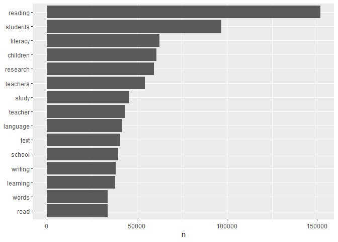

Final project; Data processing - Data Science for Linguists (LING 2340)
Fall 2022
================
Gianina Morales
11/15/2022 (version 1) - 12/1/2022 (version 2)

- <a
  href="#data-processing---progress-report-2-new-replacement-file---corrected-for-progress-report-3"
  id="toc-data-processing---progress-report-2-new-replacement-file---corrected-for-progress-report-3">Data
  processing - Progress report 2 (new replacement file - CORRECTED for
  progress report 3)</a>
  - <a
    href="#pre-processing-creating-and-tidying-dataframes-from-the-corpus"
    id="toc-pre-processing-creating-and-tidying-dataframes-from-the-corpus">Pre-processing:
    Creating and tidying dataframes from the corpus</a>
    - <a href="#turning-raw-data-on-raw-data-frames"
      id="toc-turning-raw-data-on-raw-data-frames">Turning raw data on raw
      data frames</a>
    - <a href="#turning-raw-data-frames-on-tidy-data-frames-of-tokens"
      id="toc-turning-raw-data-frames-on-tidy-data-frames-of-tokens">Turning
      raw data frames on tidy data frames of tokens</a>
  - <a href="#initial-processing" id="toc-initial-processing">Initial
    processing</a>
    - <a href="#general-sense-of-the-data-by-decade"
      id="toc-general-sense-of-the-data-by-decade">General sense of the data
      by decade</a>
    - <a href="#description-of-my-data-so-far"
      id="toc-description-of-my-data-so-far">Description of my data so far</a>
  - <a href="#topic-modeling" id="toc-topic-modeling">Topic modeling</a>
  - <a href="#next-steps" id="toc-next-steps">Next steps</a>

# Data processing - Progress report 2 (new replacement file - CORRECTED for progress report 3)

------------------------------------------------------------------------

## Pre-processing: Creating and tidying dataframes from the corpus

``` r
library(tidytext)
library(tidyverse)
library(tm)
library(stopwords)
library(stringi)
library(topicmodels)
```

### Turning raw data on raw data frames

***Note***

*After further discussion with my advisor on the possible results of my
project, the R processing of my initial data, and the confidential
agreement with the publishers of the “leading journal in the field of
Literacy education,” I decided to include data from a second journal in
my corpus. This time, I am considering the journal that publishes the
paper conferences of the annual conference of the same organization in
charge of the “leading journal in the field of Literacy education.” This
movement will have three benefits:*

- *I can share a sample of my raw data (open-access articles).*
- *I will have a more significant corpus to analyze trends over time in
  topics and language present in a community of literacy research (the
  leading association).*
- *I will have more tools to comply with the ethics of avoiding
  individualization in the data analysis*.

I divided the data into decades. It was very difficult to manipulate the
whole data (almost 3,200 `.txt` files), so I created individual data
frames.

**1. 1969-1979**

*Note: I am considering data from the first year in which the two focal
journals published, to facilitate further comparison with previous
content analysis studies.*

- Reading the `.txt` files

``` r
# read all the content from one decade of .txt files into a data frame.
raw_corpus69_79 <- tibble(file = dir("Private/1969-1979", full.names = TRUE))%>%
    mutate(text = map(file, read_lines, skip = 2, skip_empty_rows = TRUE, n_max = Inf,locale = default_locale(), na = character(), num_threads = readr_threads())) %>%
    transmute(id = basename(file), text) %>%
    unnest(text) %>%
#replace punctuation signs and numbers with spaces in column 'text'
    mutate(text = str_replace_all(text, "[[:punct:]]+|[0-9]+", " ")) 
  #replace spaces with underscore and other changes in column id
raw_corpus69_79$id <- stri_replace_all_regex(raw_corpus69_79$id, pattern=c(" ","JLR","[aeiou]"), replacement=c("_","JY_","x"), vectorize=F)

#visualization 
sample_n(raw_corpus69_79, 10) 
```

    ## # A tibble: 10 × 2
    ##    id                  text                                                     
    ##    <chr>               <chr>                                                    
    ##  1 Y1972_xxrxn.txt     "and teachers "                                          
    ##  2 Y1978_Arnxld.txt    "for  a  one  second  exposure   Then   an   array  of  …
    ##  3 Y1977_Bxldwxn.txt   "study   The  first  is  a  statement  with  the  basic …
    ##  4 JY_1975_mxyxr.txt   "  � patient collection VIOLETS "                        
    ##  5 Y1969_Schmxdt.txt   "  "                                                     
    ##  6 Y1979_Grxvxs.txt    "  ers  behavior and that of radar operators is the find…
    ##  7 Y1970_sxngxr.txt    "to do well on another task  When Gates     p     admini…
    ##  8 Y1970_rxxlsbxck.txt "Basic Edtication"                                       
    ##  9 JY_1977_brxscxx.txt "On days three and four  the children were exposed to th…
    ## 10 Y1973_Txrnxr.txt    " demic  areas   While  listening  to  the  tapes   note…

**2. 1980-1989**

- Reading the `.txt` files

``` r
# read all the content from one decade of .txt files into a data frame.
raw_corpus80_89 <- tibble(file = dir("Private/1980-1989", full.names = TRUE))%>%
    mutate(text = map(file, read_lines, skip = 2, skip_empty_rows = TRUE, n_max = Inf,locale = default_locale(), na = character(), num_threads = readr_threads())) %>%
    transmute(id = basename(file), text) %>%
    unnest(text) %>%
#replace punctuation signs and numbers with spaces in column 'text'
    mutate(text = str_replace_all(text, "[[:punct:]]+|[0-9]+", " ")) 
  #replace spaces with underscore and other changes in column id
raw_corpus80_89$id <- stri_replace_all_regex(raw_corpus80_89$id, pattern=c(" ","JLR","[aeiou]"), replacement=c("_","JY_","x"), vectorize=F)

#visualization 
sample_n(raw_corpus80_89, 10)
```

    ## # A tibble: 10 × 2
    ##    id                 text                                                      
    ##    <chr>              <chr>                                                     
    ##  1 Y1986_Lxpsxn.txt   " performance on the most difficult passage   The absolut…
    ##  2 Y1988_hxxd2.txt    "Teacher "                                                
    ##  3 JY_1981_pxrxs.txt  "Third  Fifth  Third  Fifth  "                            
    ##  4 Y1988_hxxd2.txt    "Subjects in the Self Select Group chose an array of stra…
    ##  5 Y1980_Nxlxs.txt    "on  a specific level of information   "                  
    ##  6 Y1987_Frxxdmxn.txt "contributing to  cohesive harmony   However   they  come…
    ##  7 Y1989_vxlxncxx.txt "   "                                                     
    ##  8 Y1980_Rxnkxn.txt   " n=  words  "                                            
    ##  9 Y1982_Lxxbxrt.txt  "                                        REFERENCES  "    
    ## 10 Y1985_Bxrns.txt    "Smith   F        The  creative  achievement  of literacy…

**3. 1990-1999**

- Reading the `.txt` files

``` r
# read all the content from one decade of .txt files into a data frame.
raw_corpus90_99 <- tibble(file = dir("Private/1990-1999", full.names = TRUE))%>%
    mutate(text = map(file, read_lines, skip = 2, skip_empty_rows = TRUE, n_max = Inf,locale = default_locale(), na = character(), num_threads = readr_threads())) %>%
    transmute(id = basename(file), text) %>%
    unnest(text) %>%
#replace punctuation signs and numbers with spaces in column 'text'
    mutate(text = str_replace_all(text, "[[:punct:]]+|[0-9]+", " ")) 
  #replace spaces with underscore and other changes in column id
raw_corpus90_99$id <- stri_replace_all_regex(raw_corpus90_99$id, pattern=c(" ","JLR","[aeiou]"), replacement=c("_","JY_","x"), vectorize=F)

#visualization 
sample_n(raw_corpus90_99, 10)
```

    ## # A tibble: 10 × 2
    ##    id                        text                                               
    ##    <chr>                     <chr>                                              
    ##  1 Y1995_blxxdgxxd.txt       "  "                                               
    ##  2 Y1991_dxhl.txt            "writing fairly regularly in the latter part of th…
    ##  3 Y1997_xllxngtxn.txt       "time organizing the converging evidence  from met…
    ##  4 Y1991_bxxr2.txt           "their way to becoming proficient readers  At prim…
    ##  5 JY_1998_sxpx.txt          "Glaser  B    Strauss  A      The discovery ofgrou…
    ##  6 Y1999_xx.txt              "Given the uniqueness of their home and school lit…
    ##  7 Y1991_mcKxnnx.txt         "proportions of students report their use  delinea…
    ##  8 JY_1997_fxrnxndxzfxxn.txt "boat  goat  head  bed  hair  bell  "              
    ##  9 Y1993_wxlsxn.txt          "Miles  M  B    Huberman  A M      Qualitative dat…
    ## 10 Y1997_xl-Hxndx.txt        "RESULTS"

**4. 2000-2009**

- Reading the `.txt` files

``` r
# read all the content from one decade of .txt files into a data frame.
raw_corpus00_09 <- tibble(file = dir("Private/2000-2009", full.names = TRUE))%>%
    mutate(text = map(file, read_lines, skip = 2, skip_empty_rows = TRUE, n_max = Inf,locale = default_locale(), na = character(), num_threads = readr_threads())) %>%
    transmute(id = basename(file), text) %>%
    unnest(text) %>%
#replace punctuation signs and numbers with spaces in column 'text'
    mutate(text = str_replace_all(text, "[[:punct:]]+|[0-9]+", " ")) 
```

    ## Warning: One or more parsing issues, see `problems()` for details
    ## One or more parsing issues, see `problems()` for details

``` r
  #replace spaces with underscore and other changes in column id
raw_corpus00_09$id <- stri_replace_all_regex(raw_corpus00_09$id, pattern=c(" ","JLR","[aeiou]"), replacement=c("_","JY_","x"), vectorize=F) 

#visualization 
sample_n(raw_corpus00_09, 10)
```

    ## # A tibble: 10 × 2
    ##    id                   text                                                    
    ##    <chr>                <chr>                                                   
    ##  1 Y2004_Nx.txt         "factors    Wertsch      p      of how utterances  are …
    ##  2 Y2005_Evxns.txt      "not a single RF  proposal  addressed  the  importance …
    ##  3 JY_2002_kxrxt.txt    "Tom  HSES group "                                      
    ##  4 Y2001_lxzxr.txt      "I hypothesized that weaving these principles of divers…
    ##  5 Y2007_Bxmxr.txt      "Hutchins   E       K ausen   T         Distributed  co…
    ##  6 JY_2000_gxx.txt      "played a major role in current debates about reading  …
    ##  7 Y2004_Gxndxrsxn.txt  "popular  press  focused  uncritically  on  the  findin…
    ##  8 JY_2007_bxkxr.txt    "Basal skills approaches Newsletters with such informat…
    ##  9 JY_2003_pxnx.txt     "Many studies focus on the semantic and phonetic compon…
    ## 10 Y2007_Blxchxwxcz.txt "extension of word meaning   Do you know any other word…

**5. 2010-2019**

- Reading the `.txt` files

``` r
# read all the content from one decade of .txt files into a data frame.
raw_corpus10_19 <- tibble(file = dir("Private/2010-2019", full.names = TRUE))%>%
     mutate(text = map(file, read_lines, skip = 2, skip_empty_rows = TRUE, n_max = Inf,locale = default_locale(), na = character(), num_threads = readr_threads())) %>%
    transmute(id = basename(file), text) %>%
    unnest(text) %>%
#replace punctuation signs and numbers with spaces in column 'text'
    mutate(text = str_replace_all(text, "[[:punct:]]+|[0-9]+", " ")) 
  #replace spaces with underscore and other changes in column id
raw_corpus10_19$id <- stri_replace_all_regex(raw_corpus10_19$id, pattern=c(" ","JLR","[aeiou]"), replacement=c("_","JY_","x"), vectorize=F)

#visualization
sample_n(raw_corpus10_19, 10) 
```

    ## # A tibble: 10 × 2
    ##    id                  text                                                     
    ##    <chr>               <chr>                                                    
    ##  1 Y2012_hxffmxn.txt   "Construction of meaning "                               
    ##  2 JY_2012_pxrsxns.txt "Another adaptation occurred in the seventh observation …
    ##  3 Y2012_spxncx.txt    "Lorenzo s"                                              
    ##  4 JY_2019_wxtzxl.txt  "Eight articles explored the experiences of PTs of color…
    ##  5 Y2015_nx.txt        "Oxford  England  Elsevier "                             
    ##  6 Y2012_hxthxwxy.txt  "examined in the larger study  As such  this paper focus…
    ##  7 Y2013_rxdxy.txt     "to create presentations using digital tools to infuse a…
    ##  8 Y2013_bxxch.txt     "Girls > boys"                                           
    ##  9 Y2011_gxxdwxn.txt   "   "                                                    
    ## 10 JY_2016_mxssxrx.txt "Of       "

**6. 2020-2022**

*This is the remains and is not a decade, but it represents the most
contemporary scholarship, so I am considering this set of articles as a
piece.*

- Reading the `.txt` files

``` r
# read all the content from one decade of .txt files into a data frame.
raw_corpus20_22 <- tibble(file = dir("Private/2020-2022", full.names = TRUE))%>%
    mutate(text = map(file, read_lines, skip = 2, skip_empty_rows = TRUE, n_max = Inf,locale = default_locale(), na = character(), num_threads = readr_threads())) %>%
    transmute(id = basename(file), text) %>%
    unnest(text) %>%
#replace punctuation signs and numbers with spaces in column 'text'
    mutate(text = str_replace_all(text, "[[:punct:]]+|[0-9]+", " ")) 
```

    ## Warning: One or more parsing issues, see `problems()` for details

``` r
  #replace spaces with underscore and other changes in column id
raw_corpus20_22$id <- stri_replace_all_regex(raw_corpus20_22$id, pattern=c(" ","JLR","[aeiou]"), replacement=c("_","JY_","x"), vectorize=F)

#visualization
sample_n(raw_corpus20_22, 10) 
```

    ## # A tibble: 10 × 2
    ##    id                          text                                             
    ##    <chr>                       <chr>                                            
    ##  1 Y2021_DELOSRIOS.txt         "We extend our deepest gratitude to the students…
    ##  2 JY_2020_cxllxn.txt          "Collin  R      Activism  emotion  and genre  Yo…
    ##  3 JY_2021_wxtzxl.txt          ""                                               
    ##  4 JY_2020_thxxl.txt           "Re turning to this same data scene again and ag…
    ##  5 Y2021_lxtxrxcyfxtxrxsms.txt "Closing Thoughts "                              
    ##  6 JY_2020_wxxdxrd.txt         "Introduction "                                  
    ##  7 JY_2021_vxhxbxvxc.txt       "Dawit also built on his experience to respond t…
    ##  8 Y2020_smxth.txt             "I assert that the aforementioned nuances surrou…
    ##  9 JY_2020_kxblxr.txt          "Natalia Palacios  a Latinx bilingual immigrant …
    ## 10 JY_2021_sxnchxz.txt         "Abstract "

### Turning raw data frames on tidy data frames of tokens

``` r
# preparing list of the data frames by decade
raw_corpus_all =list(raw_corpus69_79, raw_corpus80_89, raw_corpus90_99, raw_corpus00_09 , raw_corpus10_19, raw_corpus20_22)
#names
names(raw_corpus_all) <- c("tidy_corpus69_79", "tidy_corpus80_89", "tidy_corpus90_99", "tidy_corpus00_09" , "tidy_corpus10_19", "tidy_corpus20_22")
#results
raw_corpus_all %>% str(1)
```

    ## List of 6
    ##  $ tidy_corpus69_79: tibble [219,094 × 2] (S3: tbl_df/tbl/data.frame)
    ##  $ tidy_corpus80_89: tibble [199,576 × 2] (S3: tbl_df/tbl/data.frame)
    ##  $ tidy_corpus90_99: tibble [266,226 × 2] (S3: tbl_df/tbl/data.frame)
    ##  $ tidy_corpus00_09: tibble [238,349 × 2] (S3: tbl_df/tbl/data.frame)
    ##  $ tidy_corpus10_19: tibble [195,807 × 2] (S3: tbl_df/tbl/data.frame)
    ##  $ tidy_corpus20_22: tibble [23,434 × 2] (S3: tbl_df/tbl/data.frame)

``` r
#Loading custom stopwords
My_stopwords <- read_lines("My_stopwords.csv")

#tokenizing across data frames
tidy_corpus_all <- raw_corpus_all %>% 
  map(~ .x %>% 
    unnest_tokens(word, text))
#Apply stop words
tidy_corpus_all <- tidy_corpus_all %>% 
  map(~ .x %>% 
        anti_join(stop_words %>% 
               filter(lexicon=="onix") %>% 
               rbind(tibble(lexicon = "custom", word = My_stopwords)))) %>%
  #Creating a column with the year of the data and sorting columns
              map(~ .x %>% 
                    mutate (year = str_extract(id, "\\d+")) %>% 
                    relocate(year, id, word)) 
```

    ## Joining, by = "word"
    ## Joining, by = "word"
    ## Joining, by = "word"
    ## Joining, by = "word"
    ## Joining, by = "word"
    ## Joining, by = "word"

``` r
#final tidy corpus object
tidy_corpus_all %>% str(1)
```

    ## List of 6
    ##  $ tidy_corpus69_79: tibble [1,283,446 × 3] (S3: tbl_df/tbl/data.frame)
    ##  $ tidy_corpus80_89: tibble [1,411,180 × 3] (S3: tbl_df/tbl/data.frame)
    ##  $ tidy_corpus90_99: tibble [2,116,324 × 3] (S3: tbl_df/tbl/data.frame)
    ##  $ tidy_corpus00_09: tibble [2,036,441 × 3] (S3: tbl_df/tbl/data.frame)
    ##  $ tidy_corpus10_19: tibble [1,841,573 × 3] (S3: tbl_df/tbl/data.frame)
    ##  $ tidy_corpus20_22: tibble [450,618 × 3] (S3: tbl_df/tbl/data.frame)

``` r
#Individual tidy data frames saved as Rds. Almost all of them are too big for GitHub, so I only can share the file with less than 25 MB in Data_product_samples
##size
tidy_corpus_all %>%
  map_chr(~ .x %>% 
            object.size() %>% 
            format("Mb")) 
```

    ## tidy_corpus69_79 tidy_corpus80_89 tidy_corpus90_99 tidy_corpus00_09 
    ##        "31.9 Mb"        "34.4 Mb"        "51.7 Mb"          "50 Mb" 
    ## tidy_corpus10_19 tidy_corpus20_22 
    ##        "45.2 Mb"        "11.9 Mb"

``` r
##saving individual data frames as Rds  
if (!dir.exists("Private/tidy_corpus_all")) {
  dir.create("Private/tidy_corpus_all")
}
tidy_corpus_all%>%
  iwalk(~ write_rds(.x, paste0("Private/tidy_corpus_all/", .y, ".Rds")))
```

*Note: as files are heavy, I only could share in GitHub the last one*

------------------------------------------------------------------------

## Initial processing

------------------------------------------------------------------------

### General sense of the data by decade

To understand some generalities of the data, I combine the data frames
into one master data frame with all the tokens. Then, I manipulated the
data to look at trends over time.

- Master data frame

``` r
# Combining data frames
master_tidy_corpus <- bind_rows(tidy_corpus_all$tidy_corpus69_79, tidy_corpus_all$tidy_corpus80_89, tidy_corpus_all$tidy_corpus90_99, tidy_corpus_all$tidy_corpus00_09 , tidy_corpus_all$tidy_corpus10_19, tidy_corpus_all$tidy_corpus20_22)

# Saving the master data frame as an Rds with less than 25 MB to share as a sample in Github
set.seed(170)
  write_rds (master_tidy_corpus %>% 
  sample_n(900000), "Data_product_samples/master_tidycorpus_sample.Rds"   
)

#generalities
## word count
head(master_tidy_corpus %>% 
    count(word, sort = TRUE), 30)
```

    ## # A tibble: 30 × 2
    ##    word          n
    ##    <chr>     <int>
    ##  1 reading  151923
    ##  2 students  96993
    ##  3 literacy  62494
    ##  4 children  61047
    ##  5 research  59529
    ##  6 teachers  54463
    ##  7 study     45779
    ##  8 teacher   43348
    ##  9 language  41600
    ## 10 text      40838
    ## # … with 20 more rows

``` r
##summary
summary(master_tidy_corpus)  
```

    ##      year                id                word          
    ##  Length:9139582     Length:9139582     Length:9139582    
    ##  Class :character   Class :character   Class :character  
    ##  Mode  :character   Mode  :character   Mode  :character

- Plot

``` r
master_tidy_corpus %>%
  count(word, sort = TRUE)%>%
  filter(n > 30000) %>%
  mutate(word = reorder(word, n)) %>%
  ggplot(aes(n, word)) +
  geom_col() +
  labs(y = NULL)
```

<!-- -->

### Description of my data so far

After all the processes to tidy my data, I finally have a data frame
useful for applying topic modeling. My master data frame consists of
10,506,625 tokens representing the “cleaning” words from 3,131 articles
published between 1969 and 2022 in two literacy education journals—a
leading research journal and a conference papers journal, both from the
same disciplinary association. The master data frame has 131,611 unique
words. The plot above indicates the words repeated over 30,000 times
across the data frame. In general, it seems to represent the scope of
the focal journals, anchored in literacy education research. More
significance will be identified through the topic modeling analysis.

------------------------------------------------------------------------

## Topic modeling

For this report, I tried to start testing the codes for topic modeling
explained in the book [Text Mining with
R](https://www.tidytextmining.com/index.html). However, I had many
problems with the codes. As the pre-processing and initial processing of
my data was unexpectedly slow, I could not present topic modeling
analysis this time.

------------------------------------------------------------------------

## Next steps

1.  Finishing the testing and publishing the general topic modeling
    analysis.

2.  Apply the model to analyze in deep each decade.

3.  Compare results of topics between decades with more detail.

4.  Create the final report of my results.

5.  Discuss the results in relation to my research questions:

- What are the trends in topics of literacy education research and
  scholarship over more than five decades (1969-2021) of the focal
  journals?

- How do the topics have changed over time?

``` r
sessionInfo()
```

    ## R version 4.2.1 (2022-06-23 ucrt)
    ## Platform: x86_64-w64-mingw32/x64 (64-bit)
    ## Running under: Windows 10 x64 (build 19045)
    ## 
    ## Matrix products: default
    ## 
    ## locale:
    ## [1] LC_COLLATE=English_United States.utf8 
    ## [2] LC_CTYPE=English_United States.utf8   
    ## [3] LC_MONETARY=English_United States.utf8
    ## [4] LC_NUMERIC=C                          
    ## [5] LC_TIME=English_United States.utf8    
    ## 
    ## attached base packages:
    ## [1] stats     graphics  grDevices utils     datasets  methods   base     
    ## 
    ## other attached packages:
    ##  [1] topicmodels_0.2-12 stringi_1.7.8      stopwords_2.3      tm_0.7-9          
    ##  [5] NLP_0.2-1          forcats_0.5.2      stringr_1.4.1      dplyr_1.0.9       
    ##  [9] purrr_0.3.4        readr_2.1.2        tidyr_1.2.0        tibble_3.1.8      
    ## [13] ggplot2_3.3.6      tidyverse_1.3.2    tidytext_0.3.4    
    ## 
    ## loaded via a namespace (and not attached):
    ##  [1] httr_1.4.4          bit64_4.0.5         vroom_1.5.7        
    ##  [4] jsonlite_1.8.0      modelr_0.1.9        assertthat_0.2.1   
    ##  [7] highr_0.9           stats4_4.2.1        googlesheets4_1.0.1
    ## [10] cellranger_1.1.0    yaml_2.3.5          slam_0.1-50        
    ## [13] pillar_1.8.1        backports_1.4.1     lattice_0.20-45    
    ## [16] glue_1.6.2          digest_0.6.29       rvest_1.0.3        
    ## [19] colorspace_2.0-3    htmltools_0.5.3     Matrix_1.4-1       
    ## [22] pkgconfig_2.0.3     broom_1.0.1         haven_2.5.1        
    ## [25] scales_1.2.1        tzdb_0.3.0          googledrive_2.0.0  
    ## [28] farver_2.1.1        generics_0.1.3      ellipsis_0.3.2     
    ## [31] withr_2.5.0         cli_3.3.0           magrittr_2.0.3     
    ## [34] crayon_1.5.1        readxl_1.4.1        evaluate_0.16      
    ## [37] tokenizers_0.2.3    janeaustenr_1.0.0   fs_1.5.2           
    ## [40] fansi_1.0.3         SnowballC_0.7.0     xml2_1.3.3         
    ## [43] tools_4.2.1         hms_1.1.2           gargle_1.2.0       
    ## [46] lifecycle_1.0.1     munsell_0.5.0       reprex_2.0.2       
    ## [49] compiler_4.2.1      rlang_1.0.4         grid_4.2.1         
    ## [52] rstudioapi_0.14     labeling_0.4.2      rmarkdown_2.16     
    ## [55] gtable_0.3.0        DBI_1.1.3           R6_2.5.1           
    ## [58] lubridate_1.8.0     knitr_1.40          fastmap_1.1.0      
    ## [61] bit_4.0.4           utf8_1.2.2          modeltools_0.2-23  
    ## [64] parallel_4.2.1      Rcpp_1.0.9          vctrs_0.4.1        
    ## [67] dbplyr_2.2.1        tidyselect_1.1.2    xfun_0.32
