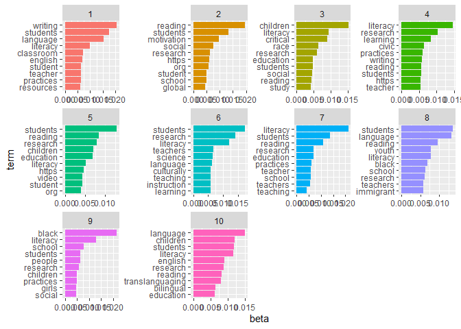
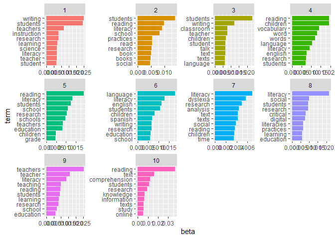
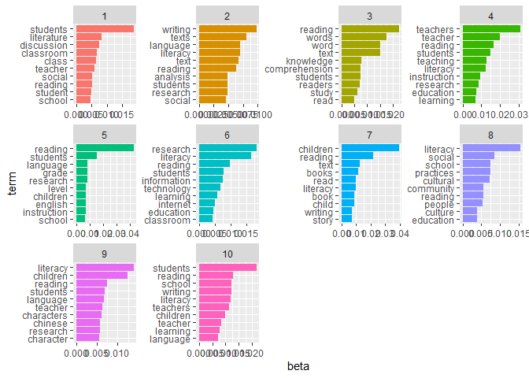
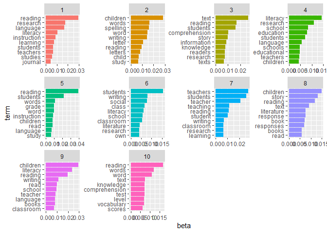
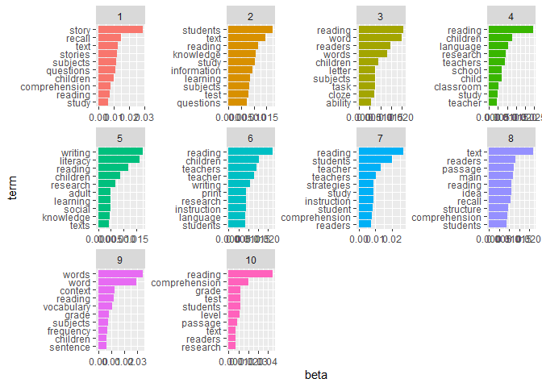
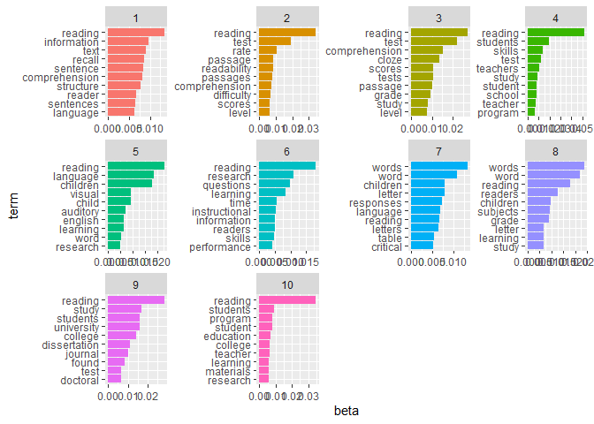

Final project; Data processing - Data Science for Linguists (LING 2340)
Fall 2022
================
Gianina Morales
12/1/2022

- <a href="#data-processing-new-continuing---part-2---progress-report-3"
  id="toc-data-processing-new-continuing---part-2---progress-report-3">Data
  processing (NEW CONTINUING - Part 2) - Progress report 3</a>
  - <a href="#topic-modeling" id="toc-topic-modeling">Topic modeling</a>

# Data processing (NEW CONTINUING - Part 2) - Progress report 3

------------------------------------------------------------------------

``` r
library(tidytext)
library(tidyverse)
library(tm)
library(stopwords)
library(stringi)
library(topicmodels)
```

## Topic modeling

**Latent Dirichlet allocation (LDA)** a mathematical method for finding
topic probabilities in a corpus. The mechanism includes two elements:

- LDA allows finding topics in a series of documents automatically. The
  number of topics responds to a parameter set by the researcher
  (*n*=x). The topics listed are weighted by their relative importance
  in the corpus, informed by the frequency and distribution of words.

- Each topic includes a series of words that the algorithm *estimates*
  is part of the topic. The automatic process implies probabilities of
  word-topic association. That is why some words appear in different
  topics.

I will apply the method following the book [Text Mining with
R](https://www.tidytextmining.com/index.html), particularly the chapters
six (“Topic modeling”) and nine (“case study”).

- **number of topics**

The processing and analysis of a large corpus (such as mine, with more
than 9 million words) take considerable time. After looking at other
studies and considering the scale of my project, I decided to set the
number of topics at 10. Also, I have discovered that my computer does
not have the memory to run the topic model with the total corpus (It
shut down) This way, I will analyze ten topics by decade to make the
trend comparison.

1.  Application to the corpus of 2020 to 2022

1.1. Topic model for ten topics

``` r
#Loading Rds
tidy_corpus20_22 <- read_rds("Private/tidy_corpus_all/tidy_corpus20_22.Rds")

#creating document-term matrix (necessary to apply the package)
corpus20_22_dtm <- 
  tidy_corpus20_22 %>% 
  count(word, id) %>%
    cast_dtm(id, word, n)

corpus20_22_dtm
```

    ## <<DocumentTermMatrix (documents: 86, terms: 28072)>>
    ## Non-/sparse entries: 154449/2259743
    ## Sparsity           : 94%
    ## Maximal term length: 35
    ## Weighting          : term frequency (tf)

``` r
# creating a model with 10 topics
corpus20_22_topicmodel <- 
LDA(corpus20_22_dtm, k = 10, control = list(seed = 1234))

corpus20_22_topicmodel
```

    ## A LDA_VEM topic model with 10 topics.

The result is a model that I will use as a base in the next steps

1.2. Word-topic probability

``` r
# per topic per word probabilities
corpus20_22_topics <- tidy(corpus20_22_topicmodel, matrix = "beta")
corpus20_22_topics
```

    ## # A tibble: 280,720 × 3
    ##    topic term         beta
    ##    <int> <chr>       <dbl>
    ##  1     1 aaliyah 4.32e-223
    ##  2     2 aaliyah 3.37e-  8
    ##  3     3 aaliyah 3.87e-223
    ##  4     4 aaliyah 3.31e-224
    ##  5     5 aaliyah 7.49e-227
    ##  6     6 aaliyah 1.34e-223
    ##  7     7 aaliyah 1.86e-223
    ##  8     8 aaliyah 1.29e-220
    ##  9     9 aaliyah 1.17e-  3
    ## 10    10 aaliyah 5.69e-225
    ## # … with 280,710 more rows

*Process*

Most common words inside each topic

``` r
#finding the terms to analyze the topics
corpus20_22_terms <- corpus20_22_topics %>%
  group_by(topic) %>%
  slice_max(beta, n = 25) %>% 
  ungroup() %>%
  arrange(topic, -beta)

#visualization of ten most common words by topic
corpus20_22_10terms <- corpus20_22_topics %>%
  group_by(topic) %>%
  slice_max(beta, n = 10) %>% 
  ungroup() %>%
  arrange(topic, -beta)
#Chart
corpus20_22_10terms %>%
  mutate(term = reorder_within(term, beta, topic)) %>%
  ggplot(aes(beta, term, fill = factor(topic))) +
  geom_col(show.legend = FALSE) +
  facet_wrap(~ topic, scales = "free") +
  scale_y_reordered()
```

<!-- -->

*Analysis*

- see note at the end

2.  Application to the corpus of 2010 to 2019

2.1. Topic model for ten topics

``` r
#Loading Rds
tidy_corpus10_19 <- read_rds("Private/tidy_corpus_all/tidy_corpus10_19.Rds")

#creating document-term matrix (necessary to apply the package)
corpus10_19_dtm <- 
  tidy_corpus10_19 %>% 
  count(word, id) %>%
    cast_dtm(id, word, n)

corpus10_19_dtm
```

    ## <<DocumentTermMatrix (documents: 390, terms: 53229)>>
    ## Non-/sparse entries: 601336/20157974
    ## Sparsity           : 97%
    ## Maximal term length: 50
    ## Weighting          : term frequency (tf)

``` r
# creating a model with 10 topics
corpus10_19_topicmodel <- 
LDA(corpus10_19_dtm, k = 10, control = list(seed = 1234))

corpus10_19_topicmodel
```

    ## A LDA_VEM topic model with 10 topics.

The result is a model that I will use as a base in the next steps

2.2. Word-topic probability

``` r
# per topic per word probabilities
corpus10_19_topics <- tidy(corpus10_19_topicmodel, matrix = "beta")
corpus10_19_topics
```

    ## # A tibble: 532,290 × 3
    ##    topic term       beta
    ##    <int> <chr>     <dbl>
    ##  1     1 ª     0.0000214
    ##  2     2 ª     0.0000354
    ##  3     3 ª     0.0000287
    ##  4     4 ª     0.0000358
    ##  5     5 ª     0.0000114
    ##  6     6 ª     0.0000573
    ##  7     7 ª     0.0000613
    ##  8     8 ª     0.0000817
    ##  9     9 ª     0.0000447
    ## 10    10 ª     0.0000488
    ## # … with 532,280 more rows

*Process*

Most common words inside each topic

``` r
#finding the terms to analyze the topics
corpus10_19_terms <- corpus10_19_topics %>%
  group_by(topic) %>%
  slice_max(beta, n = 25) %>% 
  ungroup() %>%
  arrange(topic, -beta)

#visualization of ten most common words by topic
corpus10_19_10terms <- corpus10_19_topics %>%
  group_by(topic) %>%
  slice_max(beta, n = 10) %>% 
  ungroup() %>%
  arrange(topic, -beta)
#Chart
corpus10_19_10terms %>%
  mutate(term = reorder_within(term, beta, topic)) %>%
  ggplot(aes(beta, term, fill = factor(topic))) +
  geom_col(show.legend = FALSE) +
  facet_wrap(~ topic, scales = "free") +
  scale_y_reordered()
```

<!-- -->
*Analysis*

- see note at the end

3.  Application to the corpus of 2000 to 2009

3.1. Topic model for ten topics

``` r
#Loading Rds
tidy_corpus00_09 <- read_rds("Private/tidy_corpus_all/tidy_corpus00_09.Rds")

#creating document-term matrix (necessary to apply the package)
corpus00_09_dtm <- 
  tidy_corpus00_09 %>% 
  count(word, id) %>%
    cast_dtm(id, word, n)

corpus00_09_dtm
```

    ## <<DocumentTermMatrix (documents: 480, terms: 59079)>>
    ## Non-/sparse entries: 687394/27670526
    ## Sparsity           : 98%
    ## Maximal term length: 77
    ## Weighting          : term frequency (tf)

``` r
# creating a model with 10 topics
corpus00_09_topicmodel <- 
LDA(corpus00_09_dtm, k = 10, control = list(seed = 1234))

corpus00_09_topicmodel
```

    ## A LDA_VEM topic model with 10 topics.

The result is a model that I will use as a base in the next steps

3.2. Word-topic probability

``` r
# per topic per word probabilities
corpus00_09_topics <- tidy(corpus00_09_topicmodel, matrix = "beta")
corpus00_09_topics
```

    ## # A tibble: 590,790 × 3
    ##    topic term       beta
    ##    <int> <chr>     <dbl>
    ##  1     1 à     1.39e- 18
    ##  2     2 à     5.61e-  6
    ##  3     3 à     1.37e-154
    ##  4     4 à     1.02e- 23
    ##  5     5 à     5.34e-151
    ##  6     6 à     1.16e- 45
    ##  7     7 à     5.48e-  6
    ##  8     8 à     1.19e- 20
    ##  9     9 à     1.36e-159
    ## 10    10 à     6.52e-165
    ## # … with 590,780 more rows

*Process*

Most common words inside each topic

``` r
#finding the terms to analyze the topics
corpus00_09_terms <- corpus00_09_topics %>%
  group_by(topic) %>%
  slice_max(beta, n = 25) %>% 
  ungroup() %>%
  arrange(topic, -beta)

#visualization of ten most common words by topic
corpus00_09_10terms <- corpus00_09_topics %>%
  group_by(topic) %>%
  slice_max(beta, n = 10) %>% 
  ungroup() %>%
  arrange(topic, -beta)
#Chart
corpus00_09_10terms %>%
  mutate(term = reorder_within(term, beta, topic)) %>%
  ggplot(aes(beta, term, fill = factor(topic))) +
  geom_col(show.legend = FALSE) +
  facet_wrap(~ topic, scales = "free") +
  scale_y_reordered()
```

<!-- -->
*Analysis*

- see note at the end

4.  Application to the corpus of 1990 to 1999

4.1. Topic model for ten topics

``` r
#Loading Rds
tidy_corpus90_99 <- read_rds("Private/tidy_corpus_all/tidy_corpus90_99.Rds")

#creating document-term matrix (necessary to apply the package)
corpus90_99_dtm <- 
  tidy_corpus90_99 %>% 
  count(word, id) %>%
    cast_dtm(id, word, n)

corpus90_99_dtm
```

    ## <<DocumentTermMatrix (documents: 675, terms: 56328)>>
    ## Non-/sparse entries: 753144/37268256
    ## Sparsity           : 98%
    ## Maximal term length: 52
    ## Weighting          : term frequency (tf)

``` r
# creating a model with 10 topics
corpus90_99_topicmodel <- 
LDA(corpus90_99_dtm, k = 10, control = list(seed = 1234))

corpus90_99_topicmodel
```

    ## A LDA_VEM topic model with 10 topics.

The result is a model that I will use as a base in the next steps

4.2. Word-topic probability

``` r
# per topic per word probabilities
corpus90_99_topics <- tidy(corpus90_99_topicmodel, matrix = "beta")
corpus90_99_topics
```

    ## # A tibble: 563,280 × 3
    ##    topic term       beta
    ##    <int> <chr>     <dbl>
    ##  1     1 a­     1.40e- 23
    ##  2     2 a­     5.35e-184
    ##  3     3 a­     3.68e-185
    ##  4     4 a­     1.09e-184
    ##  5     5 a­     4.65e-  6
    ##  6     6 a­     7.42e-189
    ##  7     7 a­     9.30e-190
    ##  8     8 a­     4.17e-184
    ##  9     9 a­     1.46e-189
    ## 10    10 a­     4.76e- 18
    ## # … with 563,270 more rows

*Process*

Most common words inside each topic

``` r
#finding the terms to analyze the topics
corpus90_99_terms <- corpus90_99_topics %>%
  group_by(topic) %>%
  slice_max(beta, n = 25) %>% 
  ungroup() %>%
  arrange(topic, -beta)

#visualization of ten most common words by topic
corpus90_99_10terms <- corpus90_99_topics %>%
  group_by(topic) %>%
  slice_max(beta, n = 10) %>% 
  ungroup() %>%
  arrange(topic, -beta)
#Chart
corpus90_99_10terms %>%
  mutate(term = reorder_within(term, beta, topic)) %>%
  ggplot(aes(beta, term, fill = factor(topic))) +
  geom_col(show.legend = FALSE) +
  facet_wrap(~ topic, scales = "free") +
  scale_y_reordered()
```

<!-- -->

*Analysis*

- see note at the end

5.  Application to the corpus of 1980 to 1989

5.1. Topic model for ten topics

``` r
#Loading Rds
tidy_corpus80_89 <- read_rds("Private/tidy_corpus_all/tidy_corpus80_89.Rds")

#creating document-term matrix (necessary to apply the package)
corpus80_89_dtm <- 
  tidy_corpus80_89 %>% 
  count(word, id) %>%
    cast_dtm(id, word, n)

corpus80_89_dtm
```

    ## <<DocumentTermMatrix (documents: 689, terms: 35632)>>
    ## Non-/sparse entries: 498438/24052010
    ## Sparsity           : 98%
    ## Maximal term length: 42
    ## Weighting          : term frequency (tf)

``` r
# creating a model with 10 topics
corpus80_89_topicmodel <- 
LDA(corpus80_89_dtm, k = 10, control = list(seed = 1234))

corpus80_89_topicmodel
```

    ## A LDA_VEM topic model with 10 topics.

The result is a model that I will use as a base in the next steps

5.2. Word-topic probability

``` r
# per topic per word probabilities
corpus80_89_topics <- tidy(corpus80_89_topicmodel, matrix = "beta")
corpus80_89_topics
```

    ## # A tibble: 356,320 × 3
    ##    topic term                    beta
    ##    <int> <chr>                  <dbl>
    ##  1     1 aaacoipninoiolablo 8.52e- 47
    ##  2     2 aaacoipninoiolablo 8.89e-227
    ##  3     3 aaacoipninoiolablo 1.30e- 19
    ##  4     4 aaacoipninoiolablo 7.77e-  6
    ##  5     5 aaacoipninoiolablo 4.69e-224
    ##  6     6 aaacoipninoiolablo 1.50e-227
    ##  7     7 aaacoipninoiolablo 1.32e-230
    ##  8     8 aaacoipninoiolablo 4.42e- 18
    ##  9     9 aaacoipninoiolablo 7.66e- 86
    ## 10    10 aaacoipninoiolablo 5.54e-224
    ## # … with 356,310 more rows

*Process*

Most common words inside each topic

``` r
#finding the terms to analyze the topics
corpus80_89_terms <- corpus80_89_topics %>%
  group_by(topic) %>%
  slice_max(beta, n = 25) %>% 
  ungroup() %>%
  arrange(topic, -beta)

#visualization of ten most common words by topic
corpus80_89_10terms <- corpus80_89_topics %>%
  group_by(topic) %>%
  slice_max(beta, n = 10) %>% 
  ungroup() %>%
  arrange(topic, -beta)
#Chart
corpus80_89_10terms %>%
  mutate(term = reorder_within(term, beta, topic)) %>%
  ggplot(aes(beta, term, fill = factor(topic))) +
  geom_col(show.legend = FALSE) +
  facet_wrap(~ topic, scales = "free") +
  scale_y_reordered()
```

<!-- -->

*Analysis*

- see note at the end

6.  Application to the corpus of 1969 to 1979

6.1. Topic model for ten topics

``` r
#Loading Rds
tidy_corpus69_79 <- read_rds("Private/tidy_corpus_all/tidy_corpus69_79.Rds")

#creating document-term matrix (necessary to apply the package)
corpus69_79_dtm <- 
  tidy_corpus69_79 %>% 
  count(word, id) %>%
    cast_dtm(id, word, n)

corpus69_79_dtm
```

    ## <<DocumentTermMatrix (documents: 890, terms: 43740)>>
    ## Non-/sparse entries: 520851/38407749
    ## Sparsity           : 99%
    ## Maximal term length: 49
    ## Weighting          : term frequency (tf)

``` r
# creating a model with 10 topics
corpus69_79_topicmodel <- 
LDA(corpus69_79_dtm, k = 10, control = list(seed = 1234))

corpus69_79_topicmodel
```

    ## A LDA_VEM topic model with 10 topics.

The result is a model that I will use as a base in the next steps

6.2. Word-topic probability

``` r
# per topic per word probabilities
corpus69_79_topics <- tidy(corpus69_79_topicmodel, matrix = "beta")
corpus69_79_topics
```

    ## # A tibble: 437,400 × 3
    ##    topic term       beta
    ##    <int> <chr>     <dbl>
    ##  1     1 aaa   1.65e-  6
    ##  2     2 aaa   4.07e-195
    ##  3     3 aaa   4.49e- 25
    ##  4     4 aaa   1.09e- 65
    ##  5     5 aaa   1.78e-  5
    ##  6     6 aaa   3.88e-193
    ##  7     7 aaa   4.25e-  7
    ##  8     8 aaa   5.10e- 36
    ##  9     9 aaa   2.75e-197
    ## 10    10 aaa   3.65e-160
    ## # … with 437,390 more rows

*Process*

Most common words inside each topic

``` r
#finding the terms to analyze the topics
corpus69_79_terms <- corpus69_79_topics %>%
  group_by(topic) %>%
  slice_max(beta, n = 25) %>% 
  ungroup() %>%
  arrange(topic, -beta)

#visualization of ten most common words by topic
corpus69_79_10terms <- corpus69_79_topics %>%
  group_by(topic) %>%
  slice_max(beta, n = 10) %>% 
  ungroup() %>%
  arrange(topic, -beta)
#Chart
corpus69_79_10terms %>%
  mutate(term = reorder_within(term, beta, topic)) %>%
  ggplot(aes(beta, term, fill = factor(topic))) +
  geom_col(show.legend = FALSE) +
  facet_wrap(~ topic, scales = "free") +
  scale_y_reordered()
```

<!-- -->

*Analysis*

- see note at the end

------------------------------------------------------------------------

**Plan for the analysis**

This time, I had many problems with the data, particularly with my
computer capacity (basically, it cannot run the total model). For that
reason, I could not have time to perform the analysis as much as I
wanted. I plan to finish the analysis in time for the presentation. I
will analyze every topic (I have ten by decade with 25 words for each
one) to infer a *theme* that name the topic. I will use my literature
review as an aid in that process. That will allows me to answer the
first question. Then, I will compare the main topics by decade (I am
still trying to figure out how many), looking at correlations
(reference, chapter 9.2.1 from [Text Mining with
R](https://www.tidytextmining.com/index.html)). That will allow me to
see trends and answer the second research question.

\#Summary of future actions (pending steps)

1.  Analyze each decade and compare their results (trend comparison).

2.  Create the final report of my results.

3.  Discuss the results in relation to my research questions:

- What are the trends in topics of literacy education research and
  scholarship over more than five decades (1969-2021) of the focal
  journals?
- How do the topics have changed over time?

4.  Run the whole process with an small sample of open access articles.

``` r
sessionInfo()
```

    ## R version 4.2.1 (2022-06-23 ucrt)
    ## Platform: x86_64-w64-mingw32/x64 (64-bit)
    ## Running under: Windows 10 x64 (build 19045)
    ## 
    ## Matrix products: default
    ## 
    ## locale:
    ## [1] LC_COLLATE=English_United States.utf8 
    ## [2] LC_CTYPE=English_United States.utf8   
    ## [3] LC_MONETARY=English_United States.utf8
    ## [4] LC_NUMERIC=C                          
    ## [5] LC_TIME=English_United States.utf8    
    ## 
    ## attached base packages:
    ## [1] stats     graphics  grDevices utils     datasets  methods   base     
    ## 
    ## other attached packages:
    ##  [1] topicmodels_0.2-12 stringi_1.7.8      stopwords_2.3      tm_0.7-9          
    ##  [5] NLP_0.2-1          forcats_0.5.2      stringr_1.4.1      dplyr_1.0.9       
    ##  [9] purrr_0.3.4        readr_2.1.2        tidyr_1.2.0        tibble_3.1.8      
    ## [13] ggplot2_3.3.6      tidyverse_1.3.2    tidytext_0.3.4    
    ## 
    ## loaded via a namespace (and not attached):
    ##  [1] httr_1.4.4          jsonlite_1.8.0      modelr_0.1.9       
    ##  [4] assertthat_0.2.1    highr_0.9           stats4_4.2.1       
    ##  [7] googlesheets4_1.0.1 cellranger_1.1.0    yaml_2.3.5         
    ## [10] slam_0.1-50         pillar_1.8.1        backports_1.4.1    
    ## [13] lattice_0.20-45     glue_1.6.2          digest_0.6.29      
    ## [16] rvest_1.0.3         colorspace_2.0-3    htmltools_0.5.3    
    ## [19] Matrix_1.4-1        plyr_1.8.8          pkgconfig_2.0.3    
    ## [22] broom_1.0.1         haven_2.5.1         scales_1.2.1       
    ## [25] tzdb_0.3.0          googledrive_2.0.0   farver_2.1.1       
    ## [28] generics_0.1.3      ellipsis_0.3.2      withr_2.5.0        
    ## [31] cli_3.3.0           magrittr_2.0.3      crayon_1.5.1       
    ## [34] readxl_1.4.1        evaluate_0.16       tokenizers_0.2.3   
    ## [37] janeaustenr_1.0.0   fs_1.5.2            fansi_1.0.3        
    ## [40] SnowballC_0.7.0     xml2_1.3.3          tools_4.2.1        
    ## [43] hms_1.1.2           gargle_1.2.0        lifecycle_1.0.1    
    ## [46] munsell_0.5.0       reprex_2.0.2        compiler_4.2.1     
    ## [49] rlang_1.0.4         grid_4.2.1          rstudioapi_0.14    
    ## [52] labeling_0.4.2      rmarkdown_2.16      gtable_0.3.0       
    ## [55] DBI_1.1.3           reshape2_1.4.4      R6_2.5.1           
    ## [58] lubridate_1.8.0     knitr_1.40          fastmap_1.1.0      
    ## [61] utf8_1.2.2          modeltools_0.2-23   parallel_4.2.1     
    ## [64] Rcpp_1.0.9          vctrs_0.4.1         dbplyr_2.2.1       
    ## [67] tidyselect_1.1.2    xfun_0.32
