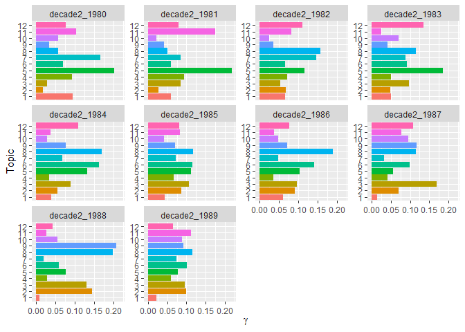
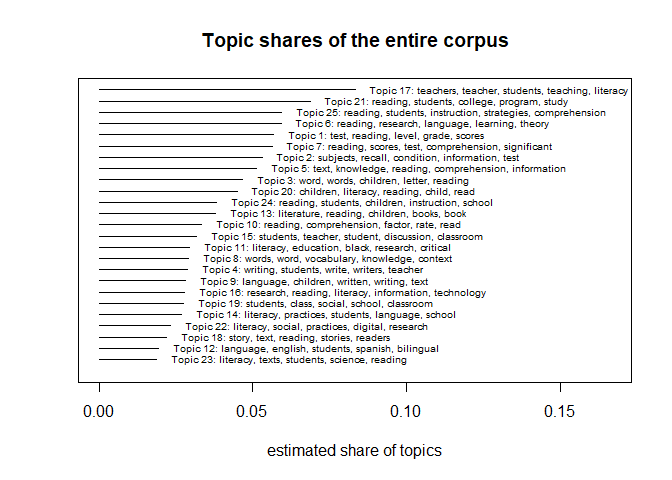

# Topic modeling of Literacy Education articles: five decades of scholarship

**Gianina Morales** 

University of Pittsburgh

Data Science for Linguists (LING 2340) Fall 2022

---

## Introduction

A perennial interest of researchers is understanding the history and characteristics of their fields. In different disciplines, scholars have turned to analyze journal publications to answer questions such as what are the topics of interest? What does characterize the scholarship in the field? How much has the research in the field changed over time? What are the trends in publications? What are the paradigms and perspectives dominant in the field, and how have they evolved? In the field of literacy education, several scholars have sought to represent scholarship trends and features through reviews of different sizes, scopes, and approaches. Some authors have focused on specific topics (e.g., Durst, 1990 and Juzwik et al., 2006 reviews of writing research), others have analyzed the field from a historical perspective (e.g., Venezky, 1984), and several scholars have applied the method content analysis to examine trends over time in a particular journal or set of journals (e.g., Baldwin et al., 1992; Dutro & Collins, 2011; Guzzetti et al., 1999; Parsons et al., 2016). The general conclusion is that topics of interest and research have evolved over the years. Yet the question about how much the community of literacy education scholars has changed perspectives and practices toward equitable representation of students is still unanswered. 

One important indicator of progress in a field is the language used by researchers. Deficit-oriented perspectives (or the opposite, asset-oriented) are evident in lexical choices. For example, in their content analysis of nine decades of three elementary literacy journals, Dutro and Collins argue, "In the journals' early decades, stance, extreme deficit assumptions about students are ever-present in the ("deprivation," "the disadvantaged child") used to characterize immigrant, and non-white students" (p.142). As an interpretative method for examining texts, content analysis is useful to trace patterns in scholarship, such as those described by Dutro and Collins. However, it has some limitations, particularly in terms of the volume of information humanly analyzable. Content analysis is limited by time when used in extant corpora. Most of the time, scholars using this method do not read the entire article or skim the majority of the articles, focusing on specific sections, such as abstracts, introductions, or methods. Therefore, applying linguistics methods associated with the analysis of big corpora, such as topic modeling, represent a complementary tool to enhance the analysis of texts representing the scholarship of a field. 

Within this rationale, I have used topic modeling techniques to analyze trends over time in literacy research and scholarship in a set of articles from two publications: one leading journal and a conference papers journal in the field of Literacy education, both pertaining to the same disciplinary association. My research questions are:

1. What are the trends in topics of literacy education research and scholarship over more than five decades (1969-2022) of the focal journals?
2. How do the topics have changed over time?  

With this exploratory study, I seek to contribute to understanding the evolution of scholarship in the field, especially regarding the representation of practices and students. 

## Method

### Topic modeling

Topic modeling is a data mining and machine learning technique that automatically analyzes texts to identify latent topic structures. Topic modeling programs use algorithms to identify probabilistic topics or patterns of words in a corpus (Brett, 2012). The most widely used model in humanities is Latent Dirichlet Allocation (LDA). Latent Dirichlet allocation (LDA) is a mathematical method for finding topic probabilities in a corpus. The technique includes two elements:

1. LDA allows finding topics in a series of documents automatically. The number of topics responds to a parameter set by the researcher (*n*=x). The topics listed are weighted by their relative importance in the corpus, informed by the frequency and distribution of words.

2. Each topic includes a series of words that the algorithm *estimates* is part of the topic. The automatic process implies probabilities of word-topic association. That is why some words appear in different topics (Silge and Robinson, 2022).

An example of the application of topic modeling to the analysis of journal articles is the study of Wang et al. (2017). They applied topic modeling to review trends in the literature on educational leadership. After finding the probabilistic topics weighted by the frequency of appearance across the articles and organized over time, they analyzed each topic qualitatively to identify *themes*. I have followed a similar approach in this study. 

Several packages allow the implementation of LDA topic modeling in R. Following Silge and Robinson (2022), I primarily employed the packages `tidytext` and `topicmodels` in my inquiry. Nevertheless, LDA is not the only method to perform topic modeling in R. In the last few years, developers have expanded the tools for this technique. This way, Roberts et al. (2019) published a new framework to develop topic modeling called Structural Topic Model (STM). The package enables the estimation of statistical regressions with the topics considering covariate data. I have applied this method and the respective package (`stm`) to complement the implementation of the LDA method for my analysis.

### Data

The data for this project corresponds to 3,131 journal articles transformed in `.txt` files. The articles represent all the publications between 1969 and 2022 in two literacy journals (a research journal and a conference journal) of a leading association in the field. My project is focused on patterns of literacy education scholarship; thus, I am not differentiating between sub-types of articles.
The data was obtained in the context of a larger research project aimed at applying topic modeling to the analysis of articles from 12 US-based journals in Literacy Education. The agreement with the publisher that gives access to the files implies that files cannot be shared directly with the public, and data results cannot individualize journals until peer-review publication. Therefore, In this repository, I am sharing my [analysis processes](/Analysis) and [data resulting](/Data_product_samples) without individualizing the sources. In the future, my project will contribute to the development of a journal publication.

### Process

The process of transforming raw data in `.txt` format to a corpus with the necessary characteristics to apply topic model techniques includes several steps, all detailed in the file [Data_processes1](/Analysis/Data_processes1.md). First, I created data frames with one sentence per row of the `.txt` files categorized by decade. One of the journals (the research journal) started in 1969, so that is the year for the beginning of the data. I decided to incorporate the articles from 1969 within the next decade (1970-1979) to maintain a logical order. I also considered the last decade with the two and a half years of articles from 2020 onwards. The implications for this shorter period are addressed in the analysis. 
Second, I converted every data frame with the raw data in a tidy data frame with one token per row. In this process, I cleaned the data of symbols and applied stopwords. As a result, I had six data frames saved as `Rds`. I also created a master data frame with all the decades and a sample of this master data frame to share in the folder with [samples](/Data_product_samples). At the end of this process, I obtained 9,134,631 tokens. The words with more presence in the corpus are in figure 1. In general, the words seem to represent the scope of the focal journals anchored in literacy education research. Later, I noticed that these words are constantly present in all the topic models I run.

**Figure 1: general word count **

After finishing the tidy data frames, I was in the condition to apply the LDA topic modeling (process detailed in [Data_processes2](/Analysis/Data_processes2.md)). To begin this process, I used `FindTopicsNumber()` from the `ldatuning` package to assess the number of topics recommended for my models. It is a time-consuming function, and my data total data is heavy for the process, so I executed the command with the lighter data frame: decade 6, available in figure 2. 

**Figure 2: evaluation of the recommended number of topics for the model**

I used the results as references for the entire data set. This method indicated that a `k` between 8 and 13 represents a "balance," considering density, within-topic divergence, and across-topic divergence. Given that the data frames for the other decades include more documents, I decided to use a `k` of 12.

I run the LDA model with the data frame for each decade first. This way, I observed the trends in literacy scholarship in each decade and by year. After running the model with all the decades (including "decade 6," which only have two and a half years), I analyzed the topics qualitatively in searching for patterns. Considering my data volume, I could not apply the LDA method to analyze de corpus entirely. For that reason, I applied the method STM to analyze the total corpus (process detailed in [Data_processes3](/Analysis/Data_processes3.md)).

## Results

I organized my results in relation to my research questions. 

### Research question 1: What are the trends in topics of literacy education research and scholarship over more than five decades (1969-2022) of the focal journals?

I will present the results of my analysis by decade.

**1. 1969 to 1979**

In this decade, the model with 12 topics includes the themes in table 1.

**Table 1: topics 1969 to 1979**

Figure 3 represents the ten most probable terms for each topic. 

**Figure 3**

In this decade, it is notorious the interest in testing (topics 1 and 10),  experimentation (topic 5), and cognitive processes related to reading, such as topic 6 (Visual processes testing) and topic 9 (Memory testing). An interest in skills such as general reading skills (topic 11)  and word recognition(topic 7) is also evident in the decade. Regarding the change in topics over time, figure 4 shows how the topics are represented in the articles across the years.

**Figure 4: representation of topics across the years 1969 to 1979**

The image shows that topics 11 (Reading skills instruction) and 3 (Instructional programs and interventions) were losing prevalence over time, while topics 9 (Memory testing) and 7 (Phonics and word recognition) were growing in prevalence over time.

**2. 1980 to 1989**

In this decade, the model with 12 topics includes the themes in table 2.

**Table 2: topics 1980 to 1989**

Figure 5 represents the ten most probable terms for each topic. 

**Figure 5**

In this decade, the interest in processes and skills continues, but it also emerged attention to texts (topic 6) and stories (topic 12). *Reading strategies* is also a topic this decade (topic 3). Regarding the change in topics over time, figure 6 shows how the topics are represented in the articles across the years.

**Figure 6: representation of topics across the years 1980 to 1989**

The image shows that topic 5 (Memory testing) seems to diminish in prevalence over the years, while topic 3 (Reading strategies) augments. It is a logical observation of a period marked by cognitive research in reading.

**3. 1990 to 1999**

In this decade, the model with 12 topics includes the themes in table 3.

**Table 3: topics 1990 to 1999**

Figure 7 represents the ten most probable terms for each topic.

**Figure 7**

In this decade, several new topics emerged. The topics ESL/bilingualism and multilingualism (topic 9), *Literacy as social practice* (topic 2), and *Family and community literacy* (topic 1) are related to the social turn (Gee, 2000) that the area of literacy had in that decade. During this decade, interest in teacher education (topic 5) also began to appear steadily—evidencing the community of literacy scholars' research in preservice teacher education and professional development. *Literature* (topic 11) is another consistent topic in this decade, reinforcing the topic of *Story reading instruction* (topic 8), which is more related to elementary literacy education. Another topic that appeared in this decade is *Writing* (topic 10), perhaps replacing topics related to grammar and sentence-level attention in past decades. Finally, topic 6 (Technology and literacy) evidence the beginning of a research interest in the implications of computational tools to literacy instruction.  

Regarding the change in topics over time, figure 8 shows how the topics are represented in the articles across the years.

**Figure 8: representation of topics across the years 1990 to 1999**

The image shows that topic 12 (Phonics and word recognition/decoding) seems to have lost strength over the years while topic 5 (Teacher education) continually grew. Topic 9 (ESL/bilingualism and multilingualism) also shows growth toward the end of the decade. 

**4. 2000 to 2009**

In this decade, the model with 12 topics includes the themes in table 4.

**Table 4: topics 2000 to 2009**

Figure 9 represents the ten most probable terms for each topic. 

**Figure 9**

This decade seems to maintain the trends from the previous decade with the topics of *Literacy as a social practice* (topic 2), *Teacher education* (topic 7), *Technology and literacy* (topic 9), *Literature* (11), and *Writing* (topic 4). However, it also indicates the return of interest toward texts (topic 10) and vocabulary (topic 6). Regarding the change in topics over time, figure 10 shows how the topics are represented in the articles across the years.

**Figure 10: representation of topics across the years 2000 to 2009**

The image shows that topic 6 (Vocabulary) grew, especially in the decade's second half. Something similar happened to topic 11 (Literature). On the contrary, topics 8 (Instructional programs and interventions) and 3 (Classroom interactions) lost some of their prevalence toward the end of the decade. 

**5. 2010 to 2019**

In this decade, the model with 12 topics includes the themes in table 5.

**Table 5: topics 2010 to 2019**

Figure 11 represents the ten most probable terms for each topic. 

**Figure 11**

Similar to the decade of 1990, the topics in this decade show the birth of new lines, such as critical literacy (topic 11), digital literacies (topic 10), and disciplinary literacy (topic 2). Additionally, it returns the interest to bilingualism and multilingualism (topic 9) and family and community literacy (topic 1). Regarding the change in topics over time, figure 12 shows how the topics are represented in the articles across the years

**Figure 12: representation of topics across the years 2010 to 2019**

The image suggests that disciplinary literacy (topic 2) was a "hot topic" at the beginning of the decade, losing some prevalence by its end. Topic 11 (Critical literacy) also saw a significant upswing in the decade's second half, especially in 2017. Critical literacy is a new paradigm related to critical pedagogy (cf. Freire, 2014); thus, its prevalence in that year may be linked to the change in political forces in the United States. Relatedly, topic 7 (Literacy as a social practice) also grew toward the end of the decade. On the contrary, topic 6 (Vocabulary) seems to have had some changes over the years, moderating its presence in the decade's final years.

**6. 2020 to 2022**

For the last decade, I am considering all the articles published in the focal journals between 2020 and August 2022. The model with 12 topics includes the themes in table 6.

**Table 6: topics 2020 to 2022**

Figure 13 represents the ten most probable terms for each topic. 

**Figure 13**

The share of topics in this period cannot be considered representative of the decade because it only includes the beginning. That may explain why some topics do not appear. However, it suggests a tendency. Some topics that appeared in the previous decade are still present, such as *Digital literacies* (topic 3) and *Critical literacy* (topic 10). Regarding the change in topics over time, figure 14 shows how the topics are represented in the articles across the years.

**Figure 14: representation of topics across the years 2020 to 2022**

Without drawing further conclusions about the current year, the image shows that topics 10 (Critical literacy) and 3(Digital literacies) moderated their prevalence between 2020 and 2021, while topics 11 (Teacher education), 9 (Literacy as a social practice), and 8 (Classroom interaction) grew in the last year.

#### Trends over time

Considering my qualitative analysis of the topics, figure 15 shows the overall presence of topics over time.  

**Figure 15**

The chart confirms my previous analyses of each decade and the conclusions of other literature reviews about "waves" of literacy education research and practice (cf. Tierney and Pearson, 2021). It is evident the change of topics from cognitive research in the 70s and 80s to more social and cultural-laden research since the 90s. However, these results may not represent the total scope of the field because other literacy associations were born just in the years of the change of paradigms. I will come back to this analysis later.  

For my qualitative analysis of topics, I consider the 30 most weighted topics in each one. That movement allowed me to appreciate nuances in the vocabulary associated with each topic. I noticed a few changes in some of the topics describing students. For example,  the word *poor* consistently appears in relation to the words *students* and *children* in topics associated with testing in the first decades. This is a sign of the deficit-oriented perspective that permeates much of the literature on testing. Conversely, from 2010 onwards, words such as * translanguaging* and *bilinguals* have more prevalence than *ESL* (English Language Learners) on topics associated with multilingual students, suggesting a distance of scholars from a term usually linked to demeaning stances toward ethnically and linguistically diverse students. 

#### Another perspective: Structural Topic Model (STM) results

My qualitative analysis of topics by decades brings a snapshot of the trends in topics of literacy research and scholarship during the period of interest. However, it does not allow me to observe the prevalence of topics in the entire corpus. To observe the general trends, I searched for the 25 most probable topics in the corpus by applying the STM method. Figure 16 presents the topics ranked by their appearance in the whole corpus.

**Figure 16**

To make sense of the results, I analyzed the topics qualitatively, considering the 50 most probably terms. In this process, I considered my previous analyses of topics by decade. Table 7 presents the STM topics tagged. 

**Table 7: STM topic names**

Considering the first five topics in the rank, the model shows that topic 17 (Teacher education) is the most prevalent in the articles, followed by topic 21 (College reading), topic 25 (Reading strategies), topic 6(Research and theory), and topic 1 (Testing, word/sentence level). Conversely, the five topics with less presence are topic 23 (Disciplinary literacy), topic 12 (ESL/Bilingualism and multilingualism), topic 18 (Story reading instruction), topic 22 (Digital literacies), and topic 14 (Family and community literacy). Regarding the topics with less presence in the corpus, the results of the STM model are consistent with my previous analyses of the LDA models by decade. Those topics have appeared relatively recently in the decades analyzed. Concerning the topics with more prevalence, a big difference between my manual analysis of decades and the STM model is the prevalence of the topic *College reading*, which I only identified in the articles published between 1969 and 1979. However, a detailed analysis by topic (presented in the next section) suggests that the reason for this prevalence is the large proportion of articles on that topic precisely in that first decade. 

### Research question 2: How do the topics have changed over time?

Although my qualitative trace of topics over decades presents a picture of the change in topics over time, it does not accurately reflect the proportions of topics from the entire corpus because it misses the mathematical part of topic modeling. For that reason, the STM model offers broader analytical possibilities. I plotted the gamma metric (per-document-per-topic probability) across the articles and decades to find the probability of topics per decade. Figures 17 to 22 show the proportion of 1 that each topic has in each decade. Dots in the boxplots represent the outlier documents leaning more toward specific topics.   

**Figure 17** 

**Figure 18** 

**Figure 19** 

**Figure 20** 

**Figure 21** 

**Figure 22** 

STM also allows estimating a regression for the proportion of documents related to topics using metadata variables as covariates. I applied this function to observe the changes in topics over the decades by analyzing *p-values*. My intercept is always the first decade (1969-1979). Details of the regression are in [Data_processes3](/Analysis/Data_processes3.md)).

I will combine the results of the plots and the regression in my narrative analysis of the topics over decades.

**Findings**

First, and considering the first decade as the baseline, all topics significantly changed over time, although not always in all decades and with the same intensity. STM topics 1 (Testing, word/sentence level), 2 (Experiments), 3 (Phonics and word recognition/decoding), 7 (Testing, reading comprehension), 10 (Readers' characterization based on measures), and 21 (College reading) evidence a significant difference from the first decade and over time. With the exception of topic 2, which had an augment in the 80s to decline in probability, all these topics presented a sustained decline over the years. Topics 6 (Research and theory), 8 (Vocabulary), and 9 (Grammar) also presented a decline over the years, but from 2000 onward.

On the contrary, topic 4 (Writing) presents a significant difference in all the decades regarding the first one, but evidence a relative growth until 2019. Topics 15 (Classroom interaction), 12 (ESL/bilingualism and multilingualism), and 24 (Instructional programs and interventions) also show a significant positive difference from the first decade but only since the 1990s. Similarly, topics 11 (Critical literacy), 14 (Family and community literacy), 22 (Digital literacies), and 23 (Disciplinary literacy) evidence a significant augment from 2000 onward. 

Finally, some topics significantly augmented their prevalence only in some periods. Topic 5 (Texts) only presents a high and significant prevalence in the 1980s. Topics 18 (Story reading instruction) and 25 (Reading strategies) significantly augment their proportion in the articles published between 1980 and 1999. Topics 13 (Literature) and 20 (Children's literacy instruction) evidence a augment in their prevalence since the 1990s, but it is significant mainly for the period between 1990 and 2009. Topics 19 (Literacy as social practice), 16 (technology and literacy), and 17 (Teacher education) show growth in their prevalence in the articles published between 1990 and 2019. 

## Conclusions, Limitations, and Implications

In conclusion, the trends in literacy scholarship between 1969 and 2022 suggest significant changes between the decades and the years analyzed. The specific analysis of each decade and the collective analysis of all the topics from the entire period show the changes in paradigms and interests of the community of literacy education represented in academic publications. In this sense, my analysis is consistent with the conclusions detailed in other reviews about the decline in cognitive research in parallel with the augment of sociocultural and critical approaches to literacy (e.g., Guzzetti et al., 1999). However, it should be noted that I only analyzed two journals from one literacy association. Other associations have been born from differences in perspectives with this one just in the years when the changes are more notorious. So probably, the analysis of other journals will have other results and may suggest different topics or a different prevalence for the same topics found in this study.

Additionally, studies using the methodology of topic modeling usually have a process of human validation of the automatized topics and conclusions. In this case, one of the limitations of my results is that I could not perform those processes of validation. To ameliorate that limitation, I applied two methods of topic modeling (LDA and STM), which allowed the contrast between results. As my analysis showed, both methods yielded similar results. Moreover, the use of the two methods was complementary because it allowed me to trace details in vocabulary inside decades that the model for the entire corpus did not always evidence. Nevertheless, my model probably needs more iterations and number of topics to observe in detail the lexical choices of the scholars. In this exploration, I could only observe the presence of some deficit language and I am sure that with further analyses, it is possible to make a finer examination on the vocabulary in the articles. 
 
In terms of the implications and future work, my study shows the feasibility of combining two automatized linguistics methods with human analysis to enhance the examination of linguistics patterns in big corpora. It represents an exploration that could be further improved through the incorporation of validation and the extension of topics to analyze. As my data is part of a major research project, my analysis and conclusions will be further used in a publication on the theme.

**Commentary about the process**

This daunting project implies many hours of work and computational resources. The combination of time and computational resources sometimes was a limitation during the development of the project. Fortunately, in the end, I could perform the necessary analysis to answer at least exploratorily the research questions. 

## References

Baldwin, R. S., Readence, J. E., Schumm, J. S., Konopak, J. P., Konopak, B. C., & Klingner, J. K. (1992). Forty Years of Nrc Publications: 1952–1991. Journal of Reading Behavior, 24(4), 505–532. https://doi.org/10.1080/10862969209547793

Durst, R. K. (1990). The mongoose and the rat in composition research: Insights from the RTE annotated bibliography. College Composition and Communication, 41(4), 393-408.

Dutro, E., & Collins. (2011). A Journey through Nine Decades of NCTE-Published Research in Elementary Literacy. Research in the Teaching of English, 46(2), 141–161.

Freire, P. (2014). Pedagogy of the Oppressed: 30th Anniversary Edition (M. Bergman Ramos, Trans.). Bloomsbury Academic & Professional. http://ebookcentral.proquest.com/lib/pitt-ebooks/detail.action?docID=1745456 (Original work published 1970)

Gee, J. P. (2000). The new literacy studies: From 'socially situated' to the work of the social. In D. Barton, M. Hamilton, & R. Ivanič, Situated literacies reading and writing in context (pp. 180–209). Routledge.

Guzzetti, B., Anders, P. L., & Neuman, S. (1999). Thirty Years of JRB/JLR: A Retrospective of Reading/Literacy Research. Journal of Literacy Research, 31(1), 67–92. https://doi.org/10.1080/10862969909548037

Juzwik, M. M., Curcic, S., Wolbers, K., Moxley, K. D., Dimling, L. M., & Shankland, R. K. (2006). Writing into the 21st century: An overview of research on writing, 1999 to 2004. Written Communication, 23(4), 451-476. https://doi.org/10.1177/0741088306291619

Parsons, S. A., Gallagher, M. A., & the George Mason University Content Analysis Team. (2016). A Content Analysis of Nine Literacy Journals, 2009-2014. Journal of Literacy Research, 48(4), 476–502. https://doi.org/10.1177/1086296X16680053

Roberts, M. E., Stewart, B. M., & Tingley, D. (n.d.). stm: R Package for Structural Topic Models. Journal of Statistical Software.

Silge, J., & Robinson, D. (2022). Welcome to Text Mining with R | Text Mining with R. https://www.tidytextmining.com/

Tierney, R. J., & Pearson, P. D. (2021). A history of literacy education: Waves of research and practice. Teachers College Press.

Venezky, R. L. (1984). The History of Reading Research. In Peardon, P.D. (Ed), Handbook of reading research, vol. 1, NY Longman, pp. 3-38.

Wang, Y., Bowers, A. J., & Fikis, D. J. (2017). Automated Text Data Mining Analysis of Five Decades of Educational Leadership Research Literature: Probabilistic Topic Modeling of EAQ Articles From 1965 to 2014. Educational Administration Quarterly, 53(2), 289–323. https://doi.org/10.1177/0013161X16660585
